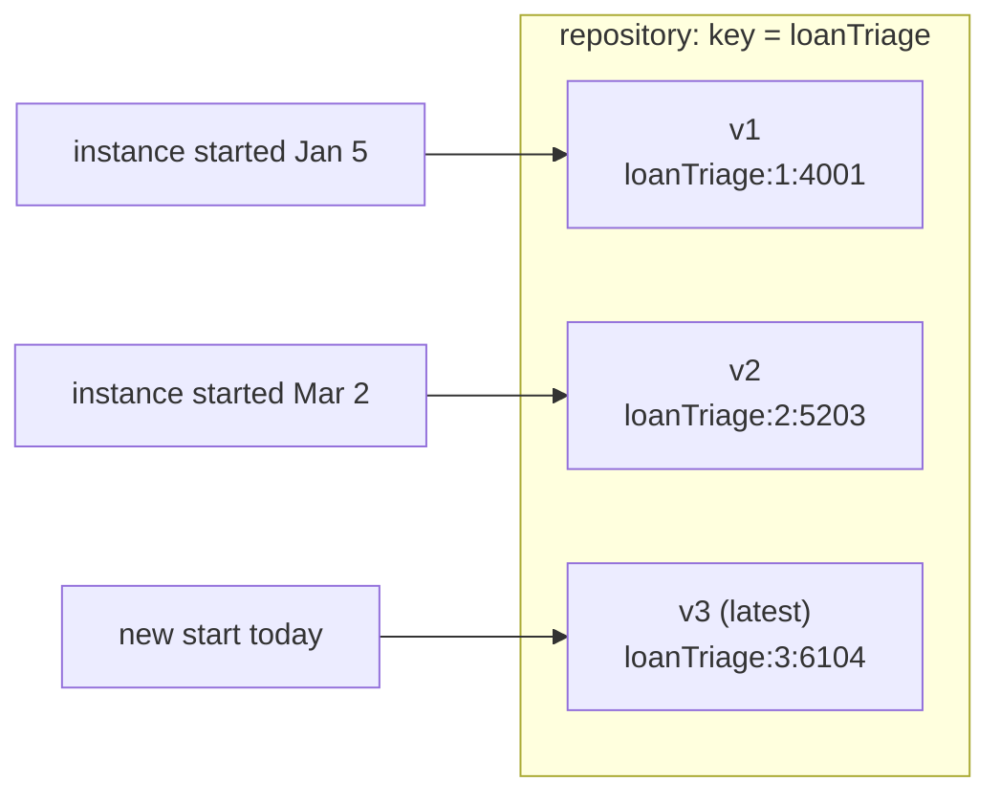

# Definition versions: what a redeploy actually does

> **Motto** — A redeploy never changes a running process; it changes what *new*
> instances get — old tokens keep executing the diagram they started on.

*Part of Phase 08 — Versioning & migration. Concept reading:
[Principle 9 — instances outlive their definitions](../../../../foundations/process-automation-principles.md).*

## The Problem

You fix a gateway condition and redeploy. The dashboard still shows applications
taking the old path. Bug? No — the most misunderstood *feature* in BPM: those
instances started before your fix, and they are executing the definition they
started on. Without a precise model of versioning you'll either "fix" things twice,
or — worse — assume a compliance-mandated change reached in-flight cases when it
didn't. Every question in this phase reduces to: *which definition does this token
read next?*

## The Concept

Deploying a model with an existing key doesn't replace anything — it appends:



Three rules carry everything:

1. **Redeploy = append.** Same key → version N+1; old versions remain deployed and
   *executable*. The definition ID (`key:version:generated`) is the precise handle;
   the key alone means "latest" only at start time.
2. **Starts bind latest, instances pin forever.** `startProcessInstanceByKey`
   resolves the newest version *at that moment*; the instance stores the definition
   ID and reads it for every subsequent step, wait state, and timer.
3. **Simultaneous versions are normal.** A 90-day mortgage process under weekly
   deploys means ~13 versions live at once. That's not mess — that's the engine
   keeping Phase 2's promise (persisted state must keep meaning what it meant).

Consequences people trip on: version-pinning applies to *everything* attached to the
definition — timers fire into the old diagram, DMN references resolve per the old
task config; history rows record the version that ran (your audit answer); and the
repository grows monotonically — cleaning up truly-dead old versions is a deliberate
operational act (Phase 9), never automatic.

## Use It

[`code/versions_client.py`](../code/versions_client.py) makes the rules observable —
deploy Phase 1's model twice, park an instance under each:

```
$ python3 versions_client.py
after 1st deploy: [(1, 'loanTriage:1:4007')]
after 2nd deploy: [(2, 'loanTriage:2:5211'), (1, 'loanTriage:1:4007')]

new start binds latest : True
old instance still pinned: True

-> two live instances of one key, on two definitions. Moving the old one is
   MIGRATION (lesson 02); until then both versions execute.
```

Two operational notes that follow directly: deploys are cheap and additive, so
deploy-often is safe *for new starts* — the risk lives entirely in forgetting the
pinned population; and if a bad version ships, you can suspend *that definition
version* (`repository/process-definitions/{id}` with `action: suspend`) to stop new
starts on it while good versions keep serving.

## Ship It

This lesson ships [`code/versions_client.py`](../code/versions_client.py) — the
three rules as a runnable proof, and the query helpers (`versions`, pinned-instance
lookup) that lesson 02's migration client builds on.

## Check Yourself

**Q1.** A compliance change deploys as v5. Applications started under v4 are…

- A) automatically on v5
- B) still executing v4 — the change reaches them only via migration (or by draining)
- C) suspended
- D) failed

<details><summary>Answer</summary>B — rule 3. If the regulator's change must reach
in-flight cases, redeploying is half the job; lesson 02 is the other half.</details>

**Q2.** A timer armed under v2 fires after v6 ships. Which diagram does the token
continue in?

- A) v6 — latest wins
- B) v2 — the instance's pinned definition, timers included
- C) whichever the job executor picks
- D) it errors

<details><summary>Answer</summary>B — pinning covers every deferred continuation:
timers, messages, async jobs all resume into the version the instance
carries.</details>

**Q3.** `startProcessInstanceByKey("loanTriage")` chooses a version…

- A) randomly among deployed versions
- B) the latest at the moment of the call; the choice is then frozen into the instance
- C) configured globally
- D) v1 always

<details><summary>Answer</summary>B — keys resolve at start time only. Everything
after start speaks definition IDs.</details>

**Challenge.** Extend the client with `population(key)`: for each deployed version,
print live-instance count and oldest start date. That one table — "who is still on
v1 and since when" — is the input every migration decision (lesson 02) and every
version-cleanup decision (Phase 9) starts from.

## Related

- Next: [Instance migration](../../02-instance-migration/docs/en.md)
- Why pinning exists at all: [Phase 2, lesson 01](../../../02-the-engine-state-and-transactions/01-wait-states-and-persistence/docs/en.md)
