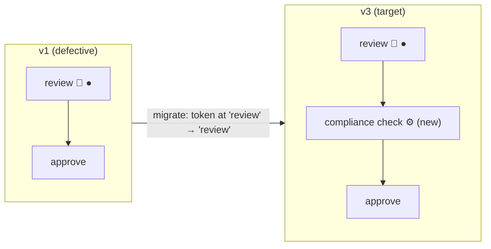

# Instance migration: moving live tokens to a new version

> **Motto** — Migration is a database change wearing a diagram: validate first, map
> every moved token explicitly, and rehearse on a copy before touching production.

*Part of Phase 08 — Versioning & migration.*

## The Problem

Lesson 01 left two versions executing side by side — fine when the old one is merely
*older*, untenable when it's *wrong*: a compliance step was missing, a routing
condition was inverted, and four hundred in-flight applications carry the defect.
Draining (letting old instances finish on the old logic) is often the right call, but
when it isn't — regulator says the new step applies to *everything in flight* — you
need to move live tokens onto the new definition without losing their position,
variables, or history. That operation is exactly as dangerous as it sounds, which is
why the engine wraps it in a ritual.

## The Concept

Migration re-points an instance's pinned definition and re-seats its tokens:



The mechanics, and where each risk lives:

1. **Auto-mapping by element ID.** A token at `review` lands on the target's
   `review` if an element with that ID exists. Unchanged IDs migrate for free —
   which is why lesson 04's checklist treats *renaming element IDs* as a breaking
   change.
2. **Explicit mappings for everything else.** Element removed, split, or renamed →
   you declare `fromActivityId → toActivityId`. No mapping and no same-ID match =
   the migration is refused; the engine won't guess where a token belongs.
3. **Validation is a server-side dry run.** It reports unmappable tokens *without
   touching the instance* — the only sane first step, and the reason the client
   below never calls migrate without validate.
4. **What moves and what doesn't.** Variables ride along untouched; history keeps
   recording (the instance's trail now spans two definitions — your audit narrative
   must say so); timer subscriptions are re-created against the target where
   mapped. What migration does *not* do: run steps the instance already passed.
   Tokens sit where they sat — if the new compliance task is *upstream* of every
   live token, migrating changes nothing for them. Position, not history, is what
   migrates.

Rule 4 is the strategic one: migration answers "make future steps follow the new
diagram", not "apply the new policy retroactively". Retroactive fixes are a batch
job over history + compensating actions (Phase 4), not a migration.

## Use It

[`code/migration_client.py`](../code/migration_client.py) scripts the ritual over
REST — find stragglers, validate + migrate each, verify:

```python
def migrate(instance_id, target_def_id, mappings=None):
    doc = {"toProcessDefinitionId": target_def_id}
    if mappings:
        doc["activityMigrationMappings"] = mappings
    call("POST", f"/runtime/process-instances/{instance_id}/migrate/validate", doc)
    call("POST", f"/runtime/process-instances/{instance_id}/migrate", doc)
    ...
```

Run it against lesson 01's leftovers:

```
$ python3 migration_client.py loanTriage
1 instance(s) not on latest (loanTriage:2:5211)
  migrated 90341  loanTriage:1:4007 -> latest

migrated 1, failed 0, remaining stragglers: 0
```

The client's failure branch is deliberate policy: instances the validator refuses
get *skipped and reported*, never forced — those are the ones needing explicit
mappings and a human decision. (In Java the same ritual is
`runtimeService.createProcessInstanceMigrationBuilder() ... .validateMigration() /
.migrate()`, plus batch variants for large populations.)

## Ship It

This lesson ships [`code/migration_client.py`](../code/migration_client.py) — the
validate → migrate → verify loop with straggler detection, the safe skeleton for
every real migration you'll run.

## Check Yourself

**Q1.** Why does the client always call validate before migrate?

- A) REST requires it
- B) validation is a server-side dry run that reports unmappable tokens without touching the instance — migrate-without-validate gambles production state on a guess
- C) it warms the cache
- D) it locks the instance

<details><summary>Answer</summary>B — same discipline as a database migration's dry
run. The validator is the only honest preview of where tokens land.</details>

**Q2.** v3 renamed `approve` to `approveLoan`. Migrating a token waiting at
`approve` requires…

- A) nothing; names are cosmetic
- B) an explicit mapping `approve → approveLoan` — auto-mapping matches element IDs only
- C) deleting the task first
- D) migrating twice

<details><summary>Answer</summary>B — IDs are the migration contract, which is why
gratuitous ID renames are the classic self-inflicted migration wound (lesson
04).</details>

**Q3.** The new mandatory compliance task sits *before* the review step where 400
tokens currently wait. After migrating all 400…

- A) each instance runs the compliance task immediately
- B) nothing visibly changes for them — tokens keep their position; the new task governs only paths not yet taken
- C) the tokens move back to the compliance task
- D) migration fails

<details><summary>Answer</summary>B — migration moves the pin, not the past.
Retroactive enforcement needs a batch of compensating actions, a different tool
entirely.</details>

**Challenge.** Break a migration on purpose: deploy a v3 of `loanTriage` with
`manualReview` renamed, park an instance at it, and run the client — watch the
skip. Then add the mapping and re-run. Keep the failing validator output; it's the
error message you'll want to recognise at 2 a.m.

## Related

- Next: [Blue-green for processes](../../03-blue-green-for-processes/docs/en.md)
- Previous: [Definition versions](../../01-definition-versions/docs/en.md)
