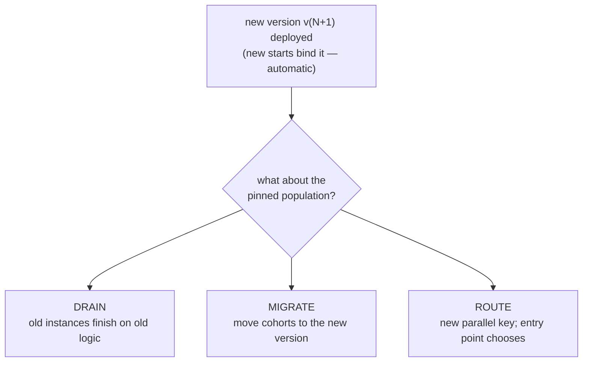

# Blue-green for processes: strategies that survive audits

> **Motto** — Stateless services cut over; stateful processes *coexist* — your real
> choices are drain, migrate, or route, and each writes a different audit story.

*Part of Phase 08 — Versioning & migration. Concept lesson — no code required.*

## The Problem

Your platform team blue-greens services: stand up green, shift traffic, kill blue,
done in an afternoon. Then they ask why the process tier can't work the same way —
and the answer is Phase 2: instances are *state with a lifespan*. A mortgage
application mid-flight is "traffic" that lasts nine months. You cannot cut it over
by flipping a load balancer; you can only decide, deliberately, which definition
each cohort of live state follows — and be able to tell an auditor, for any given
application, *which rules it ran under and why*.

## The Concept

Three strategies, all built from lesson 01's version rules and lesson 02's
migration:

| Strategy | Mechanics | Choose when | Audit story |
| :-- | :-- | :-- | :-- |
| **Drain** (default) | deploy; do nothing else; old versions empty out on their own | change is an improvement, not a correction; instance lifetimes are bounded | "policy X applied to applications started after date D" — clean cohort line |
| **Migrate** | lesson 02's ritual, usually in cohorts (validate → canary batch → rest) | old logic is *wrong* and in-flight cases must pick up the fix | "instances A…N moved to v5 on date D by change ticket T" — needs the migration log kept |
| **Route** | new *key* (`loanOriginationV2`); a start-level router (gateway, call activity, or caller config) picks per case | structural rewrites too different to map; A/B trials; per-segment rollout | two products running side by side — simplest to explain, costliest to operate (double dashboards, double fixes) |

Decision discipline that keeps this survivable:

1. **Drain is the default; justify anything else.** Migration is risk (lesson 02),
   routing is double operations. The question is never "can we move them" but "what
   breaks if we don't".
2. **Suspend is your brake, not a strategy.** A bad deploy → suspend that
   definition version (stops new starts; live instances continue) while you decide.
   Suspending *instances* freezes real customers — an incident action with a
   comms plan, not a rollout tool.
3. **Rollback = roll forward.** There is no un-deploy: v5 defective → deploy v6
   (fixed, or a copy of v4) and apply the same three-way choice to v5's brief
   population. Deleting a version with live instances is how you orphan state.
4. **The cohort line is the compliance artifact.** Whichever strategy you pick,
   the deliverable an audit accepts is a statement per application of *which
   version decided it* — lesson 01's history pinning gives you that for free
   **if** history retention (Phase 9) outlives the question.

## Ship It

This lesson ships
[`outputs/rollout-decision-guide.md`](../outputs/rollout-decision-guide.md) — the
three strategies as a decision path, plus the canary-cohort migration sequence.

## Check Yourself

**Q1.** Why doesn't service-style blue-green transfer to the process tier?

- A) engines are too slow
- B) instances are long-lived state pinned to definitions — there's no stateless "traffic" to cut over, only cohorts to drain, migrate, or route
- C) load balancers can't see BPMN
- D) it does transfer

Answer
B — the unit of rollout is the instance cohort,
not the request. Everything else in the lesson follows from that.

**Q2.** A pricing *improvement* ships mid-quarter. In-flight applications should
normally…

- A) be migrated immediately
- B) drain on the old pricing — improvements apply forward; the clean cohort line is itself worth keeping
- C) be suspended
- D) be cancelled and restarted

Answer
B — reserve migration for corrections. "Started
before D → old terms" is an audit story that writes itself.

**Q3.** v5 turns out defective an hour after deploy. First move?

- A) delete v5
- B) suspend the v5 definition (new starts stop), deploy the fix as v6, then decide drain-vs-migrate for v5's small population
- C) migrate everything to v4
- D) restart the engine

Answer
B — brake, roll forward, then cohort decision.
Deleting a version with live instances orphans them.

**Challenge.** Write the rollout plan (one page) for the capstone's "compliance
step added" scenario: strategy per cohort, the suspend trigger, the canary batch
size, and the exact sentence you'd give an auditor for an application started the
day before the deploy. Check it against the shipped decision guide.

## Related

- Next: [Backward-compatible model changes](../../04-compatibility-checklist/docs/en.md)
- The brake and the pin: [Definition versions](../../01-definition-versions/docs/en.md)
