# The history tables: audit trail vs runtime state

> **Motto** — Two table families, two jobs: `ACT_RU_*` answers "what happens next",
> `ACT_HI_*` answers "what happened" — every ops question starts by picking the right
> family.

*Part of Phase 09 — Operations & observability. Concept lesson — no code required.*

## The Problem

Phase 2 established that completed instances *vanish* from runtime tables, and every
lesson since has quietly leaned on the other side of that split: Phase 1's client
read `historic-activity-instances`, Phase 8's audit sentence depends on history
pinning, the capstone printed a timeline after the instance was gone. Time to make
the split explicit — because querying the wrong family is the most common ops
mistake ("the instance disappeared!" — no, it *completed*), and because history is
the table family that grows forever if nobody owns it (lesson 02).

## The Concept

```mermaid
flowchart LR
  subgraph ru ["ACT_RU_* — runtime (hot, small, deleted on completion)"]
    E["EXECUTION — live tokens"]
    T["TASK — open tasks only"]
    V["VARIABLE — current values"]
    J["JOB / TIMER_JOB / DEADLETTER_JOB"]
  end
  subgraph hi ["ACT_HI_* — history (append-only, grows forever)"]
    PI["PROCINST — every instance ever"]
    AI["ACTINST — every step taken"]
    TA["TASKINST — every task incl. completed"]
    VA["VARINST — final variable values"]
    ID["IDENTITYLINK — who was candidate/assignee"]
  end
  ru -- "on each commit,<br/>rows are mirrored/closed" --> hi
```

The rules of the split:

1. **Runtime is a working set, not a record.** Its size tracks *live* load only —
   which is what keeps every token operation fast (Phase 2's design bet). A row
   leaving `ACT_RU_TASK` is success, not data loss.
2. **History is written in the same transaction** as the runtime change (at the
   default history level) — the audit trail can't drift from what actually
   happened, and a rollback erases both sides together (Phase 2's boundaries apply
   to history too).
3. **Query routing is mechanical.** Open work → runtime (`/runtime/tasks`,
   `/query/tasks`). Anything involving "completed", "how long did", "who did", or a
   date range → history (`/history/...`, `/query/historic-...`). Dashboards that
   join both (throughput + backlog) make two queries, not one clever one.
4. **History is where the metrics live.** Cycle time (`START_TIME_ → END_TIME_` on
   ACTINST), SLA attainment, per-step durations, decision version per case (Phase
   8) — all history reads. Lesson 04 builds the probe on exactly these.

## Ship It

This lesson ships
[`outputs/table-families-cheatsheet.md`](../outputs/table-families-cheatsheet.md) —
the query-routing table and the "instance disappeared" triage flow.

## Check Yourself

**Q1.** An ops dashboard needs average time-to-decision for last month. Which family?

- A) runtime — it's about instances
- B) history — completed work and durations live only in ACT_HI_*
- C) both
- D) the jobs tables

Answer
B — runtime rows for those instances no longer
exist. Durations are history's whole purpose.

**Q2.** Why is history written in the same transaction as the runtime change?

- A) performance
- B) so the audit trail can never disagree with what actually committed — a rolled-back step leaves no phantom history
- C) to save connections
- D) it isn't; a nightly job copies it

Answer
B — audit integrity by construction. (Flowable's
async-history mode trades this for throughput — an explicit, documented
trade.)

**Q3.** "Instance 8801 vanished from /runtime/process-instances" most likely means…

- A) data corruption
- B) it completed (or was terminated) — check /history/historic-process-instances for its END_TIME_ and outcome
- C) the engine restarted
- D) wrong tenant

Answer
B — the triage flow on the cheat sheet: history
first, panic later.

**Challenge.** Using only history endpoints, reconstruct the capstone driver's
closing summary (timeline + final variables) for an instance that finished
yesterday — then compute one number the driver didn't: minutes spent waiting at
each user task (ACTINST start/end deltas). You've just written the seed of lesson
04's probe.

## Related

- Next: [History levels & data growth](../../02-history-levels/docs/en.md)
- The split's origin: [Phase 2, lesson 01](../../../02-the-engine-state-and-transactions/01-wait-states-and-persistence/docs/en.md)
