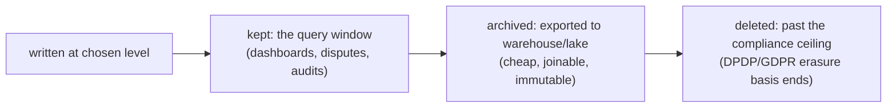

# History levels & data growth: the retention decision

> **Motto** — History is the only table family with no natural ceiling: choose what
> you record and how long you keep it *on purpose*, or the database chooses an outage
> for you.

*Part of Phase 09 — Operations & observability. Concept lesson — no code required.*

## The Problem

The Docker image and Phase 2's starter both run `history-level=full` — right for
learning, and the default nobody revisits. A loan book doing 50k applications a
month writes millions of ACTINST and VARINST rows; two years later the history
tables dwarf runtime a thousandfold, dashboards slow, backups balloon, and — the
sharp end — the DPO asks why customer PAN values sit in `ACT_HI_VARINST` seven years
past any retention basis. Recording level and retention window are one decision with
three stakeholders: ops (query speed), finance (storage), compliance (both a floor
*and* a ceiling on keeping data).

## The Concept

**Lever 1 — what gets written** (`flowable.history-level`):

| Level | Records | Honest use |
| :-- | :-- | :-- |
| `none` | nothing | pure-throughput engines where an external system owns audit |
| `activity` | instances + steps, **no variables** | metrics without payload custody — underrated for PII-heavy domains |
| `audit` (engine default) | + variable values, form properties | the usual regulated-flow answer |
| `full` | + variable *updates* (every intermediate value) | debugging, courses, never high-volume production by accident |

Two refinements before dropping a level globally: per-definition override
(`flowable:historyLevel` on the process) keeps `audit` for the loan book while the
notification workflow runs `activity`; and **transient variables** (Phase 2) plus
"store a document *reference*, not the document" solve most PII-in-history findings
without touching the level.

**Lever 2 — how long it stays.** Growth is `rate × record size × retention`, and
retention is the only lever that bounds it:

The floor comes from audit/regulatory obligations (Phase 8's audit sentence must
stay answerable); the ceiling from data-protection law — *keeping everything
forever is a compliance failure in the other direction.* Mechanically: Flowable's
built-in history-cleaning job (`flowable.enable-history-cleaning=true` +
`history-cleaning-after` window) or scheduled batch deletes by `END_TIME_` —
always end-time based, never touching open instances, always archived-before-
deleted if the warehouse is the system of record for old cases.

**The one metric:** history growth per week, plotted against the deletion job's
throughput. If ingest exceeds cleanup, the ceiling is just an outage with a date.

## Ship It

This lesson ships
[`outputs/retention-decision-guide.md`](../outputs/retention-decision-guide.md) —
the level table, the keep/archive/delete worksheet, and the PII checklist.

## Check Yourself

**Q1.** Metrics matter, but variables carry PAN/Aadhaar and an external system holds
the golden record. Best global level?

- A) full
- B) activity — timelines and durations without variable custody; references over payloads where audit needs data
- C) none
- D) audit

Answer
B — the level is a data-custody decision, not a
debugging convenience. Record what you're prepared to protect.

**Q2.** Why is retention both a floor and a ceiling?

- A) it isn't; longer is safer
- B) audit obligations set a minimum keep; data-protection law sets a maximum — past the erasure basis, keeping is the violation
- C) storage pricing
- D) the engine enforces 7 years

Answer
B — "keep everything forever" fails DPDP/GDPR
exactly the way "delete after a month" fails the auditor.

**Q3.** History cleanup jobs key on…

- A) START_TIME_
- B) END_TIME_ — only closed instances age out; an open 3-year-old mortgage keeps its full trail
- C) row count
- D) table size

Answer
B — retention clocks start at completion. Open
instances are runtime's concern, and their history must survive them.

**Challenge.** Fill the worksheet for the capstone: level per definition, keep
window, archive target, deletion basis — then compute the steady-state row count at
50k applications/month and check it against your database sizing (lesson 05). If
the number surprises you, that was the point.

## Related

- Next: [Async executor tuning](../../03-executor-tuning/docs/en.md)
- The tables being governed: [History tables](../../01-history-tables/docs/en.md)
