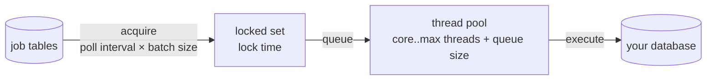

# Async executor tuning: threads, acquisition, lock times

> **Motto** — The executor has three dials — how often you look, how much you grab,
> how many hands you have — and every symptom maps to exactly one of them.

*Part of Phase 09 — Operations & observability. Builds on
[Phase 2, lesson 04](../../../02-the-engine-state-and-transactions/04-job-executor/docs/en.md).*

## The Problem

Month-end again: 20,000 timers fire in an hour, async bureau calls pile up, and
"the process is slow" tickets arrive — but *which part* is slow? Teams respond by
doubling thread pools (usually wrong) or blaming the database (sometimes right).
The Phase 2 toy executor gave you the mental model; production tuning is about
mapping symptoms onto its loop — acquire → lock → execute → settle — and knowing
which Spring Boot property moves which stage.

## The Concept

The pipeline and its dials:

| Dial | Property (`flowable.process.async-executor-*` family) | Raises when… |
| :-- | :-- | :-- |
| Poll interval | `default-async-job-acquire-wait-time` (default 10 s) | jobs sit *due but unlocked*; latency-sensitive flows want 1–5 s |
| Batch size | `max-async-jobs-due-per-acquisition` | many small jobs, acquisition round-trips dominate |
| Lock time | `async-job-lock-time` (default 5 min) | legitimate jobs run long — must exceed your **slowest** job or you get double-execution (Phase 2's lock-expiry rule) |
| Threads / queue | `max-threads` (default 8), queue capacity | threads saturated but DB has headroom |

Symptom → dial, the table you actually use during the incident:

| Symptom (from lesson 04's probe) | Diagnosis | Move |
| :-- | :-- | :-- |
| due-jobs backlog grows, threads idle | acquisition-bound | shorten poll interval, raise batch |
| threads pegged, DB CPU low | execution-bound (slow external calls in jobs) | raise threads *moderately*; better: make the slow call the async step itself with retries (Phase 4) |
| threads pegged, DB CPU high | **database-bound — the usual truth** | tune the DB (lesson 05), don't add threads that will queue on it |
| same job executes twice | lock time < job duration | raise lock time; verify handler idempotency |
| one instance's jobs serialize | `exclusive` jobs (correct default) | leave it — exclusivity prevents optimistic-lock storms (Phase 2 cheat sheet) |

Two cluster notes: acquisition contention across many nodes shows up as
optimistic-lock exceptions *in acquisition* (harmless noise at low rates, a signal
to stagger poll intervals at high rates); and scaling executor nodes multiplies
pressure on the *shared* database — which is why the third row of that table is
where most tuning journeys actually end.

## Use It

The shipped settings file —
[`outputs/application-tuned.properties`](../outputs/application-tuned.properties) —
is Phase 2's starter config with the four dials set for a mid-volume fintech
workload and each choice annotated. Apply it, then *prove* a change helped: replay
the month-end burst (the capstone driver in a loop), watching due-job count and
job age from lesson 04's probe before and after. Untested tuning is superstition
with YAML.

## Ship It

This lesson ships
[`outputs/application-tuned.properties`](../outputs/application-tuned.properties) —
annotated executor settings you can diff against your own, plus the symptom→dial
table above for the incident channel.

## Check Yourself

**Q1.** Due jobs pile up; executor threads are mostly idle. First dial?

- A) more threads
- B) acquisition — shorten the poll interval and/or raise the acquisition batch
- C) lock time
- D) bigger database

Answer
B — idle threads mean work isn't *reaching* them.
Threads fix execution pressure, not acquisition lag.

**Q2.** A bureau-call job occasionally runs 7 minutes; lock time is 5. The symptom
you'll see is…

- A) nothing; locks auto-extend
- B) the job executing twice — the lock expires mid-run and another node acquires it
- C) a dead letter
- D) a deadlock

Answer
B — Phase 2's crash-recovery mechanism firing on
a job that wasn't dead, merely slow. Lock time must exceed the slowest legitimate
job.

**Q3.** Threads pegged *and* database CPU pegged. Adding executor threads will…

- A) fix it
- B) make it worse — more concurrent transactions against the real bottleneck
- C) do nothing
- D) reduce DB load

Answer
B — the executor is a client of the DB. When the
DB is the constraint, lesson 05 is the tuning guide, not this one.

**Challenge.** Break the lock rule on purpose in the Phase 2 toy executor: set
`LOCK_SECONDS` below a sleeping job's duration, run two nodes, and watch the
double-execution. Then write the one-line monitoring rule that would have caught
it in production (hint: same job id completing twice within lock-time × 2).

## Related

- Next: [Metrics & health](../../04-metrics-and-health/docs/en.md)
- The loop being tuned: [Phase 2, lesson 04](../../../02-the-engine-state-and-transactions/04-job-executor/docs/en.md)
