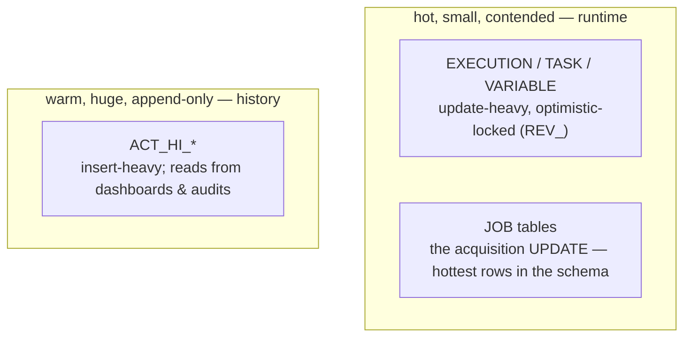

# The database is the engine: sizing, indexes, cleanup jobs

> **Motto** — Every engine promise from Phase 2 onward is a database behaviour in
> costume: treat the schema as the production system, because it is one.

*Part of Phase 09 — Operations & observability. Concept lesson — no code required.
Closes the loop opened by
[Principle 3](../../../../foundations/process-automation-principles.md).*

## The Problem

Phase 2 made the design bet explicit — state lives in the database — and this whole
course has been cashing cheques against it: wait states are rows, clustering is a
shared schema, jobs are guarded UPDATEs, history is an append-only ledger. The bill
arrives in production: the engine's ceiling *is* the database's ceiling, and most
"Flowable is slow" incidents are database incidents wearing a workflow costume.
Executor tuning already hit this wall (lesson 03's third row); this lesson is what's
on the other side of it.

## The Concept

Where the load actually lands:

The operational rules, each traceable to a lesson:

1. **Size for history, tune for runtime.** Runtime stays proportional to live load
   (Phase 2's delete-on-complete); history grows at `rate × level × retention`
   (lesson 02's formula — the worksheet's steady-state number is your sizing
   input). Disk planning is a history conversation; latency planning is a runtime
   one.
2. **Index for *your* queries, on history.** The engine ships correct indexes for
   its own runtime access paths — don't touch those. Your custom load is dashboard
   and audit queries on history (`ACT_HI_PROCINST(END_TIME_)` for cleanup,
   `ACT_HI_ACTINST(PROC_INST_ID_, ACT_ID_)` for timelines, business-key lookups) —
   profile them like any application query and index accordingly.
3. **Contention is a design smell before it's a DB problem.** Optimistic-lock
   exceptions on EXECUTION usually mean parallel branches hammering shared state —
   the fix is Phase 2's `exclusive` default or restructuring the model, not
   `SELECT FOR UPDATE`. Job-acquisition contention across nodes → lesson 03's
   stagger, not row-lock hints.
4. **Cleanup jobs are production workloads.** Lesson 02's retention deletes and
   Phase 8's dead-version pruning run *inside* business hours' blast radius:
   batch them (bounded deletes), schedule off-peak, watch replication lag, and
   reconcile archive counts before every delete. A runaway cleanup job has taken
   down more engines than any traffic spike.
5. **Backups must be schema-consistent.** Runtime and history describe the same
   instances (lesson 01's same-transaction rule); restoring them to different
   points in time manufactures instances whose past disagrees with their present.
   One database, one snapshot, one restore point — and a quarterly restore drill
   that replays the capstone against the restored copy.

## Ship It

This lesson ships
[`outputs/database-runbook.md`](../outputs/database-runbook.md) — sizing worksheet,
the index guidance, cleanup-job guardrails, and the restore drill — closing Phase
9: what the tables mean (01), how big they get (02), how fast they're worked (03),
what to watch (04), and how to keep the whole thing alive (05).

## Check Yourself

**Q1.** "Flowable is slow" during month-end. The first dashboard to open is…

- A) JVM heap
- B) the database's — runtime-table latency and lock waits; the engine is a client of its schema (lesson 03's third row)
- C) the BPMN modeler
- D) network

Answer
B — Principle 3 in incident form. Most engine
slowness is database pressure with a workflow label.

**Q2.** Which tables get *your* custom indexes?

- A) ACT_RU_EXECUTION — it's the hottest
- B) history tables, for your dashboard/audit query shapes — runtime indexes are the engine's own, tuned for its access paths
- C) all of them, defensively
- D) none ever

Answer
B — you own the history query load; the engine
owns runtime access. Adding runtime indexes also taxes every token write.

**Q3.** Restoring runtime from Monday's backup and history from Sunday's produces…

- A) a working engine minus a day of reports
- B) instances whose audit trail contradicts their live state — the same-transaction guarantee broken retroactively
- C) automatic reconciliation
- D) a startup error

Answer
B — consistency between the families exists only
inside one snapshot. Split restores forge history.

**Challenge.** Fill the runbook's sizing worksheet with lesson 02's steady-state
number, then run the restore drill against the local Docker engine: snapshot the
DB mid-capstone-run, destroy the container, restore, and verify the parked
instance resumes (Phase 2, lesson 01's promise — now *your* procedure, not the
course's claim).

## Related

- Phase README: [Operations & observability](../../README.md)
- The bet being operated: [Phase 2, lesson 01](../../../02-the-engine-state-and-transactions/01-wait-states-and-persistence/docs/en.md)
