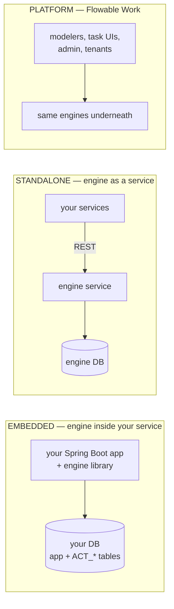

# Embedded vs standalone vs Flowable Work: deployment topologies

> **Motto** — Topology decides three things forever after: whose transaction the
> engine joins, who can call it, and who gets paged — choose it before the first
> model, not after the fiftieth.

*Part of Phase 10 — Architecture & product decisions. Concept lesson — no code
required. You've already *run* two of these: standalone in Phase 1, embedded in
Phase 2, lesson 05.*

## The Problem

Phase 2's comparison table settled the mechanics; what's left is the organisational
decision, and it's stickier than any technical one: topology fixes team boundaries
(who owns models, who owns the engine), failure domains (whose outage is a workflow
outage), and upgrade politics (who schedules engine bumps). Teams that let topology
happen by accident — usually "embedded, because the tutorial was" — discover the
real constraints at the worst time: the second team wants in.

## The Concept

The decision table, with the rows that actually decide it on top:

| | Embedded | Standalone | Flowable Work |
| :-- | :-- | :-- | :-- |
| **Transactions** | joins yours — domain writes + token moves commit atomically (Ph. 2.05) | two systems; you engineer consistency | standalone's model |
| **Who can call it** | that JVM only | anything speaking HTTP | anything + shipped UIs |
| **Failure/paging domain** | your service *is* the engine | engine team owns a platform | vendor-supported platform |
| **Model ownership** | the owning team's repo | central repo/registry, review gates | Design's model repository |
| **Second-team cost** | a second engine+schema, or awkward sharing | near zero — that's the point | near zero |
| **Fits** | one product team, JVM, atomicity-critical (the capstone's natural home) | multi-team / polyglot platform play | buy-the-UIs decision (lesson 05) |

Rules of thumb that survive re-orgs:

1. **Count the teams, then decide.** One team, one JVM product → embedded, and
   enjoy the atomic commits. The moment a *second* team needs processes, embedded
   forks into engine-per-service (fine! separate schemas, separate upgrades) or
   flips standalone — decide which *before* the second team arrives.
2. **Never share one embedded engine's schema across services.** It welds their
   deploys, upgrades, and incidents together — the worst of both topologies. The
   platform team you'd need to referee it is the sign you wanted standalone.
3. **Standalone's perimeter rule is absolute** (Phase 3.03): the engine API is an
   admin surface; it sits behind your services, never exposed to end clients.
4. **Mixed is legitimate at scale:** core products embed for atomicity; long-tail
   departmental flows share a standalone engine; Work enters if the UI/velocity
   trade (lesson 05) says buy.

## Ship It

This lesson ships
[`outputs/topology-decision-guide.md`](../outputs/topology-decision-guide.md) —
the table plus the team-count decision path.

## Check Yourself

**Q1.** The strongest *technical* argument for embedded is…

- A) fewer containers
- B) the engine joins your transaction — token moves and domain writes commit or roll back together (Phase 2's rules span your tables)
- C) faster REST
- D) no license

Answer
B — atomicity is the one property no glue code
fully recovers once you split the transaction.

**Q2.** Three product teams (one in Node) want workflows. The topology
conversation is really about…

- A) JSON serialization
- B) standing up standalone (or engine-per-JVM-team) — embedded can't serve the Node team, and sharing one embedded schema welds teams together
- C) rewriting in Java
- D) buying licenses

Answer
B — team count and language mix are the real
inputs; rule 2 forbids the tempting shortcut.

**Q3.** Flowable Work changes the topology question by…

- A) removing the engine
- B) adding shipped modelers/task UIs/admin on top of the standalone shape — it's a buy-the-UIs decision, not a new runtime model
- C) requiring Kubernetes
- D) making everything embedded

Answer
B — the engines underneath are the ones you
learned; lesson 05 prices the layer above them.

**Challenge.** Write the topology one-pager for your own organisation: team count
today and in 18 months, language mix, the flows where atomicity is
non-negotiable, and which rule of thumb bites first. If the answer is "mixed",
name the boundary line explicitly.

## Related

- Next: [Multi-tenancy](../../02-multi-tenancy/docs/en.md)
- The mechanics you already ran: [Phase 2, lesson 05](../../../02-the-engine-state-and-transactions/05-embedded-engine-spring-boot/docs/en.md)
