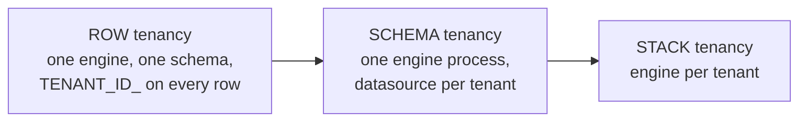

# Multi-tenancy: shared engine, shared tables, or neither

> **Motto** — Tenancy is an isolation-vs-cost dial with three stops — a tag column,
> a schema, or an engine — and regulation, not architecture taste, usually picks the
> stop.

*Part of Phase 10 — Architecture & product decisions. Concept lesson — no code
required.*

## The Problem

The platform works; now the second brand, the second country, or the second
*bank partner* wants onboarding onto it. "Just add a tenant column" and "give
everyone their own stack" are both real answers with order-of-magnitude cost
differences — and the wrong pick surfaces late, as either an auditor's finding
("partner A's ops can query partner B's loans") or a finance finding ("we run
forty engines at 2% utilisation"). Flowable supports three stops on the dial;
the work is knowing which failure you're buying.

## The Concept

| | Row (tenant ID) | Schema per tenant | Stack per tenant |
| :-- | :-- | :-- | :-- |
| Isolation | logical only — every query must carry the tenant filter | hard at the data layer | hard everywhere |
| Blast radius | shared: one bad deploy/tenant storm hits all | shared compute, isolated data | none shared |
| Cost & ops | one of everything (cheapest) | one engine, N databases | N × Phase 9 |
| Per-tenant versions/models | shared definitions, or per-tenant deployments by tag | naturally per-tenant | trivially per-tenant |
| Fits | many small tenants, same product, no data-residency walls | regulated partners, residency, "your data in your database" contracts | few, large, paranoid tenants; different countries' stacks |

Flowable mechanics for the first stop, because it's the one with sharp edges:
deployments, definitions, instances, tasks, and jobs all carry a **tenant ID** —
set at deployment (`.tenantId("partnerA")`) and start time, filterable in every
query (`taskCandidateGroupIn(...).taskTenantId("partnerA")`). The same key can be
deployed per tenant with different versions — partner-specific process variants
without forking the platform.

The rules that keep each stop safe:

1. **Row tenancy stands or falls at the API layer.** The engine *stores* tenant
   IDs; it doesn't *enforce* them. Your perimeter (Phase 3.03's claims mapping —
   tenant comes from the token, never the request body) must inject the tenant
   filter into every query and command. One missed filter is a cross-tenant leak;
   make it structurally impossible (a wrapper client, not a code-review rule).
2. **Shared definitions vs per-tenant definitions is a product decision.** One
   shared model = one upgrade, tenants move together (Phase 8 cohorts get a
   tenant dimension). Per-tenant deployments = variants allowed, N migration
   projects. Pick per *process*, not platform-wide.
3. **Ops signals need the tenant dimension early.** Phase 9's probe per tenant —
   one tenant's dead-letter storm or pool depth must be attributable, or the
   noisy tenant hides inside platform averages until they're everyone's problem.
4. **Residency trumps elegance.** "Partner data stays in partner's database /
   country" ends the row-tenancy conversation regardless of cost — that's the
   schema or stack stop, by contract.

## Ship It

This lesson ships
[`outputs/tenancy-decision-guide.md`](../outputs/tenancy-decision-guide.md) — the
dial, the enforcement checklist for row tenancy, and the residency triggers.

## Check Yourself

**Q1.** Row tenancy's isolation is enforced by…

- A) the engine, automatically
- B) your API layer injecting the tenant (from token claims) into every query and command — the engine stores the tag, you enforce it
- C) the database
- D) the modeler

Answer
B — the perimeter owns tenancy exactly as it
owns identity (Phase 3.03). Structural enforcement beats vigilance.

**Q2.** A partner contract requires "our workflow data in our own database, in our
country". The dial stop is…

- A) row — add an index
- B) schema-per-tenant at minimum, stack if the runtime must be resident too — residency clauses end the shared-tables option
- C) encryption
- D) negotiable

Answer
B — rule 4. Contracts and regulators pick this
stop; architecture just prices it.

**Q3.** Deploying `loanOrigination` separately per tenant buys… at the cost of…

- A) nothing / nothing
- B) per-partner process variants / N versioning-and-migration projects instead of one (Phase 8, multiplied)
- C) speed / memory
- D) isolation / licenses

Answer
B — variant freedom is real product value; its
price is every Phase 8 discipline times N. Choose per process.

**Challenge.** Take the capstone platform and onboard two hypothetical tenants: a
sister brand (same product, same country) and a bank partner (residency clause,
custom review step). Place each on the dial, list the enforcement mechanics for
the first and the migration-cost line for the second — you'll usually land on two
*different* stops, which is the mixed-tenancy reality most platforms run.

## Related

- Next: [Where the process ends and the domain begins](../../03-process-domain-boundary/docs/en.md)
- The perimeter that enforces it: [Phase 3, lesson 03](../../../03-user-tasks-identity-and-forms/03-identity-management/docs/en.md)
