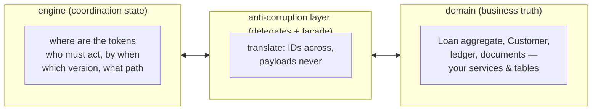

# Where the process ends and the domain begins: anti-corruption

> **Motto** — The engine owns *coordination state*; your domain owns *business
> truth* — the day a core service reads `ACT_RU_VARIABLE` for an answer, the
> boundary is gone and the engine has become your database.

*Part of Phase 10 — Architecture & product decisions. Concept lesson — no code
required. Concept reading:
[Principle 6](../../../../foundations/process-automation-principles.md).*

## The Problem

Engines are seductive state stores: variables persist, history remembers, the API
queries nicely. So the slide begins — the loan amount lives only as a process
variable; the mobile app renders account state from the task list; reporting joins
`ACT_HI_VARINST` for revenue numbers. Eighteen months later the "workflow engine"
is the system of record for a loan book, Phase 9's retention decision has become a
data-loss decision, and replacing or even upgrading the engine means migrating
your *business data*. Every BPM veteran has seen this exact failure; it has a
boundary-shaped cure.

## The Concept

Two kinds of state, and the translation layer between them:

The four boundary rules:

1. **Variables carry references, not truth.** `loanId`, `applicationId`, a
   `score` the flow routes on — yes. The loan's amount, rate schedule, customer
   PII as the *only* copy — never. (Phases 2.02 and 9.02 gave the tactical
   reasons — size, PII custody; this is the strategic one: variables are
   coordination scratchpad, and their retention clock must be allowed to run
   out.)
2. **The translation lives in the delegates.** Phase 4's delegates and HTTP
   tasks are the anti-corruption layer: they call *domain APIs* and write back
   the minimal routing facts. A delegate reaching around its service to UPDATE
   domain tables directly has smuggled domain logic into the engine's
   transaction — convenient (Phase 2.05's atomicity!) and corrosive, because now
   the domain's invariants are enforced from two places.
3. **Queries cross the boundary in one direction each.** "What must Asha do
   today?" → engine (tasks, Phase 3). "What is loan L-401's balance?" → domain.
   The app that renders *loan state* from *task state* has inverted the arrow —
   tasks say what's pending, never what's true.
4. **History is *process* audit, not business reporting.** "Who approved, when,
   under which version" → `ACT_HI_*` (Phases 8, 9). Revenue, portfolio, NPA
   reporting → domain events into your warehouse. The test: if Phase 9's
   retention job deleting a row would lose business truth, that truth was in the
   wrong store.

The payoff for holding the line: engines become *replaceable* (the Phase 0
landscape evaluation stays a real option forever), retention stays a compliance
dial rather than a data-loss risk, and domain services stay testable without a
running engine — which is also what keeps model changes (Phase 8) cheap, because
models orchestrate stable APIs instead of touching schemas.

## Ship It

This lesson ships
[`outputs/boundary-review-guide.md`](../outputs/boundary-review-guide.md) — the
four rules as a review checklist, with the smell table for model and code review.

## Check Yourself

**Q1.** The mobile app shows loan status derived from the engine's open tasks.
The violation is…

- A) performance
- B) rule 3 inverted — task state says what's *pending*, not what's *true*; status belongs to the domain, which the process updates via delegates
- C) security
- D) none; that's what tasks are for

Answer
B — the classic slide. The day the task list
renders customer-facing truth, the engine has become the system of
record.

**Q2.** A delegate updates the `loans` table directly instead of calling the loan
service, "for atomicity". The cost is…

- A) none — Phase 2.05 blesses it
- B) domain invariants now enforced from two places; the loan service can no longer guarantee its own aggregate — atomicity was real, the boundary casualty too
- C) slower commits
- D) licensing

Answer
B — embedded atomicity (2.05) is for *your
service's own* writes. Reaching into another service's tables through the engine
is the corruption the layer is named for.

**Q3.** The test for "is this data in the wrong store" is…

- A) row count
- B) would Phase 9's retention deletion lose business truth? If yes, it was coordination-store data holding domain truth
- C) column type
- D) query speed

Answer
B — retention is the boundary's enforcement
mechanism: coordination state must be *allowed* to expire.

**Challenge.** Audit the capstone against the four rules: list every variable and
tag it reference/routing-fact/truth. (`decision` and `rate` are the interesting
ones — routing facts the *domain must also record* via the disburse delegate.)
Then write the one-sentence answer to "why doesn't reporting query ACT_HI_
directly?" for your data team.

## Related

- Next: [Build vs buy vs open source](../../04-build-vs-buy/docs/en.md)
- The tactical halves: [Phase 2, lesson 02](../../../02-the-engine-state-and-transactions/02-process-variables/docs/en.md) · [Phase 9, lesson 02](../../../09-operations-and-observability/02-history-levels/docs/en.md)
