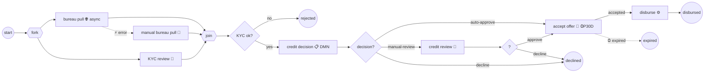

# Capstone 01 — The process model: application → decision → offer → disbursal

> **Motto** — Nothing in this model is new; the capstone is the proof that the pieces
> compose.

*Part of Phase 11 — Capstone. Combines Phases 1, 3, 4, 7.*

## The Project

One process —
[`outputs/loan-origination.bpmn20.xml`](../outputs/loan-origination.bpmn20.xml) —
carrying a loan application from arrival to disbursal, decline, or expiry:



Every element cites its lesson:

| Element | Built in |
| :-- | :-- |
| parallel fork/join over bureau + KYC | Phase 1, lesson 02 |
| async HTTP bureau task, failure → BPMN error → manual fallback | Phase 4, lessons 02/04; Phase 2, lesson 03 |
| candidate groups + form properties on every human task | Phase 3, lessons 02/04 |
| `flowable:type="dmn"` decision task, gateway routing on `${decision}` | Phase 5, lesson 03 |
| interrupting offer-expiry timer, duration from `${offerValidity}` | Phase 7, lesson 01 |

Three composition decisions worth defending in review:

1. **The bureau task is async** (`flowable:async="true"`): a third-party call must
   not hold the start transaction hostage, and retries come free (Phase 2's rules).
   Its *error* path is a designed fallback, not an incident.
2. **KYC gate before the decision task** — no point pricing a file that fails KYC;
   ordering checks by cost/kill-probability is process design, not engine mechanics.
3. **Offer validity is a variable**, not a literal `P30D` — the value can migrate
   into the DMN table later without touching the model (Phase 5's governance
   boundary).

## Verify It

```bash
python3 - <<'PY'
import xml.dom.minidom; xml.dom.minidom.parse(
  "flowable/phases/11-capstone-loan-origination/01-process-model/outputs/loan-origination.bpmn20.xml")
print("well-formed")
PY
```

Then deploy and run it — that's [lesson 03](../../03-the-driver/docs/en.md); the
decision table it references is [lesson 02](../../02-credit-decision-table/docs/en.md).

**Challenge.** Add the two Phase 7 event subprocesses from
[lesson 7.05](../../../07-events-timers-and-messaging/05-event-subprocesses/docs/en.md)
— interrupting `customerWithdrawal`, non-interrupting weekly nudge — and re-verify.
The diff should be purely additive: that's the composition property working.
