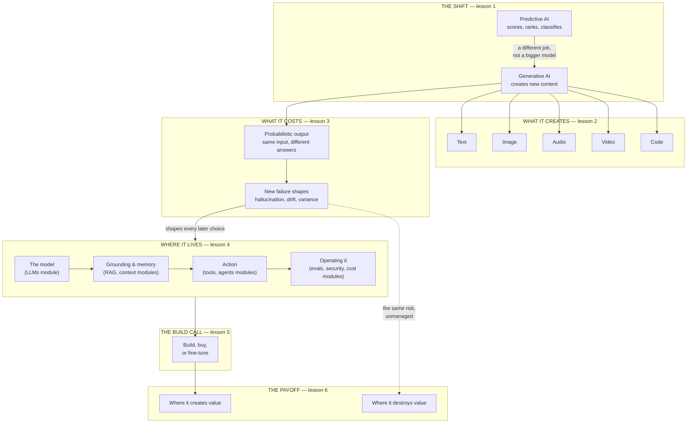

# Generative AI: the big picture

*The first module of the Generative AI family.*

Generative AI is software that creates new content instead of only analyzing existing
content. A traditional model scores, ranks, or sorts. A generative model writes an email,
draws an image, or writes code. This shift is not a small feature upgrade. It changes what
software can do, and it changes how software fails.

This module is the map. It teaches what makes a model "generative," the five modalities
it can work in, why generative output is probabilistic and what that costs a product team,
where generative AI fits in your stack, when to build versus buy versus fine-tune, and
where the technology creates real value and where it quietly destroys it. Every later
module in this family — LLMs, RAG, agents, evaluation, security, cost — is a deeper look
at one piece of the picture this module draws first.

## The knowledge graph

Generative AI is not one technology. It is a shift in what software does, with
consequences that spread through the whole stack. Every lesson in this module hangs off
this picture:

Read it in three passes. **The shift**: generative AI is a different job from predictive
AI, not a bigger version of it. **The cost**: because output is probabilistic, every
system built on it inherits a new class of failure — and that risk is what the rest of the
family exists to manage. **The stack and the call**: the model sits inside a larger
system — grounding, action, and operations — and every product leader has to decide how
much of that system to build, buy, or fine-tune, knowing where the payoff and the danger
both live.

## The lessons

- [**What makes AI "generative"?**](./what-is-generative-ai.md) — predictive versus
  generative AI, and the test for which one your product actually needs.
- [**The five modalities**](./the-modalities.md) — text, image, audio, video, and code,
  and what changes when a model creates each one.
- [**Probabilistic software**](./probabilistic-software.md) — what it costs a product
  team when the same input can produce a different output.
- [**The generative AI product stack**](./the-genai-product-stack.md) — a map from the
  model to the running product, and where each later module in this family fits.
- [**Build, buy, or fine-tune**](./build-buy-or-fine-tune.md) — the three ways to get
  generative AI into your product, and how to choose at altitude.
- [**Where generative AI creates and destroys value**](./where-value-is-created-and-destroyed.md)
  — the honest pattern behind the wins and the write-offs.

Each lesson pairs the mechanics with a **🎯 For the product leader** briefing — why it
matters, the decision it changes, the question to ask your team, and the risk if ignored —
plus a diagram. Where a lesson touches deeper mechanics, it links to the module that
covers them in full: [RAG & vector databases](../rag-vector-databases/README.md) for
grounding a model in real data, and [Agentic AI](../agentic-ai/README.md) for the loop
that turns a model into something that acts.

**📌 Close out the module:** [Recap & real-world examples](./recap.md).
