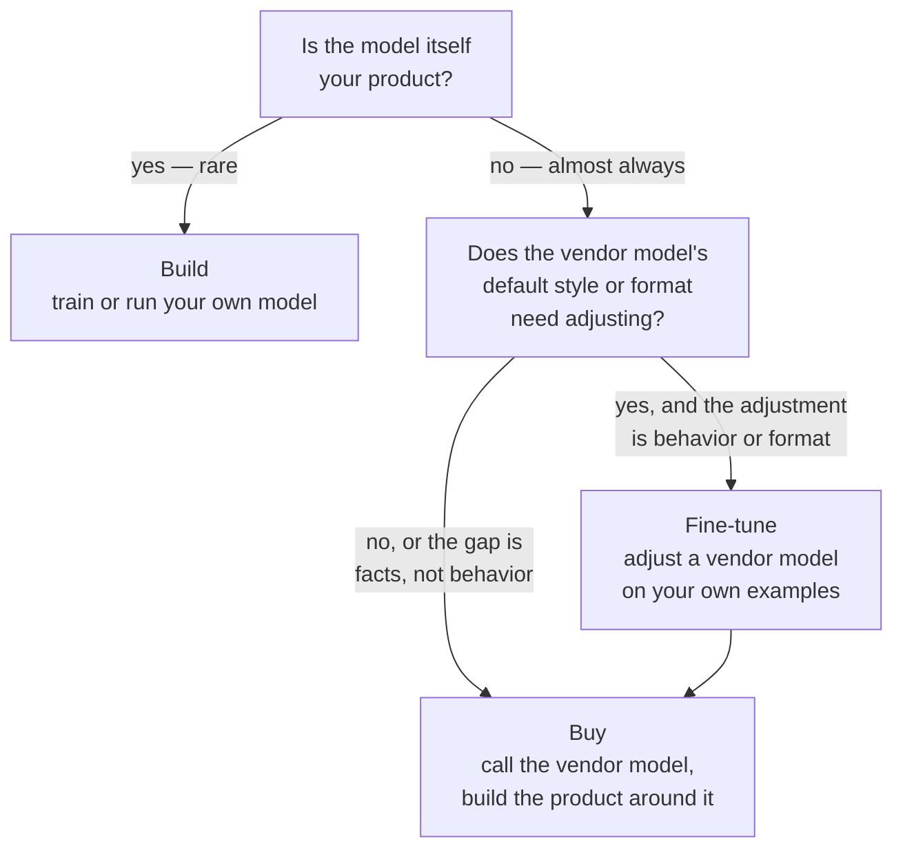

# Build, buy, or fine-tune

*Part of [Generative AI: the big picture](./README.md)*

## TL;DR

Every generative AI product decision comes back to one question at the top: how much of
this do we build ourselves, how much do we buy, and how much do we adjust through
fine-tuning? **Build** means training or running your own model — rare, expensive, and
justified only when the model itself is your product. **Buy** means calling a vendor's
model through an API and building your product around it — the default for almost every
team, because the model is a commodity input, not a differentiator. **Fine-tune** sits
between the two: you start from someone else's model and adjust it on your own examples,
usually to fix a style, a format, or a narrow skill, never to teach it new facts. Most
teams should buy the model and spend their real engineering effort on the layers around it
— grounding, action, and operations — because that is where the actual product gets built.

> 🎯 **For the product leader**
>
> **Why it matters** — Training your own model sounds like ownership and control, but it
> is usually the most expensive, slowest way to compete on a layer that is not where your
> product wins. Most teams that "build" end up rebuilding what a vendor already sells,
> at a fraction of the quality, for a much higher price.
>
> **What it changes in your decisions** — You default to buy, and you treat build and
> fine-tune as the exception that needs a specific justification, not the other way
> around.
>
> **Ask yourself** — *"Is the model itself our product, or is our product the system we
> build around a model someone else already trained?"*
>
> **Risk if ignored** — A team spends a year and a large budget training a model that
> ends up behind the next vendor release, while a competitor who bought the model and
> built the product around it shipped months earlier.

## The mental model: the engine, the workshop, and the tune-up

Buying a model is like buying a car engine from a manufacturer who has spent billions
perfecting it. Building your own model is like building an engine from raw metal in your
own workshop — possible, but only worth it if engines are your business. Fine-tuning is
like a tune-up: you keep the manufacturer's engine, and you adjust it for your specific
driving conditions.

## The three options, compared

| | Build | Fine-tune | Buy |
| --- | --- | --- | --- |
| What you get | Your own model, trained from scratch or from a base | A vendor's model, adjusted on your examples | A vendor's model, used as-is through an API |
| Right when | The model itself is your core product, and you have the data and budget to justify it | You need to change behavior, style, or format — never to teach new facts | Almost every product: the model is an input, not your differentiator |
| Cost shape | Very high, ongoing — training runs, infrastructure, a research team | Moderate, one-time per version — a training job plus data preparation | Pay-per-use, scales with usage |
| Speed to market | Slowest — months to years before a usable model exists | Moderate — days to weeks, once you have good examples | Fastest — an API call away |
| The catch | Vendor models improve constantly; a model you trained a year ago is likely behind today's default | Facts baked in this way go stale and cannot be cited — pair with retrieval for anything that changes | You depend on a vendor's pricing, availability, and policy changes |

## Why "buy" wins by default

Frontier model vendors spend enormous budgets and employ large research teams to make
their models better every few months. A team training its own model is competing against
that pace with a fraction of the resources, on a task — general-purpose generation — that
is rarely the actual product a customer pays for. The customer pays for the problem your
product solves, not for which model answers it. Buying the model and spending your budget
on grounding, action, and operations — the layers covered in the [product stack
lesson](./the-genai-product-stack.md) — is almost always the better use of a limited
budget.

## When build or fine-tune actually make sense

Build is justified when the model's behavior, cost structure, or data handling is the
product itself — a company selling a specialized model to other companies, for example, or
one bound by regulation to keep training data fully in-house. Fine-tune is justified when
a vendor model's default tone, format, or narrow skill does not fit your use case closely
enough, and you have enough well-labeled examples to teach the adjustment reliably. Both
are real, valid choices. They are just not the default, and a team should be able to state
plainly why this feature is the exception before committing the extra cost and time.

## Failure modes

- **Building for control that buying already gives you** — training a model because
  "we want to own our AI," when a vendor's terms already give you the control that
  actually matters, like data handling and usage rights.
- **Fine-tuning to teach facts** — using fine-tuning to bake in a knowledge base that goes
  stale on the next update and can never be cited, when retrieval was the right tool.
- **Buying without a fallback plan** — depending entirely on one vendor's model, with no
  plan for a price increase, a policy change, or an outage.
- **Skipping the justification step** — choosing build or fine-tune out of habit or
  preference, without a clear answer to why buy alone would not work.

## Practitioner checklist

- [ ] Have we stated plainly why buy alone would not meet this feature's needs, before
      committing to build or fine-tune?
- [ ] If we are fine-tuning, is the goal behavior, style, or format — never facts that
      will change?
- [ ] If we are building, is the model itself genuinely our product, with the budget and
      team to keep pace with vendor releases?
- [ ] Do we have a fallback plan if our chosen vendor changes price, availability, or
      policy?

## Related lessons

- [The generative AI product stack](./the-genai-product-stack.md) — where the real
  engineering effort goes once you have bought the model.
- [RAG vs. long-context vs. fine-tuning](../rag-vector-databases/rag-vs-long-context-vs-finetuning.md)
  — the same choice, applied specifically to grounding a model in facts.
- [Fine-tuning vs. ICL vs. RAG vs. distillation](../content/06-strategy-tradeoffs/finetune-vs-icl-vs-rag.md)
  — the engineering-depth spoke on this tradeoff.
