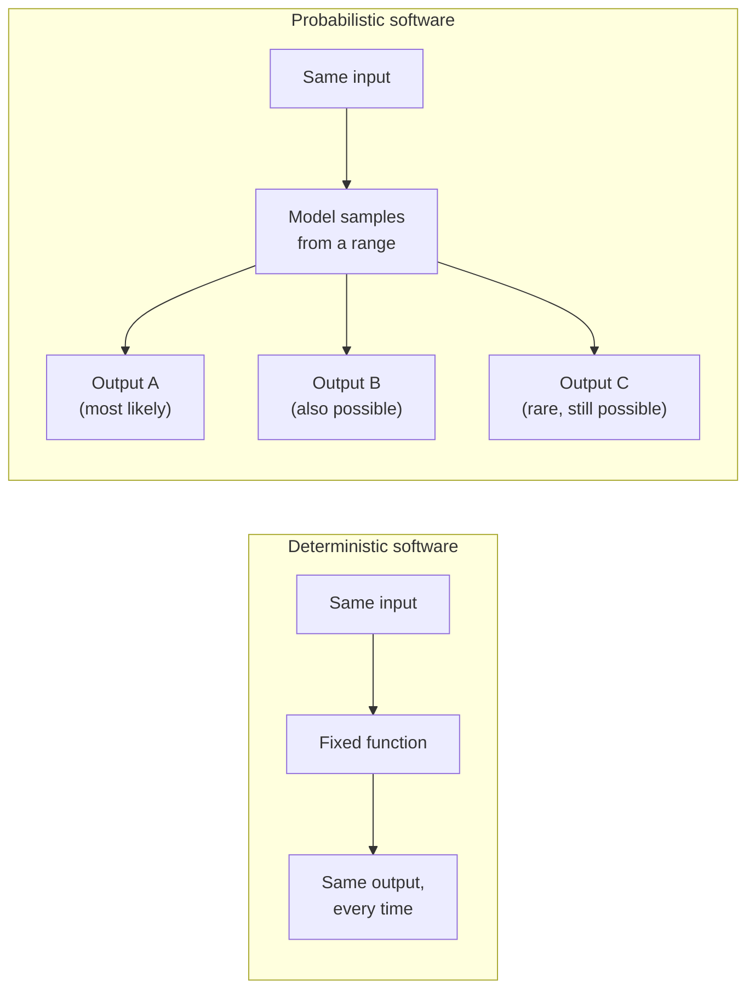

# Probabilistic software

*Part of [Generative AI: the big picture](./README.md)*

## TL;DR

Traditional software is deterministic. The same input always produces the same output, and
a bug is a bug you can reproduce on demand. Generative AI is **probabilistic**. The same
input can produce a different output each time you run it, because the model samples from
a range of likely answers instead of computing one fixed result. This is not a defect to
be patched away. It is how the technology works, and it is the single biggest mental shift
a product team has to make. Once output is probabilistic, "it worked in testing" stops
meaning "it will always work." A feature can be right ninety-nine times and wrong on the
hundredth, with no code change in between. Every later module in this family — evaluation,
observability, guardrails — exists because of this one property.

> 🎯 **For the product leader**
>
> **Why it matters** — Engineering teams, QA teams, and support teams all learned their
> craft on deterministic software. Ship a generative feature without naming this shift, and
> every team downstream will treat a normal, expected variation as a bug to be fixed once
> and closed.
>
> **What it changes in your decisions** — You stop asking "does it work?" as a yes-or-no
> question. You start asking "how often does it work, on what kind of input, and what
> happens on the times it doesn't?" That reframing changes your test plan, your support
> playbook, and your launch bar.
>
> **Ask yourself** — *"If we ran this exact request one hundred times, what is the
> acceptable range of outcomes, and have we actually measured that range?"*
>
> **Risk if ignored** — A demo that worked perfectly convinces a stakeholder the feature is
> "done," and the team discovers the real failure rate only after launch, from angry users.

## The mental model: a die, not a switch

A traditional function is a switch. Flip it the same way, and the same thing happens every
time. A generative model is closer to a loaded die. It leans heavily toward likely,
sensible answers, and it can still land somewhere else. Ask it the same question twice, and
you are rolling the die twice, not flipping the same switch twice.

This does not mean the model is random in a useless way. Good answers are far more likely
than bad ones, and a well-built system biases the die further toward good answers. But
"far more likely" is not "always," and the gap between those two words is where most
production incidents live.

## Where the variation comes from

- **Sampling.** Most generative models pick each next piece of output from a probability
  distribution, not the single most likely choice every time. This is often deliberate: it
  makes writing feel natural instead of robotic, and it lets the same model produce many
  different, valid answers to an open-ended request.
- **Context sensitivity.** A tiny change in the input — a rephrased question, an extra
  sentence of history, a different time of day in a system prompt — can shift the output
  in ways that feel disproportionate to the size of the change.
- **Model updates.** A vendor's model can change behavior after an update you did not ask
  for, even when your own prompt has not changed. Behavior you tested against last month
  may not hold this month.

## What this costs a product team

Determinism let teams write a test once and trust it forever. Probabilistic output breaks
that assumption in three concrete ways:

- **Testing shifts from checking to measuring.** A single passing test proves almost
  nothing. You need a set of test cases, run repeatedly, with a measured pass rate — the
  discipline covered in the evaluation module later in this family.
- **Support shifts from "reproduce the bug" to "read the pattern."** A user reporting "it
  gave me a wrong answer" cannot always be reproduced on the same input, because the next
  run might succeed. Support has to look for patterns across many reports, not a single
  reproducible case.
- **Trust has to be built at the system level, not the model level.** Because no single
  response can be guaranteed correct, the system around the model — checks, fallbacks,
  human review — has to carry the weight that a deterministic function used to carry alone.

## Failure modes

- **"It worked in the demo"** — treating one successful run as proof the feature is ready,
  instead of measuring a pass rate across many runs and many inputs.
- **Chasing a single bad output as a bug to fix once** — spending engineering time trying
  to reproduce and patch one bad response, when the real fix is lowering the overall rate
  of bad responses across the whole input space.
- **No plan for the unlucky roll** — shipping a feature with no fallback, no review step,
  and no way to catch the response that lands outside the expected range.
- **Assuming stability across vendor updates** — building a system that quietly depends on
  today's exact model behavior, with no test suite to catch a change after an update.

## Practitioner checklist

- [ ] Have we measured a pass rate across many runs and many inputs, not just watched one
      successful demo?
- [ ] Does our test suite run repeatedly and report a rate, instead of a single pass or
      fail?
- [ ] Do we have a plan for the response that lands outside the expected range — a
      fallback, a review step, or a way to catch it before a user sees it?
- [ ] Does support know to look for a pattern across reports, instead of trying to
      reproduce one exact case?
- [ ] Do we re-run our test suite after a model update, instead of assuming past behavior
      still holds?

## Related lessons

- [What makes AI "generative"?](./what-is-generative-ai.md) — why this variability exists
  in the first place.
- [Evals](../content/04-evals-observability/evals.md) — turning "it feels off" into a
  measured rate.
- [Guardrails](../content/05-safety-multitenancy/safety-engineering.md) — catching the
  response that lands outside the expected range before a user sees it.
