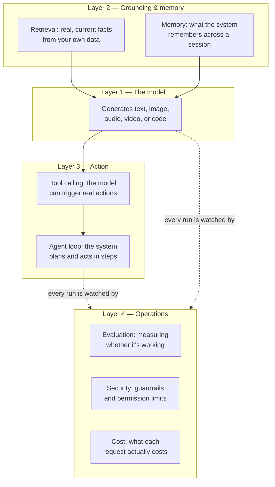

# The generative AI product stack

*Part of [Generative AI: the big picture](./README.md)*

## TL;DR

A generative AI feature is never just a model. The model is one layer inside a stack that
runs from raw request to shipped answer, and most of a product team's engineering work
happens in the layers above and below the model, not inside it. Four layers make up the
stack: the **model** that generates content, the **grounding and memory** that give it
real, current facts to work from, the **action layer** that lets it call tools or take
steps in a loop, and the **operations layer** that measures, secures, and prices the whole
system in production. A team that only budgets for "the model" — one API call, one
line item — has priced roughly a quarter of the actual system. This lesson is the map. Each
layer is a full module elsewhere in this curriculum, and this lesson tells you which one to
open next.

> 🎯 **For the product leader**
>
> **Why it matters** — "We're using GPT" or "we're using Claude" describes one layer of a
> four-layer system. Every layer above and below it — where facts come from, what the
> system can do, how you know it is working — is a separate set of decisions, costs, and
> risks.
>
> **What it changes in your decisions** — You scope and budget by layer, not by model. A
> project plan that lists "integrate the model" as one line item is missing three-quarters
> of the actual build.
>
> **Ask yourself** — *"For this feature, what grounds the model in real facts, what lets it
> act, and how will we know when it's wrong — and have we budgeted each of those
> separately?"*
>
> **Risk if ignored** — A team ships "the model part" on time, then discovers grounding,
> action, and operations were never scoped, and the feature cannot go live without months
> of work nobody planned for.

## The mental model: an engine is not a car

A model is an engine. An engine alone cannot take you anywhere — it needs fuel lines, a
chassis, a steering system, and a dashboard before it becomes a car. The model in a
generative AI product is the same. It needs a way to get real facts (grounding), a way to
act on the world (the action layer), and a way to be watched and controlled once it is
running (operations). Skip any of these, and you have an engine on a workbench, not a
product.

## The four layers, and where to go deeper

| Layer | What it does | The module that covers it |
| --- | --- | --- |
| **The model** | Turns a request into new content, in one of the five modalities | This module names the shift; the mechanics of the model itself live in [inference internals](../content/01-inference-internals/README.md). |
| **Grounding & memory** | Supplies real, current, private facts, and remembers what happened earlier in a session | [RAG & vector databases](../rag-vector-databases/README.md) for grounding; [context engineering](../content/00-foundations/context-engineering.md) for memory. |
| **Action** | Lets the model trigger real steps — calling an API, running code, taking an action in a loop | [Function calling](../content/02-reliable-outputs/function-calling.md) for single actions; [Agentic AI](../agentic-ai/README.md) for the full loop. |
| **Operations** | Measures quality, blocks unsafe output, and tracks what the system costs to run | [Evals](../content/04-evals-observability/evals.md), [safety engineering](../content/05-safety-multitenancy/safety-engineering.md), and [cost attribution](../content/04-evals-observability/cost-attribution.md). |

Not every feature needs every layer at full strength. A simple text-summarization tool may
need almost no grounding and no action layer at all — just a model and a thin operations
layer to catch bad output. A customer-facing support agent needs all four layers, built
with real care, because it must know real facts, take real actions, and be watched closely
once it is live. Scoping a feature means deciding how much of each layer it actually needs,
not assuming every feature needs the same four-layer weight.

## Why teams under-price this stack

Vendor demos show the model layer, because that is the layer a vendor sells and controls.
Grounding, action, and operations are almost always work your own team does, on your own
data, inside your own systems — which makes them invisible in a demo and easy to leave out
of an early estimate. The fix is structural: price a generative AI feature as four
line items, not one, before you commit to a date.

## Failure modes

- **One-line budgeting** — pricing a feature as "the model API cost" and missing the
  engineering cost of grounding, action, and operations entirely.
- **Skipping operations until after launch** — shipping the model and action layers, then
  discovering there is no way to measure quality or catch unsafe output once real users
  arrive.
- **Over-building the action layer** — adding tool calling and an agent loop to a feature
  that only ever needed a model and some grounding, and inheriting agent-shaped risk for
  no benefit.
- **Confusing a vendor's demo scope with your product's scope** — believing a polished
  demo of the model layer means the rest of the stack is already solved.

## Practitioner checklist

- [ ] Have we named, for this specific feature, how much of each of the four layers it
      actually needs?
- [ ] Is our cost estimate broken into four parts, or is it one line that only covers the
      model?
- [ ] Does someone own the operations layer — evaluation, security, and cost — before
      launch, not after?
- [ ] Have we avoided adding an action layer to a feature that only needed a model and
      some grounding?

## Related lessons

- [Build, buy, or fine-tune](./build-buy-or-fine-tune.md) — the decision that follows once
  you know what each layer needs.
- [RAG & vector databases](../rag-vector-databases/README.md) — the grounding layer in
  full depth.
- [Agentic AI](../agentic-ai/README.md) — the action layer in full depth.
