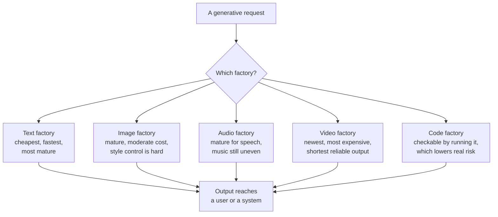

# The five modalities

*Part of [Generative AI: the big picture](./README.md)*

## TL;DR

Generative AI is not one product. It is a set of capabilities, split by what the model
creates. Text, image, audio, video, and code are the five modalities in common use today.
Each modality has its own maturity, its own cost, and its own failure pattern. Text
generation is the most mature and the cheapest to run at scale. Video generation is the
newest and the most expensive. Code generation sits in a special place: its output can be
checked by running it, which makes it easier to trust than free-form text. A product
leader who treats "generative AI" as one thing will misjudge cost, risk, and readiness.
The right question is never "should we use generative AI?" It is "which modality does this
feature need, and is that modality mature enough for what we are about to ship?"

> 🎯 **For the product leader**
>
> **Why it matters** — A roadmap that says "add AI generation" hides five very different
> engineering bets. Text generation for a support reply and video generation for a product
> demo do not share a cost model, a latency budget, or a quality bar.
>
> **What it changes in your decisions** — You scope by modality, not by the word
> "generative." Each modality gets its own cost estimate, its own review of maturity, and
> its own plan for checking output before it reaches a user.
>
> **Ask yourself** — *"Which modality does this feature actually need, and have we looked
> at real failure examples in that modality, not just the demo reel?"*
>
> **Risk if ignored** — You commit to a launch date based on text-generation maturity,
> then discover the feature actually needs image or video generation, which is slower,
> costlier, and less predictable.

## The mental model: five different factories

Think of each modality as a separate factory, not a setting on one machine. Each factory
takes a different kind of raw material and produces a different kind of product, at a
different speed and a different cost per unit.

## The five modalities, compared

| Modality | What it produces | Where it stands today | The distinct risk |
| --- | --- | --- | --- |
| **Text** | Prose, summaries, structured data, conversation | Most mature. Cheap enough for high-volume features. | Hallucination: a fluent, wrong answer. |
| **Image** | Illustrations, photos, product mockups, edits | Mature for many styles. Exact brand and layout control is still hard. | Subtle visual errors a glance can miss — an extra finger, a wrong logo. |
| **Audio** | Speech, voice cloning, sound effects, some music | Mature for speech. Music generation is improving but less consistent. | Voice cloning raises consent and misuse questions a text feature never faces. |
| **Video** | Short clips, edits, avatars, simple animation | Newest and least consistent. Short clips only, at real cost per second. | Cost per output is far higher than any other modality, and quality still varies widely. |
| **Code** | Functions, scripts, full features, tests | Mature, and self-checking: you can run it, test it, or type-check it. | Looks correct and compiles, but is wrong in a way tests did not catch. |

Code deserves its own note, because it breaks the usual pattern. Text, image, audio, and
video all require a human or another model to judge quality. Code can often be judged by a
machine: does it compile, do the tests pass, does the type checker accept it? This is why
code generation moved into daily engineering use faster than the other modalities — the
feedback loop is tighter, and closes automatically.

## Mixing modalities

Real products increasingly combine modalities in one flow. A single request might use text
generation to write a script, then audio generation to voice it, then image generation for
a thumbnail. Each hop adds its own cost, its own latency, and its own chance of failure.
Multiply the reliability of each step, and a five-step, five-modality pipeline is far less
reliable than any single step suggests. Treat a multi-modality feature as a chain, and
price and test every link in it, not just the final result.

## Failure modes

- **Treating all modalities as equally mature** — pricing and scheduling a video feature
  as if it had text generation's maturity and cost.
- **Skipping modality-specific review** — using the same "looks fine" check on an image or
  a video that would catch an error in text, when visual and audio errors need a different
  kind of review.
- **Ignoring consent in audio** — shipping voice generation or cloning without a clear
  answer on whose voice it is and whether they agreed to it.
- **Trusting code because it runs** — treating "it compiled" as "it is correct," when
  passing tests only prove the tests you wrote, not the ones you didn't.

## Practitioner checklist

- [ ] Have we named the exact modality, or modalities, this feature needs?
- [ ] Have we looked at real failure examples in that modality, not only polished demos?
- [ ] Does our review process match the modality — a visual check for images, a listen for
      audio, running tests for code?
- [ ] If the feature chains modalities, have we priced and tested every link, not just the
      final output?
- [ ] For audio or video with real people, do we have clear consent for how their likeness
      is used?

## Related lessons

- [What makes AI "generative"?](./what-is-generative-ai.md) — the shift that makes all
  five modalities possible.
- [Probabilistic software](./probabilistic-software.md) — why every modality shares the
  same underlying variability.
- [Structured output](../content/02-reliable-outputs/structured-output.md) — checking
  text output the way code output checks itself.
