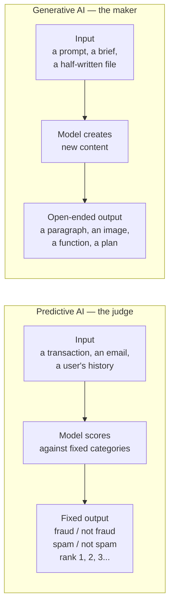

# What makes AI "generative"?

*Part of [Generative AI: the big picture](./README.md)*

## TL;DR

Most AI before 2022 was **predictive**. It took an input and returned a score, a label, or
a ranking. Will this transaction be fraud? Which category does this email belong to? What
should this user see next? **Generative AI** does a different job. It takes an input and
creates new content: a paragraph, an image, a block of code, a plan. The model does not
pick from a fixed list of answers. It builds an answer, token by token or pixel by pixel,
that did not exist before the request. This is not a bigger version of predictive AI. It is
a different capability, with different strengths and a different failure shape. The test
for your product is simple: do you need a judgment on something that exists, or do you need
something new to exist? The first is prediction. The second is generation.

> 🎯 **For the product leader**
>
> **Why it matters** — Teams reach for a generative model out of habit, even when the task
> is really a classification or a ranking problem. A predictive model is cheaper, faster,
> and easier to test. Knowing which job you actually have changes your build cost by an
> order of magnitude.
>
> **What it changes in your decisions** — You stop asking "should we use AI?" and start
> asking "does this task need something to be judged, or something to be made?" That one
> question routes you to a cheaper predictive model or a generative one, before any
> architecture conversation starts.
>
> **Ask yourself** — *"Could a human answer this by picking from a short list, or does a
> human have to write, draw, or compose something new each time?"*
>
> **Risk if ignored** — You pay generative-model prices and accept generative-model
> unpredictability for a task a small classifier would have solved for a fraction of the
> cost, with a fraction of the failure modes.

## The mental model: judge versus maker

A predictive model is a **judge**. Show it a case, and it returns a verdict: a score, a
label, a rank. The set of possible verdicts is fixed in advance. A spam filter always
returns "spam" or "not spam." A recommendation model always ranks items you already have.

A generative model is a **maker**. Show it a request, and it produces something new. The
set of possible outputs is not fixed. It is enormous, and often unbounded. Ask a generative
model for a product description twice, and you can get two different, both reasonable,
answers. Ask a judge model twice, and you expect the same verdict both times.

The distinction is not about which model is "smarter." A fraud-detection model can be far
more accurate, at its job, than any generative model would ever be at the same job. The
distinction is about the *shape* of the task: closed set of answers, or open-ended
creation.

## Why this split matters for a product team

- **Cost and speed.** A predictive model is usually small, fast, and cheap to run at
  scale. A generative model, especially a large language model, costs more per request and
  responds more slowly. Using a generative model for a predictive job is expensive by
  default.
- **Testability.** A predictive model has a right answer you can check against a labeled
  dataset. Accuracy, precision, and recall are well-understood metrics. A generative
  model's output often has no single right answer, which makes testing harder and pushes
  you toward the evaluation practices covered later in this family.
- **Failure shape.** A predictive model fails by being wrong in a bounded way — the wrong
  label, from a known list. A generative model can fail in an unbounded way — it can
  invent a fact, a citation, or a policy that never existed. This failure, called
  hallucination, has no equivalent in predictive AI.
- **User expectation.** Users expect a judge to be consistent. They expect a maker to have
  some range. A recommendation engine that changes its top pick every time you refresh the
  page feels broken. A writing assistant that phrases things slightly differently each
  time feels normal.

## The line is not always sharp

Some products use both in the same flow, and the line blurs in practice. A support tool
might use a predictive model to route a ticket to the right queue, then a generative model
to draft the reply. A search product might use a predictive model to rank results, then a
generative model to summarize them. Knowing which part of your pipeline is which job lets
you put the cheap, testable, consistent tool on the judging work, and reserve the
generative model for the parts that truly need to create something new.

## Failure modes

- **Generative-by-default** — reaching for a large language model because it is the
  familiar tool, on a task that is really a classification problem in disguise.
- **Judging with a maker** — using a generative model's raw output as a score or a
  decision, without converting it into a structured, checkable judgment first.
  [Structured output](../content/02-reliable-outputs/structured-output.md) exists to
  bridge exactly this gap.
- **Expecting judge-like consistency from a maker** — building a product experience that
  assumes the same input always gives the same output, then treating natural variation as
  a bug.
- **Ignoring the cheap option** — building an expensive generative pipeline when a small
  predictive model, trained on your own labeled data, would answer the actual question.

## Practitioner checklist

- [ ] For this feature, is the task a judgment on something that exists, or the creation
      of something new?
- [ ] If it is a judgment, have we priced a predictive model against the generative one we
      defaulted to?
- [ ] If it is a creation, do we know what "good" looks like well enough to test it later?
- [ ] Does the product experience expect consistency where the model is actually
      generative, and therefore variable?

## Related lessons

- [The five modalities](./the-modalities.md) — what a generative model can create, beyond
  text.
- [Probabilistic software](./probabilistic-software.md) — the cost of the variation this
  lesson names.
- [Structured output](../content/02-reliable-outputs/structured-output.md) — turning a
  maker's output into something a system can judge.
