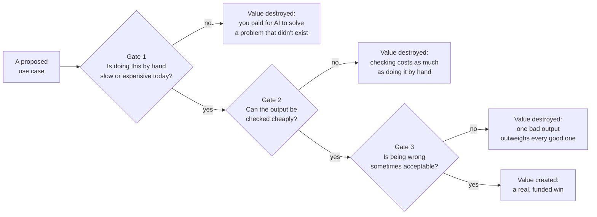

# Where generative AI creates and destroys value

*Part of [Generative AI: the big picture](./README.md)*

## TL;DR

Generative AI has produced real wins and real write-offs, often inside the same company,
sometimes on the same team. The pattern behind the split is consistent enough to name.
Value gets created where the task has three properties: a human doing it today is slow or
expensive, the output can be checked cheaply, and being wrong sometimes is an acceptable
cost. Value gets destroyed where any of those three is missing — where checking the output
costs as much as doing the task by hand, or where being wrong even once is unacceptable,
or where the task was never actually slow or expensive in the first place. This lesson
closes the module by giving you the filter to run every generative AI idea through, before
it becomes a funded project.

> 🎯 **For the product leader**
>
> **Why it matters** — Most "AI strategy" conversations list use cases without weighing
> them against a real filter. The result is a portfolio where a few bets pay off and the
> rest quietly become write-offs nobody wants to discuss in the next planning cycle.
>
> **What it changes in your decisions** — You run every proposed use case through the same
> three-part filter before funding it, instead of funding whatever generates the most
> excitement in a demo.
>
> **Ask yourself** — *"If this goes wrong ten percent of the time, is that a rounding error
> or a front-page problem — and have we actually checked which?"*
>
> **Risk if ignored** — You fund a portfolio of AI projects that looks impressive on a
> roadmap slide and returns almost nothing, because nobody checked whether the underlying
> task actually fit the technology.

## The mental model: three gates, not one

Picture every candidate use case walking through three gates. It only creates real value if
it clears all three. Fail any one gate, and the honest answer is not "add more AI." It is
"this was never a good fit."

## Where the wins cluster

Look at the generative AI deployments that actually returned value, and they share a
shape. **Drafting, not deciding** — a first draft of an email, a summary, or a block of
code, which a human reviews before it matters. The task was slow by hand, the draft is easy
to check against the source, and an occasional weak draft costs only a few minutes to fix.
**High-volume, low-stakes classification and routing** — sorting support tickets, tagging
content, extracting fields from documents — where a wrong answer some of the time is far
cheaper than the manual alternative, and spot-checking catches the pattern of errors.
**Search and synthesis over your own data** — finding and summarizing information a person
would otherwise dig for manually, where the source is right there to check the answer
against.

## Where the write-offs cluster

The failures share a shape too, and it is the mirror image of the wins. **Unsupervised
decisions with real consequences** — letting a model approve a loan, finalize a diagnosis,
or send an irreversible message with no human check, where gate three fails outright.
**Tasks where checking costs as much as doing** — generating a legal contract from
scratch, when a lawyer still has to read every clause as carefully as if they wrote it,
which means gate two never really clears. **Tasks that were never actually slow or
expensive** — automating something a simple form or a short script already handled well,
where gate one was never true, and the "AI feature" replaced a five-minute task with an
unpredictable one.

## Running the filter honestly

The filter only works if you are honest about each gate, not optimistic. "Can the output
be checked cheaply?" is not answered by "a person could review it." It is answered by
"reviewing it takes meaningfully less time and skill than doing the task from scratch." If
review takes as long as the task, you have not saved anything — you have added a step. The
same discipline applies to gate three: "acceptable to be wrong sometimes" needs an actual
number and an actual cost, not a shrug. What follows in this family — evaluation to measure
the error rate, and security to bound the damage of the worst case — exists to make that
number real instead of a guess.

## Failure modes

- **Skipping gate one** — building a generative feature for a task that was never actually
  slow or expensive, because it seemed like an obvious place to "add AI."
- **Optimistic gate two** — assuming review is cheap without measuring it, then discovering
  reviewers spend as long checking output as they would have spent doing the task.
- **No answer for gate three** — shipping a feature with no plan for what happens when it
  is wrong, because the team never asked how often, or how badly.
- **Funding by excitement, not by filter** — greenlighting the use case with the best demo,
  instead of the one that actually clears all three gates.

## Practitioner checklist

- [ ] For this use case, is doing it by hand today genuinely slow or expensive — with a
      real number, not an assumption?
- [ ] Can the output be checked in meaningfully less time than doing the task from
      scratch?
- [ ] Do we have an actual cost estimate for being wrong, and is that cost acceptable at
      the rate we expect to be wrong?
- [ ] Have we run this filter before funding the project, not after it has already missed
      its numbers?

## Related lessons

- [What makes AI "generative"?](./what-is-generative-ai.md) — the capability this filter
  applies to.
- [Probabilistic software](./probabilistic-software.md) — why gate three is never zero.
- [Production failure modes](../content/06-strategy-tradeoffs/production-failure-modes.md)
  — the engineering-depth view of what happens when a use case clears the filter poorly.
