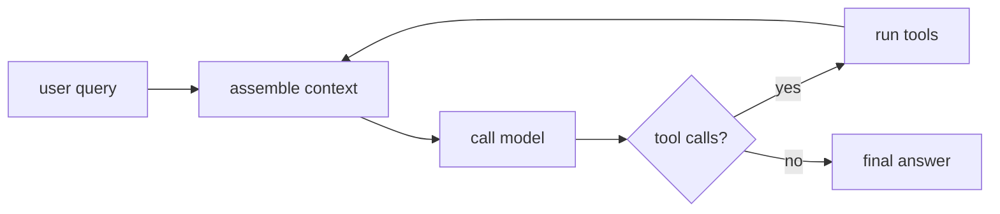

# Authoring a Lesson

Every lesson in *Harness Engineering from Scratch* has the **same shape**, so readers
never re-learn the navigation and the build script can parse it.

## Folder structure

```
phases/<NN>-<phase-name>/<NN>-<lesson-name>/
├── code/      runnable implementations (at least one; Python and/or TypeScript)
├── notebook/  optional Jupyter notebook for experimentation
├── docs/
│   └── en.md  the lesson narrative (required). Translations: zh.md, ja.md, …
└── outputs/   the reusable artifact this lesson ships
```

## The six beats (every `en.md`)

```markdown
# Lesson Title

> **Motto** — the core idea in one quotable sentence.

## The Problem
A concrete pain. What can't you do, or what breaks, without this?

## The Concept
Intuition first. **Lead with a diagram** (see below). Code comes after.
Link to the matching doc in `foundations/` when one exists.

## Build It
Implement it from scratch — standard library only, no agent framework.
Small and complete (~80–150 lines). Every snippet must actually run.

## Use It
Do the same task with the real SDK / framework (Anthropic SDK, MCP SDK, etc.),
so the abstraction is transparent because the reader built the toy version.

## Ship It
The artifact this lesson produces, saved under `outputs/`:
a prompt · skill · hook · harness module · eval · MCP server · settings.

## Check Yourself
3–5 questions (see Quiz format). End with one **challenge** exercise.
```

## Diagrams — lead with a picture

Use **Mermaid** for flows/architecture and **tables** for comparisons. At minimum,
the Concept beat should open with a diagram. Keep the same theme block so they render
consistently:

````markdown

````

For polished figures, drop SVGs in `site/assets/figures/` and reference them
(`FIG_0NN`). ASCII diagrams are acceptable inside code blocks
when a mental model is simpler shown as text.

## Quiz format (Check Yourself)

Each question is multiple choice, 3–4 options, exactly one correct, with the answer in
a collapsed block so readers self-test first:

```markdown
**Q1.** When the model returns a malformed tool call, the harness should…

- A) crash the loop
- B) return the raw text to the user
- C) feed a structured error back to the model and retry within budget
- D) silently skip the step

<details><summary>Answer</summary>C — the loop stays alive; the model self-corrects
from the error message, bounded by the tool budget.</details>
```

Phase-level quizzes are generated by the [`check-understanding`](../.claude/skills/check-understanding/SKILL.md)
skill, which reads every `docs/en.md` in a phase and produces 8 questions (4
conceptual + 4 practical). Placement is handled by
[`find-your-level`](../.claude/skills/find-your-level/SKILL.md).

## Ship-It artifact formats

```markdown
---
name: artifact-name
description: what it does
kind: prompt | skill | hook | module | eval | mcp | settings
phase: 02
lesson: 01
---
```

## Strict-format rules (the build script depends on these)

- Phase headers in `ROADMAP.md`: `## Phase N — Name \`X lessons\` <glyph>`
- Lesson tables keep the column shape `| # | Lesson | Type | Lang | Ships |`
  (capstone: `| # | Project | Combines | Lang | Ships |`).
- Status glyphs are the exact characters `✅ 🚧 ⬚` — never replace with text.
- `Type` is `Build` or `Use`. `Lang` is plain text (`Python, TypeScript`).
