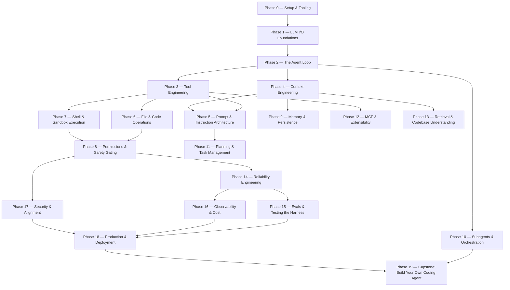

# Harness Engineering from Scratch — Roadmap

> Build a production coding agent (a "harness" like Claude Code) **by hand**, one piece
> at a time — then use the real SDKs and frameworks. Every lesson ships a reusable
> artifact: a prompt, a skill, a hook, a harness module, an eval, or an MCP server.

**Status:** `✅` done · `🚧` in progress · `⬚` planned

The phases stack. **The model-as-a-function is the floor; a full coding agent is the
roof.** Skip ahead if you know a lower layer, but don't skip and then wonder why the
top is breaking.

---

## Phase 0 — Setup & Tooling `5 lessons` ✅
*Get a model talking to your terminal with nothing but the standard library.*

| # | Lesson | Type | Lang | Ships |
|---|--------|------|------|-------|
| 01 | [Dev environment & the SDK](./phases/00-setup-and-tooling/01-dev-environment/docs/en.md) ✅ | Build | Python | setup script |
| 02 | [Your first raw model call (HTTP, no SDK)](./phases/00-setup-and-tooling/02-first-raw-call/docs/en.md) ✅ | Build | Python | prompt |
| 03 | [API keys, secrets & env hygiene](./phases/00-setup-and-tooling/03-secrets-and-env/docs/en.md) ✅ | Build | Python | hook |
| 04 | [A REPL you can talk to](./phases/00-setup-and-tooling/04-repl/docs/en.md) ✅ | Build | Python | harness module |
| 05 | [Reading the docs like an engineer](./phases/00-setup-and-tooling/05-reading-docs/docs/en.md) ✅ | Build | — | skill |

## Phase 1 — LLM I/O Foundations `8 lessons` ✅
*The model is a fast, stateless, non-deterministic function. Learn its interface.*

| # | Lesson | Type | Lang | Ships |
|---|--------|------|------|-------|
| 01 | [Messages, roles & turns](./phases/01-llm-io-foundations/01-messages-roles-turns/docs/en.md) ✅ | Build | Python | harness module |
| 02 | [Tokens & the context window](./phases/01-llm-io-foundations/02-tokens-and-context-window/docs/en.md) ✅ | Build | Python | harness module |
| 03 | [Sampling: temperature, top-p, determinism](./phases/01-llm-io-foundations/03-sampling/docs/en.md) ✅ | Build | Python | harness module |
| 04 | [Streaming responses token-by-token](./phases/01-llm-io-foundations/04-streaming/docs/en.md) ✅ | Build | Python | harness module |
| 05 | [Stop reasons & max tokens](./phases/01-llm-io-foundations/05-stop-reasons/docs/en.md) ✅ | Build | Python | harness module |
| 06 | [System vs. user vs. assistant — who controls what](./phases/01-llm-io-foundations/06-roles-precedence/docs/en.md) ✅ | Build | — | prompt |
| 07 | [Structured output without tools (JSON + repair)](./phases/01-llm-io-foundations/07-structured-output/docs/en.md) ✅ | Build | Python | harness module |
| 08 | [Prompt caching: what's cacheable and why](./phases/01-llm-io-foundations/08-prompt-caching/docs/en.md) ✅ | Use | Python | harness module |

## Phase 2 — The Agent Loop `7 lessons` ✅
*The ~120 lines at the heart of every coding agent.*

| # | Lesson | Type | Lang | Ships |
|---|--------|------|------|-------|
| 01 | [The agent loop from scratch](./phases/02-the-agent-loop/01-agent-loop/docs/en.md) ✅ | Build | Python | agent |
| 02 | [Tool-call parsing & the act step](./phases/02-the-agent-loop/02-tool-call-parsing/docs/en.md) ✅ | Build | Python | harness module |
| 03 | [Termination: stop conditions & max steps](./phases/02-the-agent-loop/03-termination/docs/en.md) ✅ | Build | Python | harness module |
| 04 | [Turn history & conversation state](./phases/02-the-agent-loop/04-turn-history/docs/en.md) ✅ | Build | Python | harness module |
| 05 | [Use It: the same loop with the SDK tool-use API](./phases/02-the-agent-loop/05-sdk-tool-use-loop/docs/en.md) ✅ | Use | Python, TS | agent |
| 06 | [Error recovery inside the loop](./phases/02-the-agent-loop/06-error-recovery/docs/en.md) ✅ | Build | Python | harness module |
| 07 | [A streaming agent loop](./phases/02-the-agent-loop/07-streaming-loop/docs/en.md) ✅ | Build | Python | agent |

## Phase 3 — Tool Engineering `8 lessons` ✅
*Tools are the agent's hands. Define, dispatch, validate, and trust them.*

| # | Lesson | Type | Lang | Ships |
|---|--------|------|------|-------|
| 01 | [Tool schemas & dispatch by hand](./phases/03-tool-engineering/01-schemas-and-dispatch/docs/en.md) ✅ | Build | Python | harness module |
| 02 | [Argument validation & JSON-schema enforcement](./phases/03-tool-engineering/02-argument-validation/docs/en.md) ✅ | Build | Python | harness module |
| 03 | [Tool results, errors & the feedback channel](./phases/03-tool-engineering/03-results-and-errors/docs/en.md) ✅ | Build | Python | harness module |
| 04 | [Idempotency & side-effecting tools](./phases/03-tool-engineering/04-idempotency/docs/en.md) ✅ | Build | Python | harness module |
| 05 | [Tool budgets & rate limits](./phases/03-tool-engineering/05-tool-budgets/docs/en.md) ✅ | Build | Python | hook |
| 06 | [Writing tool descriptions the model obeys](./phases/03-tool-engineering/06-tool-descriptions/docs/en.md) ✅ | Build | — | prompt |
| 07 | [Use It: SDK tool definitions & parallel tool use](./phases/03-tool-engineering/07-sdk-parallel-tools/docs/en.md) ✅ | Use | Python | agent |
| 08 | [A tool registry & discovery layer](./phases/03-tool-engineering/08-tool-registry/docs/en.md) ✅ | Build | Python | harness module |

## Phase 4 — Context Engineering `7 lessons` ✅
*What the model "knows" is whatever your harness put in the window.*

| # | Lesson | Type | Lang | Ships |
|---|--------|------|------|-------|
| 01 | [Context budgeting & token accounting](./phases/04-context-engineering/01-context-budgeting/docs/en.md) ✅ | Build | Python | harness module |
| 02 | [Message assembly & ordering](./phases/04-context-engineering/02-message-assembly/docs/en.md) ✅ | Build | Python | harness module |
| 03 | [Truncation strategies that don't break tool calls](./phases/04-context-engineering/03-truncation/docs/en.md) ✅ | Build | Python | harness module |
| 04 | [Compaction & summarization across turns](./phases/04-context-engineering/04-compaction/docs/en.md) ✅ | Build | Python | harness module |
| 05 | [Injecting files & retrieved context safely](./phases/04-context-engineering/05-injecting-context/docs/en.md) ✅ | Build | Python | harness module |
| 06 | [Context windows in the wild (cache-aware layout)](./phases/04-context-engineering/06-cache-aware-layout/docs/en.md) ✅ | Use | Python | harness module |
| 07 | [Measuring context rot](./phases/04-context-engineering/07-measuring-context-rot/docs/en.md) ✅ | Build | Python | eval |

## Phase 5 — Prompt & Instruction Architecture `6 lessons` ✅
*System prompts, steering files, and output styles — the harness's voice.*

| # | Lesson | Type | Lang | Ships |
|---|--------|------|------|-------|
| 01 | [Anatomy of a system prompt](./phases/05-prompt-instruction-architecture/01-system-prompt-anatomy/docs/en.md) ✅ | Build | — | prompt |
| 02 | [Memory files (CLAUDE.md / AGENTS.md)](./phases/05-prompt-instruction-architecture/02-memory-files/docs/en.md) ✅ | Build | — | skill |
| 03 | [Steering: tone, refusals, and guardrail text](./phases/05-prompt-instruction-architecture/03-steering/docs/en.md) ✅ | Build | — | prompt |
| 04 | [Output styles & response contracts](./phases/05-prompt-instruction-architecture/04-output-contracts/docs/en.md) ✅ | Build | Python | harness module |
| 05 | [Few-shot & in-context examples that scale](./phases/05-prompt-instruction-architecture/05-few-shot/docs/en.md) ✅ | Build | Python | harness module |
| 06 | [Prompt versioning & A/B in the harness](./phases/05-prompt-instruction-architecture/06-prompt-versioning/docs/en.md) ✅ | Build | Python | harness module |

## Phase 6 — File & Code Operations `7 lessons` ✅
*Read, search, and edit a codebase the way a coding agent does.*

| # | Lesson | Type | Lang | Ships |
|---|--------|------|------|-------|
| 01 | [A read tool with line numbers & ranges](./phases/06-file-and-code-operations/01-read-tool/docs/en.md) ✅ | Build | Python | harness module |
| 02 | [Exact-string edit & why diffs beat rewrites](./phases/06-file-and-code-operations/02-edit-tool/docs/en.md) ✅ | Build | Python | harness module |
| 03 | [Write & overwrite safety](./phases/06-file-and-code-operations/03-write-safety/docs/en.md) ✅ | Build | Python | harness module |
| 04 | [Glob & file discovery](./phases/06-file-and-code-operations/04-glob/docs/en.md) ✅ | Build | Python | harness module |
| 05 | [Grep / ripgrep-style content search](./phases/06-file-and-code-operations/05-grep/docs/en.md) ✅ | Build | Python | harness module |
| 06 | [Applying & validating patches](./phases/06-file-and-code-operations/06-patches/docs/en.md) ✅ | Build | Python | harness module |
| 07 | [Use It: tree-sitter for structural edits](./phases/06-file-and-code-operations/07-tree-sitter/docs/en.md) ✅ | Use | Python | harness module |

## Phase 7 — Shell & Sandbox Execution `6 lessons` ✅
*Let the agent run commands without letting it run wild.*

| # | Lesson | Type | Lang | Ships |
|---|--------|------|------|-------|
| 01 | [A bash tool: capture stdout, stderr, exit code](./phases/07-shell-and-sandbox-execution/01-bash-tool/docs/en.md) ✅ | Build | Python | harness module |
| 02 | [Timeouts & killing runaway processes](./phases/07-shell-and-sandbox-execution/02-timeouts/docs/en.md) ✅ | Build | Python | harness module |
| 03 | [Background tasks & long-running commands](./phases/07-shell-and-sandbox-execution/03-background-tasks/docs/en.md) ✅ | Build | Python | harness module |
| 04 | [Working-directory & shell-state pitfalls](./phases/07-shell-and-sandbox-execution/04-cwd-and-state/docs/en.md) ✅ | Build | Python | harness module |
| 05 | [Sandboxing: containers, namespaces, seccomp](./phases/07-shell-and-sandbox-execution/05-sandboxing/docs/en.md) ✅ | Use | Python | harness module |
| 06 | [Network policies & egress control](./phases/07-shell-and-sandbox-execution/06-egress-control/docs/en.md) ✅ | Use | — | hook |

## Phase 8 — Permissions & Safety Gating `6 lessons` ⬚
*The line between "agent" and "incident" is the permission layer.*

| # | Lesson | Type | Lang | Ships |
|---|--------|------|------|-------|
| 01 | Permission modes (ask / allow / deny) | Build | Python | harness module |
| 02 | Allowlists, denylists & pattern matching | Build | Python | harness module |
| 03 | Pre/post tool-use hooks | Build | Python | hook |
| 04 | Human-in-the-loop approval flows | Build | Python | harness module |
| 05 | Least privilege & capability scoping | Build | Python | harness module |
| 06 | Use It: settings.json & the hooks system | Use | — | settings |

## Phase 9 — Memory & Persistence `5 lessons` ⬚
*Statelessness is the model's problem; memory is the harness's job.*

| # | Lesson | Type | Lang | Ships |
|---|--------|------|------|-------|
| 01 | Session state & the scratchpad | Build | Python | harness module |
| 02 | Persisting & resuming conversations | Build | Python | harness module |
| 03 | Long-term memory & retrieval | Build | Python | harness module |
| 04 | Compaction across sessions | Build | Python | harness module |
| 05 | Use It: a memory MCP server | Use | Python | mcp |

## Phase 10 — Subagents & Orchestration `6 lessons` ✅
*One agent spawns many. Coordinate them with contracts, budgets, and waves.*

| # | Lesson | Type | Lang | Ships |
|---|--------|------|------|-------|
| 01 | [Sprint contracts & budgeted waves](./phases/10-subagents-and-orchestration/01-sprint-contract-and-waves/docs/en.md) ✅ | Build | Python | module, prompt, settings |
| 02 | [Bounded roles & context allowlists](./phases/10-subagents-and-orchestration/02-bounded-roles/docs/en.md) ✅ | Build | Python | harness module |
| 03 | [Worktree isolation & the dependency graph](./phases/10-subagents-and-orchestration/03-worktree-isolation/docs/en.md) ✅ | Build | Python | harness module |
| 04 | [Checkpoints & resumable runs](./phases/10-subagents-and-orchestration/04-checkpoints/docs/en.md) ✅ | Build | Python | harness module |
| 05 | [Supervisor / worker patterns](./phases/10-subagents-and-orchestration/05-supervisor-worker/docs/en.md) ✅ | Build | Python | agent |
| 06 | [Use It: the agent-team pipeline](./phases/10-subagents-and-orchestration/06-agent-team-pipeline/docs/en.md) ✅ | Use | Python, TS | skill |

## Phase 11 — Planning & Task Management `5 lessons` ⬚
*Decompose, plan, track — so long tasks don't drift.*

| # | Lesson | Type | Lang | Ships |
|---|--------|------|------|-------|
| 01 | A todo/task data model | Build | Python | harness module |
| 02 | Plan mode: propose before you act | Build | Python | harness module |
| 03 | Task decomposition prompts | Build | — | prompt |
| 04 | Progress tracking & self-correction | Build | Python | harness module |
| 05 | Use It: plan mode in a real harness | Use | — | skill |

## Phase 12 — MCP & Extensibility `6 lessons` ⬚
*Make the harness pluggable. Build the protocol, then a server.*

| # | Lesson | Type | Lang | Ships |
|---|--------|------|------|-------|
| 01 | The MCP wire protocol from scratch | Build | Python | mcp |
| 02 | An MCP server: tools, resources, prompts | Build | Python | mcp |
| 03 | An MCP client & tool discovery | Build | Python | harness module |
| 04 | Skills (`SKILL.md`) & progressive disclosure | Build | — | skill |
| 05 | Plugins & deferred tool loading | Build | Python | harness module |
| 06 | Use It: the official MCP SDK | Use | Python, TS | mcp |

## Phase 13 — Retrieval & Codebase Understanding `5 lessons` ⬚
*Help the agent find the right 200 lines in a million-line repo.*

| # | Lesson | Type | Lang | Ships |
|---|--------|------|------|-------|
| 01 | Lexical search & repo maps | Build | Python | harness module |
| 02 | Embeddings & semantic code search | Build | Python | harness module |
| 03 | Hybrid search & reranking | Build | Python | harness module |
| 04 | Chunking code without breaking it | Build | Python | harness module |
| 05 | Use It: a retrieval tool the agent calls | Use | Python | harness module |

## Phase 14 — Reliability Engineering `6 lessons` ⬚
*Make a stochastic system dependable enough to ship.*

| # | Lesson | Type | Lang | Ships |
|---|--------|------|------|-------|
| 01 | Retries, backoff & jitter | Build | Python | harness module |
| 02 | Validation & repair loops | Build | Python | harness module |
| 03 | Fallback chains & model routing | Build | Python | harness module |
| 04 | Loop, tool & token budgets | Build | Python | harness module |
| 05 | Degraded-mode UX | Build | Python | harness module |
| 06 | Use It: production failure-mode playbook | Use | — | prompt |

## Phase 15 — Evals & Testing the Harness `6 lessons` ⬚
*You cannot improve a harness you cannot measure.*

| # | Lesson | Type | Lang | Ships |
|---|--------|------|------|-------|
| 01 | Golden tasks & fixtures | Build | Python | eval |
| 02 | Trajectory evals (did it take the right steps?) | Build | Python | eval |
| 03 | LLM-as-judge | Build | Python | eval |
| 04 | Regression gates in CI | Build | Python | eval |
| 05 | Adversarial & red-team cases | Build | Python | eval |
| 06 | Use It: an eval harness you run on every change | Use | Python | eval |

## Phase 16 — Observability & Cost `5 lessons` ⬚
*Traces, tokens, latency, dollars — per call, per session, per tenant.*

| # | Lesson | Type | Lang | Ships |
|---|--------|------|------|-------|
| 01 | Tracing & spans for an agent | Build | Python | harness module |
| 02 | Token & cost accounting | Build | Python | harness module |
| 03 | Latency: prefill vs. decode, TTFT | Build | Python | harness module |
| 04 | Drift detection | Build | Python | eval |
| 05 | Use It: OpenTelemetry for agents | Use | Python | harness module |

## Phase 17 — Security & Alignment `6 lessons` ⬚
*The agent reads untrusted data. Assume it's hostile.*

| # | Lesson | Type | Lang | Ships |
|---|--------|------|------|-------|
| 01 | Prompt injection from tool results & files | Build | Python | eval |
| 02 | Treating model output as data, never control flow | Build | Python | harness module |
| 03 | Data exfiltration & egress guards | Build | Python | hook |
| 04 | Secret redaction in context & logs | Build | Python | harness module |
| 05 | Multi-tenant isolation & cache contamination | Build | Python | harness module |
| 06 | Use It: a security-review skill | Use | — | skill |

## Phase 18 — Production & Deployment `6 lessons` ⬚
*Ship the harness to real users and real repos.*

| # | Lesson | Type | Lang | Ships |
|---|--------|------|------|-------|
| 01 | Remote / sandboxed execution environments | Use | — | harness module |
| 02 | GitHub integration & CI triggers | Build | Python | mcp |
| 03 | Webhooks & event-driven agents | Build | Python | harness module |
| 04 | Config, settings & feature flags | Build | Python | settings |
| 05 | Rollout, canary & kill switches | Build | Python | harness module |
| 06 | Use It: deploy the capstone agent | Use | — | harness module |

## Phase 19 — Capstone: Build Your Own Coding Agent `4 lessons` ⬚
*Assemble every phase into one working harness.*

| # | Project | Combines | Lang | Ships |
|---|---------|----------|------|-------|
| 01 | Minimal coding agent (loop + tools + files) | P2,3,6,7 | Python | agent |
| 02 | Add context, memory & permissions | P4,8,9 | Python | agent |
| 03 | Add subagents, MCP & retrieval | P10,12,13 | Python | agent |
| 04 | Add evals, observability & ship it | P15,16,18 | Python | agent |

---

### Totals (planned)

20 phases · ~120 lessons · Python + TypeScript · every lesson ships an artifact.

See [`METHODOLOGY.md`](./METHODOLOGY.md) for the framework and
[`AUTHORING.md`](./AUTHORING.md) for how to write a lesson.
