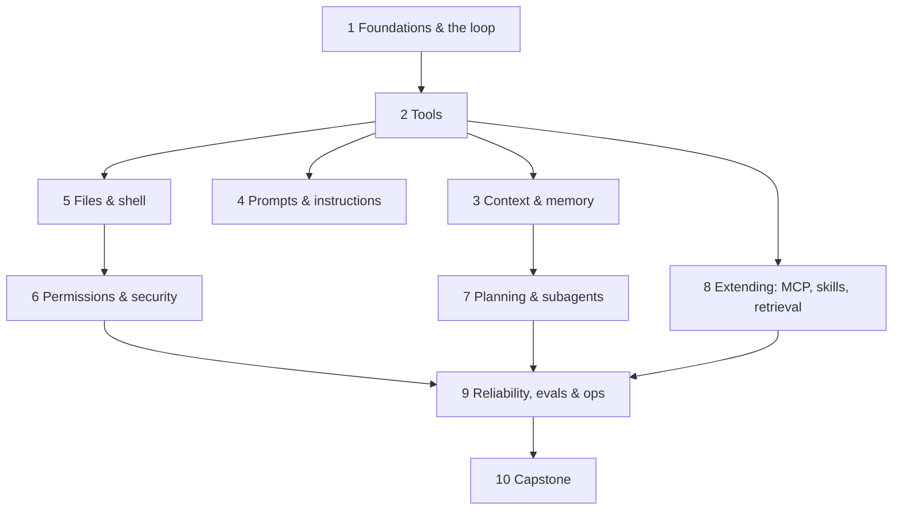

# Harness engineering from scratch — roadmap

> Build a coding agent's harness by hand, one piece at a time. Then run the same piece
> through the real tools. **10 phases, 41 lessons.** Every code file runs with the
> standard library and ends with assertions.

The phases stack. The model as a function is the floor. A working coding agent is the roof.
Skip a lower layer only if you already know it.

```mermaid
flowchart TB
  P1["1 Foundations & the loop"] --> P2["2 Tools"]
  P2 --> P3["3 Context & memory"]
  P2 --> P4["4 Prompts & instructions"]
  P2 --> P5["5 Files & shell"]
  P5 --> P6["6 Permissions & security"]
  P3 --> P7["7 Planning & subagents"]
  P2 --> P8["8 Extending: MCP, skills, retrieval"]
  P6 --> P9["9 Reliability, evals & ops"]
  P7 --> P9
  P8 --> P9
  P9 --> P10["10 Capstone"]
```

## The phases

| # | Phase | Lessons | You build |
| --- | --- | --- | --- |
| 1 | [Foundations & the loop](./phases/01-foundations-and-the-loop/README.md) | 5 | A REPL, a prompt-cache layout, the agent loop, stop rules, a streaming loop |
| 2 | [Tools](./phases/02-tools/README.md) | 3 | A tool registry, validation and error results, parallel tool calls |
| 3 | [Context & memory](./phases/03-context-and-memory/README.md) | 5 | A token budget, message assembly, compaction, session resume, long-term memory |
| 4 | [Prompts & instructions](./phases/04-prompts-and-instructions/README.md) | 3 | A system prompt, memory files, an output contract |
| 5 | [Files & shell](./phases/05-files-and-shell/README.md) | 6 | Read, edit and search tools, a bash tool, background jobs, a sandbox and egress guard |
| 6 | [Permissions & security](./phases/06-permissions-and-security/README.md) | 4 | A permission gate, hooks, a settings file, defenses for untrusted content |
| 7 | [Planning & subagents](./phases/07-planning-and-subagents/README.md) | 4 | A todo list, plan mode, a sprint contract with waves, a supervisor and workers |
| 8 | [Extending: MCP, skills, retrieval](./phases/08-extending-mcp-skills-retrieval/README.md) | 5 | An MCP server and client, a skill, a repo map, a `search_code` tool |
| 9 | [Reliability, evals & ops](./phases/09-reliability-evals-and-ops/README.md) | 5 | A failure ladder, budgets, an eval gate, tracing and cost, a rollout switch |
| 10 | [Capstone](./phases/10-capstone/README.md) | 1 | One agent that combines the pieces and passes a real test |

## How to use this track

- Read [The ten principles](./foundations/harness-principles.md) first. They describe one
  multi-agent pattern. Phase 7 builds it.
- Each phase ends with a short **Test yourself**. The `/check-understanding` skill can quiz
  you on a phase. The `/find-your-level` skill picks a starting phase.
- Each lesson follows the same beats: Motto, Problem, Concept, Build It, Use It.

## What this track leaves to other tracks

Model internals, general RAG, the product case for evals, the security taxonomy and cost
strategy are covered elsewhere. Phases link to them where they matter.

| Topic | Read |
| --- | --- |
| Sampling, tokens, the context window | [LLMs](../llms/README.md) |
| Embeddings and hybrid search | [RAG & vector databases](../rag-vector-databases/README.md) |
| Evals and observability as a product decision | [Evaluation & observability](../evaluation-and-observability/README.md) |
| Attacks, red-teaming and compliance | [AI security & guardrails](../ai-security-and-guardrails/README.md) |
| Cost control | [Cost optimization](../cost-optimization/README.md) |
| Memory design | [Memory & context](../memory-and-context/README.md) |
