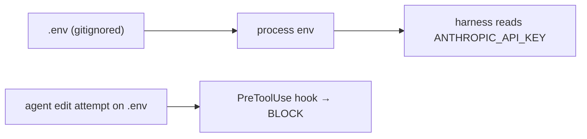

# API Keys, Secrets & Env Hygiene

> **Motto** — A secret in code is a secret already leaked.

*Part of Phase 00 — Setup & Tooling.*

## The Problem

The harness runs an agent that reads and writes files. Two failure modes follow
immediately: a key hardcoded in source gets committed to git forever, and an agent
"helpfully" edits `.env` and prints it into a transcript or log. Both are how credentials
escape. Hygiene here is structural, not a reminder you hope everyone remembers.

## The Concept

Three rules:

1. **Secrets live in the environment** (`ANTHROPIC_API_KEY`), loaded from a `.env` that
   is **git-ignored** — never committed.
2. **The agent may not touch `.env`** — enforce with a pre-edit hook that blocks it.
3. **Redact on the way out** — never log raw key values (Phase 17 generalizes this).



## Build It

A `PreToolUse` hook that blocks any edit/write targeting `.env`. `outputs/block-env-edit.sh`
reads the tool-call JSON on stdin and exits non-zero to deny:

```bash
#!/usr/bin/env bash
# PreToolUse hook: deny any Edit/Write whose path touches a .env file.
input="$(cat)"
path="$(printf '%s' "$input" | grep -oE '"(file_path|path)"[[:space:]]*:[[:space:]]*"[^"]*"' | head -1 | sed -E 's/.*"([^"]*)"$/\1/')"
case "$path" in
  *.env|*.env.*|*/.env) echo "BLOCKED: edits to .env are not allowed" >&2; exit 2 ;;
  *) exit 0 ;;
esac
```

Exit code 2 tells the harness to deny the call and surface the message. The agent sees
"BLOCKED" and moves on; the secret file is never writable by the model.

## Use It

In Claude Code this is wired in `.claude/settings.json` under `hooks.PreToolUse` (Phase 8
covers the hook system in depth). The same idea — a deterministic gate around a dangerous
action — recurs throughout the permissions phase.

## Ship It

[`outputs/block-env-edit.sh`](../../03-secrets-and-env/outputs/block-env-edit.sh) — a
drop-in PreToolUse hook that protects `.env` files.

## Check Yourself

**Q1.** Why block `.env` edits with a hook instead of a prompt instruction?

- A) hooks are faster
- B) a deterministic gate can't be talked around; an instruction can be ignored
- C) prompts cost tokens
- D) no reason

<details><summary>Answer</summary>B — structural enforcement beats hoping the model
complies.</details>

**Q2.** What makes a hardcoded key unrecoverable once pushed?

- A) nothing, just delete it
- B) git history retains it even after deletion, so it must be rotated
- C) GitHub auto-redacts it
- D) it expires

<details><summary>Answer</summary>B — committed secrets live in history; rotate the key,
don't just delete the line.</details>

**Challenge.** Extend the hook to also block reads of `.env` (not just edits), and to
allow a `.env.example` template through.

## Related

- Builds on: [Dev environment](../../01-dev-environment/docs/en.md)
- Next: [A REPL you can talk to](../../04-repl/docs/en.md)
- Deepens in: Phase 8 — Permissions, Phase 17 — Security
