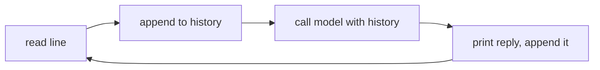

# A REPL You Can Talk To

> **Motto** — A read-eval-print loop over a model is the smallest useful harness.

*Part of Phase 00 — Setup & Tooling.*

## The Problem

You can make a one-shot call (lesson 02). But to *feel* the model as a conversational
partner — and to have a sandbox for every later concept — you need a loop that reads your
input, sends the running conversation, prints the reply, and remembers the turn. This is
the agent loop (Phase 2) stripped of tools: just conversation state.

## The Concept



The only state is the message list. Each turn appends the user message and the assistant
reply, so the model always sees the full conversation.

## Build It

`code/repl.py` — uses the SDK; type `exit` to quit:

```python
import anthropic
client = anthropic.Anthropic()

def repl(model="claude-opus-4-8"):
    history = []
    print("Talk to the model (type 'exit' to quit).")
    while True:
        try:
            user = input("you> ").strip()
        except (EOFError, KeyboardInterrupt):
            break
        if user in ("exit", "quit"):
            break
        history.append({"role": "user", "content": user})
        msg = client.messages.create(model=model, max_tokens=1024, messages=history)
        text = "".join(b.text for b in msg.content if b.type == "text")
        print("ai>", text)
        history.append({"role": "assistant", "content": text})

if __name__ == "__main__":
    repl()
```

That's a working conversational harness in ~20 lines. Phase 2 adds tools to the same
loop; everything else in the course thickens it.

## Use It

This is the shape the Claude Code CLI is built around — a loop carrying conversation
state, with tools, permissions, and rendering layered on. You'll recognize this skeleton
under every coding agent.

## Ship It

[`code/repl.py`](../../04-repl/code/repl.py) — a minimal conversational REPL you can extend
in later phases.

## Check Yourself

**Q1.** What is the REPL's only piece of state?

- A) the model name
- B) the message history list
- C) the API key
- D) the terminal

<details><summary>Answer</summary>B — history is the conversation memory; the model is
stateless.</details>

**Q2.** What turns this REPL into the Phase 2 agent loop?

- A) a bigger model
- B) adding tools and a tool-execution step inside the loop
- C) streaming
- D) a database

<details><summary>Answer</summary>B — tools + the act step make it an agent.</details>

**Challenge.** Add a `/reset` command that clears history, and print a running token
estimate each turn (4 chars ≈ 1 token).

## Related

- Builds on: [Your first raw model call](../../02-first-raw-call/docs/en.md)
- Leads to: Phase 2 — [The Agent Loop](../../../../ROADMAP.md)
