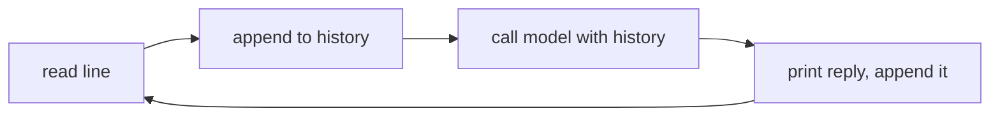

# First Call and a REPL

> **Motto** — A model call is one HTTPS POST, and a read-eval-print loop around it is the smallest useful harness.

*Part of Phase 01 — Foundations and the Loop.*

*Last reviewed: 2026-10 · Volatility: fast*

## The Problem

An SDK hides the wire. When a call fails, you cannot tell if the bug is yours or the library's. You also need a place to try every later idea.

Two things fix this. First, make one call with nothing but `urllib`. You see the URL, the headers, and the JSON body. Second, wrap that call in a loop that keeps the conversation. The loop is where tools, memory, and permissions will attach in later lessons.

## The Concept

A request is a POST to `/v1/messages`. It needs three headers: `x-api-key`, `anthropic-version`, and `content-type`. The body needs `model`, `max_tokens`, and `messages`. The reply holds a `content` list of typed blocks. Read the `text` blocks.

The model keeps no state. Your `messages` list is the only memory, so the REPL appends every turn to it.

Roles have a job each:

- **system** holds durable rules. It is a top-level field. The Messages API has no `"system"` role inside `messages`.
- **user** holds the task and any outside text, such as a file or a web page.
- **assistant** holds the model's earlier replies.

The API combines consecutive turns that have the same role. Alternate them anyway, so you see what the model sees. Wrap outside text in tags and tell the system prompt to treat it as data. This lowers the risk of injected instructions. It does not remove it.



## Build It

`code/repl.py` has no dependencies. `build_request` makes the POST but does not send it, so you can inspect it offline.

```python
def build_request(messages, system=None, api_key="", max_tokens=1024):
    """Build the one HTTPS POST behind every model call. Nothing is sent here."""
    body = {"model": MODEL, "max_tokens": max_tokens, "messages": messages}
    if system:
        body["system"] = system        # top-level field: messages have no "system" role
    headers = {"x-api-key": api_key, "anthropic-version": "2023-06-01",
               "content-type": "application/json"}
    return urllib.request.Request(API_URL, data=json.dumps(body).encode(),
                                  headers=headers, method="POST")
```

`untrusted` marks outside text as data. It also stops that text from closing the tag early.

```python
def untrusted(text, title="document"):
    """Wrap outside text as data. This lowers risk. It does not remove it."""
    safe = text.replace("</document>", "&lt;/document&gt;")   # block an early close tag
    return f'<document title="{title}">\n{safe}\n</document>'
```

`repl` takes any `send(history)` function. It rolls back the user turn if the call fails. Without that line, the next call would carry two user turns and a broken thread.

```python
def repl(send, read=input, write=print):
    """Read a line, append it, call the model, print and append the reply."""
    history = []
    while True:
        try:
            line = read("you> ").strip()
        except (EOFError, KeyboardInterrupt):
            break
        if line in ("exit", "quit"):
            break
        history.append({"role": "user", "content": line})
        try:
            reply = send(history)
        except Exception as exc:
            history.pop()              # a failed call must not leave a dangling user turn
            write(f"error: {exc}")
            continue
        write("ai>", reply)
        history.append({"role": "assistant", "content": reply})
    return history
```

The file ends with asserts. A scripted model proves that it sees the whole history each turn, that a failed call leaves no dangling turn, and that the request has the right shape.

## Use It

`code/repl_sdk.py` swaps `send` for the official SDK. It needs `pip install anthropic` and `ANTHROPIC_API_KEY`.

```python
def send(history):
    msg = client.messages.create(model=MODEL, max_tokens=1024,
                                 system=SYSTEM, messages=history)
    return "".join(b.text for b in msg.content if b.type == "text")
```

`MODEL` comes from the `HARNESS_MODEL` environment variable. Every model ID is a pinned snapshot, so one constant is the only place to change it. The SDK sends the same POST you built. It reads the key from the environment and returns typed blocks.

Every coding agent is this loop plus tools. The next lessons add the parts around it.

## Challenge

Make `call_api` catch `urllib.error.HTTPError`. Print the status code and the JSON error body. Then force a 401 with a bad key and read the message.

## Sources

[Messages API reference](https://platform.claude.com/docs/en/api/messages)

Next: [Tokens, Context and Caching](../../02-tokens-context-and-caching/docs/en.md)
