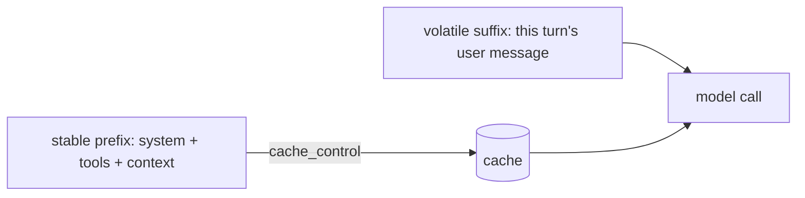

# Tokens, Context and Caching

> **Motto** — Count tokens before you send, and put the bytes that never change at the front so the provider can reuse them.

*Part of Phase 01 — Foundations and the Loop.*

*Last reviewed: 2026-10 · Volatility: fast*

## The Problem

The model reads tokens, not characters. Cost, speed, and the size of the context window are all measured in tokens. A harness that does not count them overflows the window or surprises you with a bill.

An agent also resends a large, mostly identical prefix on every turn. That prefix holds the system prompt, the tool schemas, and the project rules. Paying to process it each time is slow and costly. Lay the request out badly and you get no reuse at all.

## The Concept

A token is a word piece. For English, 4 characters is about 1 token on older tokenizers. Claude Opus 4.7 and later use a newer tokenizer that gives about 30% more tokens for the same text, roughly 2.5 characters per token. This is a planning rule only, and it is optimistic for current models. Use the token-counting endpoint for any tight budget.

The window is shared: `input + max_output` must stay within the model limit.

Prompt caching lets the provider reuse its work on an unchanged prefix. The prefix order is fixed: tools, then system, then messages. You mark its end with `cache_control`. A change at any level breaks the cache for that level and every level after it. Short prefixes are never cached. The minimum length depends on the model.



## Build It

`code/cache_layout.py` keeps the window rule in one function. The check uses the 4-character estimate.

```python
def fits(req, max_output, limit):
    """Window rule: input + max_output must stay within the model limit."""
    used, room = request_tokens(req), limit - max_output
    return used <= room, used, room
```

`build_request` orders the request by volatility. It puts the breakpoint on the last stable block.

```python
def build_request(system_text, tools, history, user_text):
    """Order by volatility: tools, then system, then messages. Mark the end of the prefix."""
    system = [{"type": "text", "text": system_text,
               "cache_control": {"type": "ephemeral"}}]       # breakpoint
    messages = history + [{"role": "user", "content": user_text}]
    return {"tools": tools, "system": system, "messages": messages}
```

The provider holds the real cache. This file models the one rule you control: the prefix must match byte for byte. `cache_hit` compares two prefixes and applies a minimum length.

```python
def cached_prefix(req):
    """Everything up to and including the block that carries cache_control."""
    return json.dumps([req["tools"], req["system"]], sort_keys=True)


def cache_hit(previous, new):
    """A hit needs an identical prefix that is long enough to be cached."""
    same = cached_prefix(previous) == cached_prefix(new)
    return same and estimate_tokens(cached_prefix(new)) >= MIN_CACHE_TOKENS
```

The asserts prove four cases. A new last message hits. A timestamp at the top of the system prompt misses. A reworded tool description misses, because tools come first. A short prompt misses even when identical.

## Use It

`code/cache_layout_sdk.py` sends two requests with the same prefix. It needs `pip install anthropic` and `ANTHROPIC_API_KEY`. The usage object tells you what happened:

- `cache_creation_input_tokens` counts tokens written to the cache.
- `cache_read_input_tokens` counts tokens read from it.
- `input_tokens` counts only the tokens after the last breakpoint.

The total input is the sum of the three. Watch these numbers. Do not guess.

Cache entries last 5 minutes by default, and you can set up to 4 breakpoints. A 5-minute write costs 1.25 times the base input price. A read costs a fraction of it: 0.1 times on most models and less on some (0.05 times on Opus 5.5). Check the pricing page for your model.

To plan before you send, call `client.messages.count_tokens(...)`. It takes the same arguments as `create`, returns `input_tokens`, and is free. The count is an estimate.

## Challenge

Add a second breakpoint after the older turns of the history. Then list which single edit breaks each breakpoint: a tool description, a system line, an old message, and the new message.

## Sources

[Prompt caching](https://platform.claude.com/docs/en/build-with-claude/prompt-caching) · [Token counting](https://platform.claude.com/docs/en/build-with-claude/token-counting)

Other tracks: [Prompt vs. semantic caching](../../../../../content/01-inference-internals/prompt-vs-semantic-caching.md) and [KV cache management](../../../../../content/01-inference-internals/kv-cache-management.md) cover the inference side.

Next: [The Agent Loop](../../03-the-agent-loop/docs/en.md)
