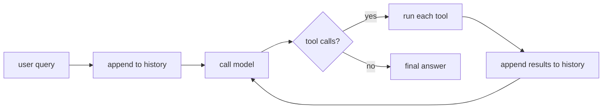

# The Agent Loop

> **Motto** — An agent is a `while` loop that lets a stateless model take actions until it is done.

*Part of Phase 01 — Foundations and the Loop.*

*Last reviewed: 2026-10 · Volatility: fast*

## The Problem

One model call can describe what to do. It can say "run the tests, then read the failing file". It cannot do either. The model has no hands, and it keeps no memory of the last call.

Every coding agent closes this gap with the same primitive: a loop. The loop calls the model, runs the tools the model asks for, feeds the results back, and calls again. Until you write it, the rest of the harness has nowhere to live.

## The Concept

The model is a function from messages to a message. The loop is everything around it. Three rules make it work.

1. **History is the memory.** The loop sends the whole conversation on every call, tool results included.
2. **Tool calls are data.** The model asks for an action. The harness decides whether to run it. This is the security boundary.
3. **The loop must end.** It stops when the model stops asking for tools. A step ceiling stops it when the model never does.

One message can hold several `tool_use` blocks. The act step must run all of them. It must send all results back in the next user message. A `tool_result` has to follow its `tool_use` at once, or the API rejects the request. Failures go back as results with `is_error` set, so the model can react.



## Build It

`code/agent_loop.py` uses no SDK. History holds the same block shapes as the Messages API. `act` is the act step.

```python
def act(calls, tools):
    """Run EVERY tool_use block. Return one tool_result per call. Failures are data."""
    results = []
    for call in calls:
        try:
            fn = tools.get(call["name"])
            if fn is None:
                raise LookupError(f"no tool named {call['name']!r}; have {sorted(tools)}")
            out, is_error = str(fn(**call["input"])), False
        except Exception as exc:                        # bad args, tool crash, unknown tool
            out, is_error = f"{type(exc).__name__}: {exc}", True
        results.append({"type": "tool_result", "tool_use_id": call["id"],
                        "content": out, "is_error": is_error})
    return results
```

`check_pairing` enforces the API rule before every call. You see the error in your own code first.

```python
def check_pairing(history):
    """Each tool_use must be answered by a tool_result in the very next user message."""
    for i, msg in enumerate(history):
        if msg["role"] != "assistant" or isinstance(msg["content"], str):
            continue
        asked = sorted(b["id"] for b in msg["content"] if b["type"] == "tool_use")
        nxt = history[i + 1]["content"] if i + 1 < len(history) else []
        got = sorted(b["tool_use_id"] for b in nxt
                     if isinstance(nxt, list) and b["type"] == "tool_result")
        if asked and asked != got:
            raise ValueError(f"tool_use {asked} not answered by tool_result {got}")
```

`run` is the loop. Each rule appears once: history, the harness running tools, and the ceiling.

```python
def run(query, model, tools=TOOLS, max_steps=MAX_STEPS):
    """Drive a stateless model: messages -> {"stop_reason", "content"}."""
    history = [{"role": "user", "content": query}]     # history is the only memory
    for _ in range(max_steps):                         # a step ceiling always ends the loop
        check_pairing(history)
        msg = model(history)
        history.append({"role": "assistant", "content": msg["content"]})
        calls = [b for b in msg["content"] if b["type"] == "tool_use"]
        if msg["stop_reason"] != "tool_use" or not calls:
            return text_of(msg["content"]), history
        history.append({"role": "user", "content": act(calls, tools)})  # all results, one turn
    return "stopped: hit max_steps", history
```

A scripted model stands in for the real one. It reads the history and asks for two calls in one turn. The asserts prove five things. Both results return together. Bad calls become `is_error` results. A stuck model hits the ceiling. A dropped result fails the pairing check. `parse_text_calls` recovers calls from plain text, for a model with no native tool blocks.

## Use It

`code/agent_loop_sdk.py` reuses `act` and swaps the scripted model for the SDK. It needs `pip install anthropic` and `ANTHROPIC_API_KEY`.

```python
def run(query):
    history = [{"role": "user", "content": query}]
    for _ in range(MAX_STEPS):
        msg = client.messages.create(model=MODEL, max_tokens=1024,
                                     tools=SCHEMAS, messages=history)
        history.append({"role": "assistant", "content": msg.content})
        calls = [{"id": b.id, "name": b.name, "input": b.input}
                 for b in msg.content if b.type == "tool_use"]
        if msg.stop_reason != "tool_use" or not calls:
            return "".join(b.text for b in msg.content if b.type == "text")
        history.append({"role": "user", "content": act(calls, TOOLS)})
    return "stopped: hit max_steps"
```

The loop has the same shape. Tool calls arrive as `tool_use` blocks with `id`, `name`, and `input`. You answer with `tool_result` blocks keyed by `tool_use_id`. The `stop_reason` of `tool_use` means "run tools and continue". The SDK also ships a tool runner that manages this loop for you. Build the loop once by hand and its behavior stops being a mystery.

## Challenge

Record the real SDK responses from one run to a JSON file. Write a `replay_model` that returns them in order. Run your loop against it offline and assert the final text.

## Sources

[Handle tool calls](https://platform.claude.com/docs/en/agents-and-tools/tool-use/handle-tool-calls)

Other tracks: [What is an agent?](../../../../../agentic-ai/what-is-an-agent.md) gives the concept. [Ten principles of a working harness](../../../../foundations/harness-principles.md) says why the loop belongs to you.

Next: [Stopping, Errors and Recovery](../../04-stopping-errors-and-recovery/docs/en.md)
