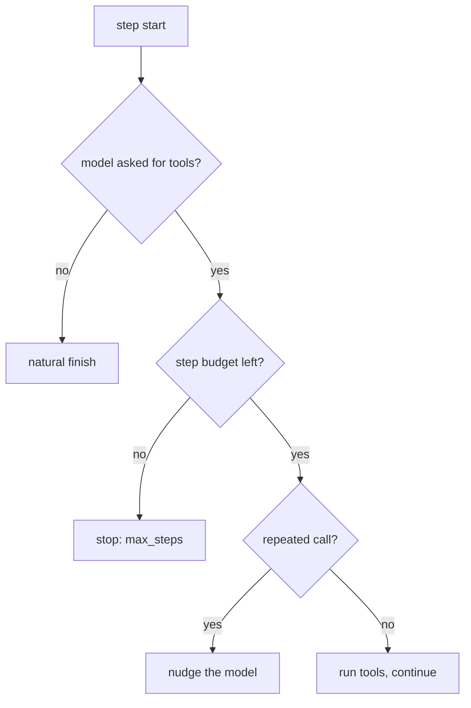

# Stopping, Errors and Recovery

> **Motto** — An agent with no stop rule is a fork bomb with opinions, and a tool error is a message to the model, not a crash.

*Part of Phase 01 — Foundations and the Loop.*

*Last reviewed: 2026-10 · Volatility: fast*

## The Problem

"Stop when the model stops asking for tools" is not enough. A confused model can ask forever. It can repeat one call. Its answer can be cut off at the output cap. A tool can time out, reject a bad argument, or lose its credentials. Each case needs a different response.

A loop that crashes on the first tool error gives the user a stack trace. A loop with no ceiling gives them a bill.

## The Concept

Ask three questions every turn.

**Why did the model stop?** `stop_reason` tells you.

| stop_reason | Action |
| --- | --- |
| `end_turn`, `stop_sequence` | return the text |
| `tool_use` | run tools, loop again |
| `max_tokens` | continue the text; raise the cap if a tool call was cut off |
| `pause_turn` | send the content back to resume |
| `refusal`, `model_context_window_exceeded` | stop and report |

**Did a tool fail?** A model mistake, such as a bad argument, goes back as an `is_error` result. A transient error, such as a timeout or 429, is retried with backoff, a bounded number of times. A fatal error, such as bad credentials, ends the run. Other failures go to the model.

**Should the loop stop anyway?** Keep a hard step ceiling and repeat detection. A nudge must be a `tool_result`, or the pairing rule breaks.



## Build It

`code/termination.py` holds the whole policy. The table maps each `stop_reason` to an action. An unknown reason stops the loop.

```python
# What the harness does for each stop_reason. Unknown reasons stop the loop.
ACTIONS = {"end_turn": "return", "stop_sequence": "return", "tool_use": "run_tools",
           "max_tokens": "continue", "pause_turn": "resume",
           "refusal": "stop", "model_context_window_exceeded": "stop"}


def next_action(stop_reason, has_calls):
    if stop_reason == "max_tokens" and has_calls:
        return "stop"                      # a cut-off tool call is incomplete: raise max_tokens
    return ACTIONS.get(stop_reason, "stop")


def classify(exc):
    """transient: retry. fatal: abort the run. tool: the model sees it and decides."""
    if isinstance(exc, PermissionError) or "unauthorized" in str(exc).lower():
        return "fatal"
    if any(t in str(exc).lower() for t in TRANSIENT):
        return "transient"
    return "tool"
```

`dispatch` runs one call. It checks the arguments against the function signature first. It retries transient errors with exponential backoff, and `sleep` is injectable so tests run fast.

```python
def dispatch(call, tools, sleep=time.sleep, max_retries=2):
    """Run one tool_use block. Return (tool_result, fatal)."""
    fn = tools.get(call["name"])
    if fn is None:
        return result(call, f"no tool {call['name']!r}; have {sorted(tools)}", True), False
    try:
        inspect.signature(fn).bind(**call["input"])
    except TypeError as exc:               # the model can fix its own arguments
        return result(call, f"bad arguments: {exc}", True), False
    for attempt in range(max_retries + 1):
        try:
            return result(call, str(fn(**call["input"])), False), False
        except Exception as exc:
            kind = classify(exc)
            if kind == "transient" and attempt < max_retries:
                sleep(0.5 * 2 ** attempt)  # exponential backoff, bounded by max_retries
                continue
            return result(call, f"{kind} error: {exc}", True), kind == "fatal"
```

`run` is the loop from the last lesson with the policy added.

```python
def run(query, model, tools, max_steps=6, max_continues=2, sleep=time.sleep):
    history, last_sig, continues = [{"role": "user", "content": query}], None, 0
    for _ in range(max_steps):                               # hard ceiling
        msg = model(history)
        history.append({"role": "assistant", "content": msg["content"]})
        calls = [b for b in msg["content"] if b["type"] == "tool_use"]
        text = "".join(b["text"] for b in msg["content"] if b["type"] == "text")
        action = next_action(msg["stop_reason"], bool(calls))
        if action == "return":
            return text, "done", history
        if action == "continue":                             # output was cut off
            continues += 1
            if continues > max_continues:
                return text, "max_continues", history
            history.append({"role": "user", "content": "continue"})
            continue
        if action == "resume":                               # server tool paused: send it back
            continue
        if action != "run_tools":
            return text, f"stopped:{msg['stop_reason']}", history
        if signature(calls) == last_sig:                     # same calls as last step
            nudge = "You repeated this call. Try a different approach or finish."
            history.append({"role": "user", "content": [result(c, nudge, True) for c in calls]})
            continue                                         # a nudge is still a tool_result
        last_sig, results, fatal = signature(calls), [], False
        for call in calls:
            res, is_fatal = dispatch(call, tools, sleep)
            results.append(res)
            fatal = fatal or is_fatal
        history.append({"role": "user", "content": results})
        if fatal:
            return "aborted: fatal tool error", "fatal", history
    return "stopped: hit max_steps", "max_steps", history
```

The asserts drive a scripted model through every path. Transient errors retry and then succeed. Model mistakes come back as results and the model recovers. A stuck model is nudged and then stopped. Cut-off text continues, but only twice. A fatal error aborts at once.

## Use It

The SDK gives you `stop_reason` and nothing more. Handle every value in the table. A `refusal` is a normal HTTP 200 response, not an error. A `pause_turn` appears when a server-side tool loop hits its iteration limit.

The step, repeat, and cost ceilings are yours. The provider stops a single call. Only your harness stops a runaway agent.

For a cut-off tool call, raise `max_tokens` and retry the request. Do not run a half-built call.

## Challenge

Add a `max_tool_calls` ceiling across all steps. A model that asks for five tools per step can then not spend the budget before it reaches `max_steps`.

## Sources

[Handling stop reasons](https://platform.claude.com/docs/en/build-with-claude/handling-stop-reasons)

Next: [The Streaming Loop](../../05-the-streaming-loop/docs/en.md)
