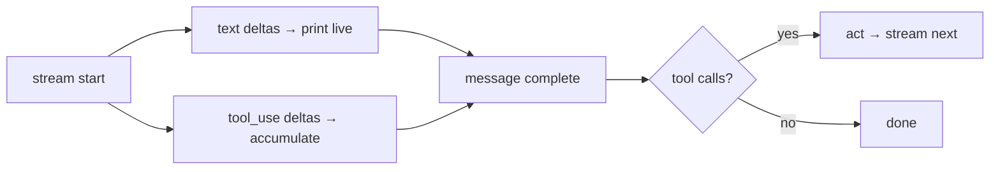

# The Streaming Loop

> **Motto** — Stream the text so the human sees progress, and assemble the message before the loop acts.

*Part of Phase 01 — Foundations and the Loop.*

*Last reviewed: 2026-10 · Volatility: fast*

## The Problem

A non-streaming loop shows nothing until the whole reply is ready. A coding agent can think for many seconds. The screen looks frozen. The user cannot tell work from a hang, and cannot stop a wrong answer early.

Streaming fixes the screen. It also adds a job. The reply now arrives as small events. Text pieces and tool-call fragments mix together. You must rebuild a complete message before the act step can run.

## The Concept

The stream uses server-sent events (SSE). Each event has an `event:` line and a `data:` line with JSON. A blank line ends the event.

The order is fixed. `message_start` opens the message. Each content block then sends `content_block_start`, one or more `content_block_delta` events, and `content_block_stop`. A `message_delta` carries the `stop_reason`. `message_stop` ends the stream.

Text arrives as `text_delta` events. Tool input arrives as `input_json_delta` events. Each holds a `partial_json` string. A fragment is not valid JSON on its own. Join the fragments and parse them at `content_block_stop`. This lesson handles text and `tool_use` blocks only. With thinking or server tools, you must also keep `thinking_delta`, `signature_delta` and the server-tool JSON.

Two more rules. `ping` events can appear anywhere, and new event types can appear later, so ignore what you do not know. An `error` event can arrive mid-stream, for example `overloaded_error`. Raise it. Do not return a half message.



## Build It

`code/streaming.py` builds raw SSE lines in the real format, so the parser sees what it would see on the wire. `parse_sse` turns lines into events.

```python
def parse_sse(lines):
    """Yield (event, data) pairs from raw SSE lines. A blank line ends an event."""
    event, data = None, []
    for line in list(lines) + [""]:                    # the final "" flushes the last event
        line = line.rstrip("\n")
        if line.startswith("event:"):
            event = line[6:].strip()
        elif line.startswith("data:"):
            data.append(line[5:].strip())
        elif line == "" and (event or data):
            yield event, json.loads("\n".join(data)) if data else {}
            event, data = None, []
```

`assemble` folds events into content blocks and a stop reason. Text goes to `on_text` at once. Tool JSON waits for the block to stop.

```python
def assemble(events, on_text=lambda t: None):
    """Fold events into (content blocks, stop_reason). Tool JSON is parsed only at block stop."""
    blocks, partial, stop = {}, {}, None
    for name, ev in events:
        kind, i = ev.get("type", name), ev.get("index")
        if kind == "error":
            raise StreamError(ev["error"]["message"])
        if kind == "content_block_start":
            blocks[i], partial[i] = dict(ev["content_block"]), ""
        elif kind == "content_block_delta":
            d = ev["delta"]
            if d["type"] == "text_delta":
                blocks[i]["text"] += d["text"]
                on_text(d["text"])                     # live output
            elif d["type"] == "input_json_delta":
                partial[i] += d["partial_json"]        # a fragment, not valid JSON yet
        elif kind == "content_block_stop" and blocks[i]["type"] == "tool_use":
            try:
                blocks[i]["input"] = json.loads(partial[i] or "{}")
            except json.JSONDecodeError as exc:
                raise StreamError(f"incomplete tool input: {exc}") from exc
        elif kind == "message_delta":
            stop = ev["delta"]["stop_reason"]
        # message_start, ping, message_stop and unknown events are ignored on purpose
    if stop is None:
        raise StreamError("stream ended before message_delta")
    return [blocks[i] for i in sorted(blocks)], stop
```

`run` is the same loop as before. Only the way the message arrives has changed.

```python
def run(query, stream_model, tools, on_text=sys.stdout.write, max_steps=5):
    """The same loop as before. Only how the message arrives has changed."""
    history = [{"role": "user", "content": query}]
    for _ in range(max_steps):
        blocks, stop = assemble(parse_sse(stream_model(history)), on_text)
        history.append({"role": "assistant", "content": blocks})
        calls = [b for b in blocks if b["type"] == "tool_use"]
        if stop != "tool_use" or not calls:
            return "".join(b["text"] for b in blocks if b["type"] == "text")
        results = [{"type": "tool_result", "tool_use_id": c["id"],
                    "content": str(tools[c["name"]](**c["input"]))} for c in calls]
        history.append({"role": "user", "content": results})
    return "stopped: max_steps"
```

The asserts prove four things. Text reaches `on_text` in pieces. Fragments join into `{"a": 2, "b": 3}`. A tool block that never closes raises `StreamError`. So do a stream that ends early and an `error` event.

## Use It

`code/streaming_sdk.py` lets the SDK do the parsing. It needs `pip install anthropic` and `ANTHROPIC_API_KEY`.

```python
def stream_turn(history, tools):
    """Print text live, then return the assembled message for the act step."""
    extra = {"tools": tools} if tools else {}
    with client.messages.stream(model=MODEL, max_tokens=1024,
                                messages=history, **extra) as stream:
        for text in stream.text_stream:
            print(text, end="", flush=True)
        return stream.get_final_message()
```

`stream.text_stream` yields the text for the human. `stream.get_final_message()` returns the assembled message, with `tool_use` blocks. You pass that message to the same act step. Streaming is two parts: stream for the human, assemble for the loop. The Python and TypeScript helpers also expose the parsed `input` while it streams. Still run a tool only after the final message is whole.

## Challenge

Add interrupt support. On Ctrl-C, stop reading, drop the unfinished assistant turn from history, and return. Assert that history still passes the pairing check from [The Agent Loop](../../03-the-agent-loop/docs/en.md).

## Sources

[Streaming messages](https://platform.claude.com/docs/en/build-with-claude/streaming)

Next: [Schemas, Registry and Descriptions](../../../02-tools/01-schemas-registry-and-descriptions/docs/en.md)
