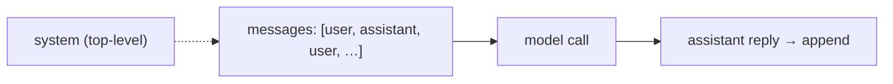

# Messages, roles & turns

> **Motto** — A conversation is a typed list of role-tagged messages — nothing more, nothing less.

*Part of Phase 01 — LLM I/O Foundations.*

## The Problem

Every call you make sends a *list of messages*, each tagged with a role. Get the roles or
ordering wrong and the API rejects the request or the model misbehaves. Before any higher
abstraction, you need a precise mental model — and a small helper — for constructing
well-formed message lists.

## The Concept

Three roles, one rule:

- **system** — instructions/context (passed as a top-level field, not a message).
- **user** — input from the human (or tool results, returned as a user turn).
- **assistant** — the model's replies (you echo these back to continue a conversation).



Turns alternate user/assistant. The system prompt is separate.

## Build It

`code/messages.py` — typed constructors and a validator for alternation:

```python
def system(text): return text                       # passed as top-level `system=`
def user(text):   return {"role": "user", "content": text}
def assistant(t): return {"role": "assistant", "content": t}

def validate(messages):
    if not messages or messages[0]["role"] != "user":
        return "conversation must start with a user message"
    for a, b in zip(messages, messages[1:]):
        if a["role"] == b["role"]:
            return f"two {a['role']} messages in a row — turns must alternate"
    return None

def build(*turns):
    msgs = []
    for role, text in turns:
        msgs.append(user(text) if role == "user" else assistant(text))
    err = validate(msgs)
    if err:
        raise ValueError(err)
    return msgs
```

```python
msgs = build(("user", "hi"), ("assistant", "hello"), ("user", "2+2?"))
print(validate(msgs))    # None — well-formed
```

## Use It

`client.messages.create(model=..., system=system_text, messages=msgs)` takes exactly this
shape. Tool results (Phase 2/3) come back as `user` messages, preserving alternation —
which is why `validate` matters once tools enter.

## Ship It

[`code/messages.py`](../../01-messages-roles-turns/code/messages.py) — message constructors
plus an alternation validator.

## Check Yourself

**Q1.** Where does the system prompt go?

- A) as the first `user` message
- B) as a top-level `system` field, separate from `messages`
- C) as an `assistant` message
- D) anywhere

<details><summary>Answer</summary>B — system is its own field, not a message in the
list.</details>

**Q2.** Why must turns alternate user/assistant?

- A) style
- B) the API expects alternating roles; two in a row is malformed
- C) to save tokens
- D) they don't

<details><summary>Answer</summary>B — non-alternating turns are rejected.</details>

**Challenge.** Extend `build` to accept tool-result turns (a `user` message carrying
structured `tool_result` blocks) without breaking alternation.

## Related

- Next: [Tokens & the context window](../../02-tokens-and-context-window/docs/en.md)
- [Roadmap](../../../../ROADMAP.md)
