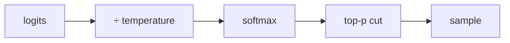

# Sampling: temperature, top-p, determinism

> **Motto** — The model outputs a distribution; sampling decides which token you actually get.

*Part of Phase 01 — LLM I/O Foundations.*

## The Problem

"Why did the model give a different answer this time?" Because generation is *sampling*
from a probability distribution over the next token. Temperature and top-p reshape that
distribution. If you don't understand them, you can't make outputs reproducible for
tests, or creative when you want variety. Build the sampler and the knobs stop being
magic.

## The Concept

For each step the model produces logits → a probability over the vocabulary.

- **Temperature** scales logits before softmax: `<1` sharpens (more deterministic), `>1`
  flattens (more random), `→0` ≈ argmax (greedy).
- **Top-p (nucleus)** keeps the smallest set of tokens whose probability sums to `p`,
  renormalizes, samples from those.



## Build It

`code/sampling.py` — temperature + top-p over a toy distribution, pure stdlib:

```python
import math, random

def softmax(logits, temp):
    t = max(temp, 1e-6)
    m = max(logits)
    exps = [math.exp((x - m) / t) for x in logits]
    s = sum(exps)
    return [e / s for e in exps]

def top_p_filter(probs, p):
    ranked = sorted(enumerate(probs), key=lambda kv: -kv[1])
    kept, cum = [], 0.0
    for i, pr in ranked:
        kept.append((i, pr)); cum += pr
        if cum >= p:
            break
    z = sum(pr for _, pr in kept)
    return {i: pr / z for i, pr in kept}

def sample(logits, temp=1.0, p=1.0, rng=random.Random(0)):
    probs = softmax(logits, temp)
    nucleus = top_p_filter(probs, p)
    r, acc = rng.random(), 0.0
    for i, pr in nucleus.items():
        acc += pr
        if r <= acc:
            return i
    return next(iter(nucleus))
```

```python
logits = [2.0, 1.0, 0.1, -1.0]
print(sample(logits, temp=0.0001))   # ~always 0 (argmax) — deterministic
print([sample(logits, temp=1.0, rng=__import__('random').Random(s)) for s in range(5)])
```

Low temperature collapses to greedy (reproducible); higher temperature with top-p gives
controlled variety.

## Use It

In the API you set `temperature` and `top_p` on `messages.create`. For reproducible
evals (Phase 15), pin a low temperature; for brainstorming, raise it. Note: even at
temperature 0, exact determinism isn't guaranteed across infrastructure — design tests to
tolerate small variation.

## Ship It

[`code/sampling.py`](../../03-sampling/code/sampling.py) — a from-scratch temperature/top-p
sampler for intuition and tests.

## Check Yourself

**Q1.** Temperature → 0 makes generation…

- A) more random
- B) greedy / near-deterministic (argmax)
- C) faster
- D) longer

<details><summary>Answer</summary>B — sharpening to the most likely token.</details>

**Q2.** Top-p = 0.9 means…

- A) keep 90% of tokens
- B) keep the smallest set of tokens whose probabilities sum to 0.9, then sample
- C) temperature 0.9
- D) top 9 tokens

<details><summary>Answer</summary>B — nucleus sampling over the cumulative mass.</details>

**Challenge.** Add top-k filtering (keep only the k highest-probability tokens) and show
how top-k and top-p interact.

## Related

- Builds on: [Tokens](../../02-tokens-and-context-window/docs/en.md)
- Next: [Streaming](../../04-streaming/docs/en.md) · Used in: Phase 15 — Evals
- [Roadmap](../../../../ROADMAP.md)
