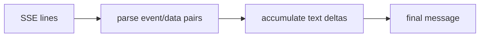

# Streaming Responses Token-by-Token

> **Motto** — Streaming is just parsing a sequence of server-sent events into a growing message.

*Part of Phase 01 — LLM I/O Foundations.*

## The Problem

A non-streaming call blocks until the whole reply is ready. For anything interactive that
feels broken. Streaming sends the reply as a series of **server-sent events (SSE)** — but
now your harness has to parse those events and *reassemble* them into the final message.
Build the parser and streaming stops being a black box.

## The Concept

The wire format is SSE: lines like `event: <type>` and `data: <json>`, blocks separated
by blank lines. For messages you get `content_block_delta` events carrying text fragments,
then a final `message_stop`.



## Build It

`code/sse.py` — a from-scratch SSE parser fed a fake event stream:

```python
import json

def parse_sse(lines):
    """Yield (event, data) pairs from raw SSE lines."""
    event, data = None, None
    for line in lines:
        line = line.rstrip("\n")
        if line.startswith("event:"):
            event = line[6:].strip()
        elif line.startswith("data:"):
            data = json.loads(line[5:].strip())
        elif line == "":                              # blank line ends an event
            if event is not None:
                yield event, data
            event, data = None, None

def assemble(events):
    text = ""
    for event, data in events:
        if event == "content_block_delta":
            text += data["delta"]["text"]
    return text
```

```python
raw = [
  'event: content_block_delta', 'data: {"delta":{"text":"Hel"}}', '',
  'event: content_block_delta', 'data: {"delta":{"text":"lo"}}', '',
  'event: message_stop', 'data: {}', '',
]
print(assemble(parse_sse(raw)))      # "Hello"
```

You just reconstructed a streamed message from raw events — exactly what the SDK does
behind `for text in stream.text_stream`.

## Use It

`with client.messages.stream(...) as stream:` gives you `stream.text_stream` (live text)
and `stream.get_final_message()` (the assembled message with tool_use blocks). The agent
loop streams for the human and assembles for the act step (you built both halves in
Phase 2 lesson 07).

## Ship It

[`code/sse.py`](../../04-streaming/code/sse.py) — an SSE parser + message assembler.

## Check Yourself

**Q1.** What separates one SSE event from the next?

- A) a comma
- B) a blank line
- C) a semicolon
- D) nothing

<details><summary>Answer</summary>B — events are blocks of lines ended by a blank
line.</details>

**Q2.** When is the act step (tool dispatch) safe to run on a streamed reply?

- A) on the first delta
- B) only after the message is fully assembled
- C) never
- D) before streaming

<details><summary>Answer</summary>B — partial deltas can't be dispatched; assemble
first.</details>

**Challenge.** Handle `error` events in the stream: surface them as a clean exception
instead of silently producing a truncated message.

## Related

- Builds on: [Messages](../../01-messages-roles-turns/docs/en.md)
- Related: Phase 2 — [A streaming agent loop](../../../02-the-agent-loop/07-streaming-loop/docs/en.md)
- [Roadmap](../../../../ROADMAP.md)
