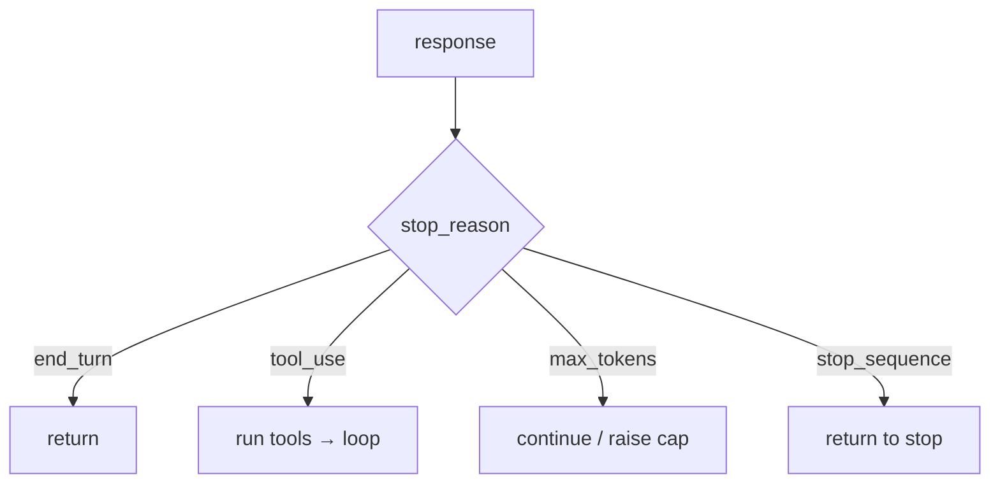

# Stop reasons & max tokens

> **Motto** — Why the model stopped tells the harness what to do next.

*Part of Phase 01 — LLM I/O Foundations.*

## The Problem

Every response carries a `stop_reason`. Treat them all the same and you'll return a
half-finished answer to the user (truncated at `max_tokens`), or fail to run the tools the
model asked for. The harness's next action is a function of the stop reason — so make that
mapping explicit.

## The Concept

The common stop reasons and the correct harness response:

| stop_reason | meaning | harness action |
| --- | --- | --- |
| `end_turn` | model finished naturally | return the text |
| `tool_use` | model requested tools | run them, loop again |
| `max_tokens` | hit the output cap | continue generation or raise the cap |
| `stop_sequence` | hit a configured stop string | return up to the stop |



## Build It

`code/stop_reasons.py` — a dispatch that turns a stop reason into an action:

```python
def next_action(stop_reason, has_tool_calls):
    if stop_reason == "tool_use" and has_tool_calls:
        return "run_tools"
    if stop_reason == "end_turn":
        return "return"
    if stop_reason == "max_tokens":
        return "continue"          # response was truncated — generate more
    if stop_reason == "stop_sequence":
        return "return"
    return "return"                # unknown → safest is to return what we have

def continue_generation(messages, partial):
    """For max_tokens: append the partial assistant text and ask it to keep going."""
    return messages + [
        {"role": "assistant", "content": partial},
        {"role": "user", "content": "continue"},
    ]
```

```python
print(next_action("max_tokens", False))   # continue
print(next_action("tool_use", True))      # run_tools
print(next_action("end_turn", False))     # return
```

Handling `max_tokens` instead of silently truncating is the difference between a complete
answer and a mysterious cut-off.

## Use It

`msg.stop_reason` drives your loop (you used it in Phase 2 lesson 05). For long outputs,
either raise `max_tokens` or implement the continue pattern; for structured outputs,
configure a `stop_sequences` list so generation halts cleanly at a delimiter.

## Ship It

[`code/stop_reasons.py`](../../05-stop-reasons/code/stop_reasons.py) — a stop-reason → action
dispatcher with a continue-generation helper.

## Check Yourself

**Q1.** `stop_reason == "max_tokens"` means…

- A) the model finished
- B) the output was cut off at the cap — it may be incomplete
- C) a tool is needed
- D) an error

<details><summary>Answer</summary>B — truncation; continue or raise the cap.</details>

**Q2.** On `tool_use`, the harness should…

- A) return the text to the user
- B) execute the requested tools and loop again
- C) stop
- D) raise the token cap

<details><summary>Answer</summary>B — act, then continue the loop.</details>

**Challenge.** Add a guard so the continue pattern can't loop forever on `max_tokens`
(cap the number of continuations), tying back to Phase 2 termination.

## Related

- Builds on: [Streaming](../../04-streaming/docs/en.md)
- Used in: Phase 2 — [The Agent Loop](../../../02-the-agent-loop/01-agent-loop/docs/en.md)
- [Roadmap](../../../../ROADMAP.md)
