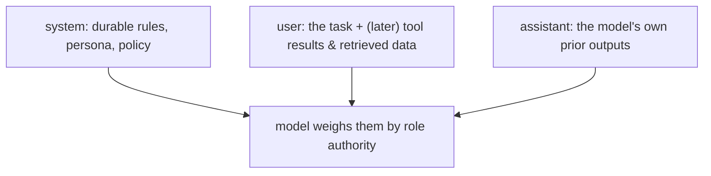

# System vs. user vs. assistant — who controls what

> **Motto** — Put durable rules in system, the task in user, and never let either pretend to be the other.

*Part of Phase 01 — LLM I/O Foundations.*

## The Problem

Three roles can carry text — but they don't carry equal authority, and conflating them is
a security and reliability bug. Stuff instructions into a user message and they're easier
to override (including by injected content, Phase 17). Put volatile task data in the system
prompt and you defeat caching and blur what's a rule vs. what's input. You need a clear
policy for what goes where.

## The Concept

- **system** — stable across turns: who the model is, what it must/mustn't do, output
  contract. Highest standing instructions.
- **user** — the actual request, plus tool results and retrieved documents. *Treat
  retrieved/user-supplied text as data, not instructions.*
- **assistant** — the model's previous replies, echoed back to maintain the thread.

## Build It (a placement policy)

There's no algorithm here — the artifact is a written policy you apply when constructing
every call. `outputs/role-placement.md` encodes it:

- Rules, persona, and the output contract → **system**.
- The task, inputs, retrieved docs, tool results → **user** (wrap untrusted data so the
  model knows it's data).
- Don't restate volatile data in system (kills caching; see lesson 08).
- Don't put authority-bearing instructions in user where injected text can imitate them.

## Use It

In the SDK, `system=` is the durable layer; `messages=` carries the task and history.
Phase 5 builds the system prompt in depth; Phase 17 shows why retrieved content must be
clearly demarcated as data so a malicious document can't escalate to instruction.

## Ship It

[`outputs/role-placement.md`](../../06-roles-precedence/outputs/role-placement.md) — a
placement policy you apply when assembling messages.

## Check Yourself

**Q1.** Where do durable rules and the output contract belong?

- A) the last user message
- B) the system prompt
- C) an assistant message
- D) a tool result

Answer
B — system carries the highest-standing, stable
instructions.

**Q2.** Why treat retrieved documents as *data, not instructions*?

- A) to save tokens
- B) so injected text in a document can't act as commands to the agent
- C) it's faster
- D) no reason

Answer
B — this is the core prompt-injection defense (Phase
17).

**Challenge.** Write a wrapper that places untrusted text inside clearly labeled
delimiters in the user turn (e.g. `<document>…</document>`) and a system line telling the
model to treat anything inside as data only.

## Related

- Builds on: [Messages, roles & turns](../../01-messages-roles-turns/docs/en.md)
- Deepens in: Phase 5 — Prompt Architecture, Phase 17 — Security
- [Roadmap](../../../../ROADMAP.md)
