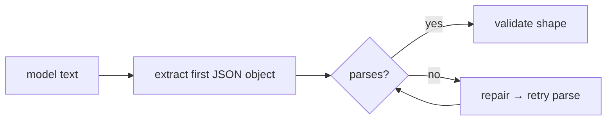

# Structured output without tools (JSON + repair)

> **Motto** — Ask for JSON, but never trust that you got valid JSON — extract, validate, repair.

*Part of Phase 01 — LLM I/O Foundations.*

## The Problem

You want the model to return data your code can consume — a JSON object. Even with a clear
instruction, models sometimes wrap JSON in prose ("Here's the result: { … }"), add
trailing commas, or emit a code fence. One malformed reply and a naive `json.loads` takes
down the workflow. The harness needs to *extract*, *validate*, and *repair* before trusting
output.

## The Concept



Three layers, each cheap: pull the JSON out of surrounding prose, attempt common repairs,
and validate required fields before use.

## Build It

`code/structured.py` — extraction + light repair + validation, stdlib only:

```python
import json, re

def extract_json(text):
    """Grab the first balanced {...} block, ignoring surrounding prose/fences."""
    start = text.find("{")
    if start == -1:
        return None
    depth = 0
    for i in range(start, len(text)):
        if text[i] == "{": depth += 1
        elif text[i] == "}":
            depth -= 1
            if depth == 0:
                return text[start:i + 1]
    return None

def repair(blob):
    blob = blob.strip().strip("`")                       # strip code fences
    blob = re.sub(r",\s*([}\]])", r"\1", blob)           # trailing commas
    return blob

def parse(text, required=()):
    blob = extract_json(text)
    if blob is None:
        return None, "no JSON object found"
    for candidate in (blob, repair(blob)):
        try:
            obj = json.loads(candidate)
        except json.JSONDecodeError:
            continue
        missing = [k for k in required if k not in obj]
        if missing:
            return None, f"missing keys {missing}"
        return obj, None
    return None, "unparseable JSON"
```

```python
msg = 'Sure! Here you go:\n```json\n{"name": "ada", "age": 36,}\n```'
print(parse(msg, required=["name", "age"]))   # ({'name': 'ada', 'age': 36}, None)
```

When `parse` returns an error, the harness re-prompts the model with the error message
(the same errors-are-data pattern as the agent loop).

## Use It

The SDK also supports forcing structure via **tool use** (define a tool whose schema *is*
your output type and let the model fill it). That's the robust production path (Phase 3);
this lesson's extractor is the fallback for plain-text models and the thing tools save you
from.

## Ship It

[`code/structured.py`](../../07-structured-output/code/structured.py) — JSON extract +
repair + validate.

## Check Yourself

**Q1.** Why not call `json.loads` directly on the model's reply?

- A) it's slow
- B) replies often include prose/fences/trailing commas that break a naive parse
- C) JSON is deprecated
- D) you can

<details><summary>Answer</summary>B — extract and repair first; trust nothing.</details>

**Q2.** What's the most robust way to get structured output in production?

- A) bigger model
- B) define a tool whose schema is the output type and let the model fill it
- C) lower temperature only
- D) ask twice

<details><summary>Answer</summary>B — tool-schema-constrained output (Phase 3).</details>

**Challenge.** Add a `coerce` step that fixes single-quoted keys/values before parsing,
and return how many repair steps were needed (useful for an eval metric).

## Related

- Builds on: [Stop reasons](../../05-stop-reasons/docs/en.md)
- Robust path: Phase 3 — [Tool Engineering](../../../../ROADMAP.md)
- [Roadmap](../../../../ROADMAP.md)
