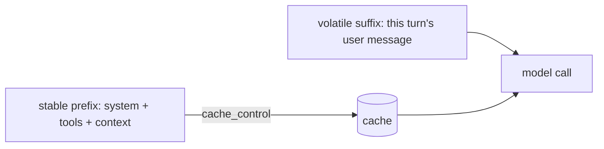

# Prompt caching: what's cacheable and why

> **Motto** — Put the stable bytes first and mark them cacheable; the model re-reads them for almost free.

*Part of Phase 01 — LLM I/O Foundations.*

## The Problem

A coding agent resends a large, mostly-identical prefix on every turn: the system prompt,
tool definitions, project context. Reprocessing those tokens every call is slow and
expensive. Prompt caching lets the provider reuse the computation for an unchanged prefix —
but only if your harness lays the context out so the stable part comes first and is marked
cacheable. Lay it out wrong and you get zero cache hits.

## The Concept



Rules of thumb:

- **Order by volatility:** stable content first (system, tool schemas, long context),
  changing content last (the new user turn).
- **Mark a cache breakpoint** at the end of the stable prefix.
- **Don't interleave volatile data into the prefix** — one changed byte early invalidates
  the whole cached prefix.

## Build It / Use It

Caching is a provider feature, so this is a **Use It** lesson — but the *layout* is yours.
`code/cache_layout.py` shows how to construct a request with a cached prefix (SDK
`cache_control`), defaulting to **Claude Opus 4.8**:

```python
import anthropic
client = anthropic.Anthropic()

SYSTEM = [
    {"type": "text", "text": "You are a coding agent. <long stable instructions...>",
     "cache_control": {"type": "ephemeral"}},          # cache breakpoint here
]

def ask(user_text, tools):
    return client.messages.create(
        model="claude-opus-4-8", max_tokens=1024,
        system=SYSTEM,                                   # stable, cached
        tools=tools,                                     # stable, cached (place before volatile)
        messages=[{"role": "user", "content": user_text}],  # volatile, last
    )
```

The response usage reports `cache_creation_input_tokens` (first call, writes the cache) and
`cache_read_input_tokens` (later calls, cheap reads). You verify caching is working by
watching those numbers, not by guessing.

## Ship It

[`code/cache_layout.py`](../../08-prompt-caching/code/cache_layout.py) — a cache-aware request
layout you reuse whenever a big stable prefix repeats.

## Check Yourself

**Q1.** Why must stable content come *before* volatile content?

- A) readability
- B) caching reuses an unchanged prefix; a change early invalidates everything after it
- C) the API sorts it
- D) it doesn't matter

<details><summary>Answer</summary>B — order by volatility so the cached prefix stays
valid.</details>

**Q2.** How do you confirm caching is actually happening?

- A) it always is
- B) check `cache_read_input_tokens` in the response usage
- C) time the call once
- D) you can't

<details><summary>Answer</summary>B — the usage fields report cache writes and
reads.</details>

**Challenge.** Measure it: make two identical-prefix calls and print
`cache_creation_input_tokens` then `cache_read_input_tokens` to see the cache populate
then hit.

## Related

- Builds on: [Tokens & the context window](../../02-tokens-and-context-window/docs/en.md)
- Deepens in: Phase 4 — Context Engineering, Phase 16 — Observability & Cost
- Phase complete → next: Phase 3 — [Tool Engineering](../../../../ROADMAP.md)
- Other tracks: [Prompt vs. semantic caching](../../../../../content/01-inference-internals/prompt-vs-semantic-caching.md) · [KV cache management](../../../../../content/01-inference-internals/kv-cache-management.md) — the inference-side view of what you cache and why.
- [Roadmap](../../../../ROADMAP.md)
