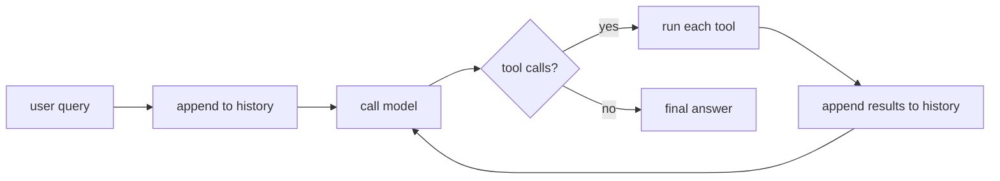

# The agent loop from scratch

> **Motto** — An agent is a `while` loop that lets a stateless model take actions until it's done.

*Part of Phase 02 — The Agent Loop. Concept reading:
[Harness engineering, not just prompt engineering](../../../../foundations/harness-principles.md).*

## The Problem

A single model call can *describe* what to do — "run the tests, then read the failing
file" — but it can't actually do any of it. The model has no hands. It can't run a
command, read a file, or see the result of its own suggestion. One call in, one block
of text out, no memory of the last call.

Every coding agent you've used — Claude Code, Cursor's agent, Codex — closes that gap
with the same small primitive: a loop that calls the model, executes the tools the
model asks for, feeds the results back, and calls again. Until you've written that
loop, the rest of harness engineering has nowhere to live.

## The Concept

The model is a function: `messages -> message`. The loop is everything around it that
turns a one-shot function into an agent that acts.



Three invariants make it work:

1. **History is the memory.** The model is stateless; the loop carries the whole
   conversation — including tool results — forward on every call.
2. **Tool calls are data, not control flow.** The model *requests* an action; the
   harness decides whether and how to run it. (This is also the security boundary —
   see [Phase 17](../../../../ROADMAP.md).)
3. **The loop must terminate.** A max-step ceiling is not optional; it's the
   difference between an agent and a runaway bill.

## Build It

No SDK, no framework — a fake model so the loop logic is undeniable. `code/agent_loop.py`:

```python
MAX_STEPS = 10

def user(text):      return {"role": "user", "content": text}
def assistant(text): return {"role": "assistant", "content": text}
def tool_result(name, out): return {"role": "tool", "name": name, "content": out}

# A tool is just a named Python function.
TOOLS = {
    "add": lambda a, b: str(a + b),
    "read_file": lambda path: open(path).read()[:500],
}

def run(query, model):
    history = [user(query)]
    for step in range(MAX_STEPS):
        msg = model(history)                      # messages -> message
        history.append(assistant(msg["text"]))
        if not msg["tool_calls"]:                 # invariant 3: termination
            return msg["text"]
        for call in msg["tool_calls"]:            # invariant 2: harness runs tools
            fn = TOOLS.get(call["name"])
            try:
                out = fn(**call["args"]) if fn else f"error: no tool {call['name']}"
            except Exception as e:
                out = f"error: {e}"               # errors go back as data, not crashes
            history.append(tool_result(call["name"], out))  # invariant 1: history is memory
    return "stopped: hit MAX_STEPS"
```

A scripted model proves the loop drives multiple steps without any LLM:

```python
def fake_model(history):
    n = sum(1 for m in history if m["role"] == "tool")
    if n == 0:
        return {"text": "Let me add them.", "tool_calls": [{"name": "add", "args": {"a": 2, "b": 3}}]}
    return {"text": f"The answer is {history[-1]['content']}.", "tool_calls": []}

print(run("what is 2 + 3?", fake_model))   # -> "The answer is 5."
```

The loop is ~25 lines and contains all three invariants. Everything else in this
course is a better tool, a better history, or a better stopping rule.

## Use It

Now swap the fake model for the real one. The Anthropic SDK speaks the same
`messages -> message` shape; tool calls arrive as `tool_use` content blocks and you
return `tool_result` blocks. We default to the latest model, **Claude Opus 4.8**
(`claude-opus-4-8`). `code/agent_loop_sdk.py`:

```python
import anthropic
client = anthropic.Anthropic()

tools = [{
    "name": "add",
    "description": "Add two numbers.",
    "input_schema": {"type": "object",
        "properties": {"a": {"type": "number"}, "b": {"type": "number"}},
        "required": ["a", "b"]},
}]

def run(query):
    history = [{"role": "user", "content": query}]
    for _ in range(MAX_STEPS):
        msg = client.messages.create(
            model="claude-opus-4-8", max_tokens=1024, tools=tools, messages=history)
        history.append({"role": "assistant", "content": msg.content})
        calls = [b for b in msg.content if b.type == "tool_use"]
        if msg.stop_reason != "tool_use" or not calls:
            return "".join(b.text for b in msg.content if b.type == "text")
        results = []
        for call in calls:
            out = str(call.input["a"] + call.input["b"])  # dispatch -> Phase 3
            results.append({"type": "tool_result", "tool_use_id": call.id, "content": out})
        history.append({"role": "user", "content": results})
    return "stopped: hit MAX_STEPS"
```

Same loop. Same three invariants. The only differences are the wire format
(`tool_use` / `tool_result` blocks) and that `stop_reason` now tells you when the model
is done. Because you wrote the toy version, none of that is mysterious.

## Ship It

This lesson ships a reusable agent: [`outputs/agent.py`](../outputs/agent.py) — a
model-agnostic loop that takes a `model` callable and a `tools` dict, so later phases
can plug in real dispatch, budgets, and observability without rewriting the core.

## Check Yourself

**Q1.** Why must tool results be appended to the message history?

- A) To make logs nicer
- B) The model is stateless — without them, the next call can't see what happened
- C) The SDK requires it for billing
- D) It isn't necessary

<details><summary>Answer</summary>B — history is the only memory the model has. Drop a
tool result and the model is blind to its own action's outcome.</details>

**Q2.** A tool raises an exception mid-loop. The best default is to…

- A) let it crash the process
- B) return the raw stack trace to the end user
- C) catch it and append a structured error as the tool result, so the model can react
- D) silently skip and continue

<details><summary>Answer</summary>C — errors are data. The model can retry, pick a
different tool, or explain the failure — all within the step budget.</details>

**Q3.** What stops the loop in the Build It version?

- A) The model running out of tokens
- B) Either no tool calls in the model's reply, or hitting `MAX_STEPS`
- C) A timeout
- D) The user pressing Ctrl-C

<details><summary>Answer</summary>B — those are the two termination conditions. Real
harnesses add timeouts and budgets (Phase 14) on top.</details>

**Challenge.** Extend `run()` so that if the same tool is called with identical
arguments twice in a row, the loop injects a nudge ("you already did that — try
something else") instead of re-running it. This is the seed of loop-detection you'll
formalize in [Phase 14 — Reliability Engineering](../../../../ROADMAP.md).

## Related

- Next: `02-tool-call-parsing` and Phase 3 — [Tool Engineering](../../../../ROADMAP.md)
- Concept: [Harness engineering, not just prompt engineering](../../../../foundations/harness-principles.md)
- Concept: [Agent guardrails](../../../../ROADMAP.md)
- Other tracks: [What is an agent?](../../../../../agentic-ai/what-is-an-agent.md) — the conceptual loop; [Job executor](../../../../../flowable/phases/02-the-engine-state-and-transactions/04-job-executor/docs/en.md) — the same drive-until-done loop in a process engine.
