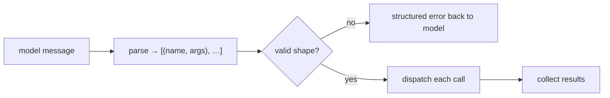

# Tool-call parsing & the act step

> **Motto** — The act step turns the model's *words* about an action into a *typed, validated call*.

*Part of Phase 02 — The Agent Loop. Builds on
[The agent loop from scratch](../../01-agent-loop/docs/en.md).*

## The Problem

In lesson 01 the fake model handed us tidy `tool_calls` dicts. Real models don't — they
emit content blocks (or, with weaker models, free-form text like
`I'll call add(2, 3)`). Before the loop can *act*, it has to parse that intent into a
structured `(name, args)` it can trust, reject malformed calls, and turn one model
message into possibly several tool invocations. Get this wrong and the loop either
crashes on bad input or executes something the model didn't actually request.

## The Concept



The act step has three jobs: **extract** every tool call from one message, **validate**
each against the tool's schema, and **dispatch** them (in order, or in parallel if
independent). Parsing failures are data — they go back to the model, they don't raise.

## Build It

`code/act.py` — a parser that handles both structured blocks and a text fallback, then
validates argument shape before dispatch:

```python
import json, re

def parse_calls(message):
    """Return [(name, args), ...] from a model message (blocks or text fallback)."""
    if isinstance(message, dict) and message.get("tool_calls"):
        return [(c["name"], c["args"]) for c in message["tool_calls"]]
    text = message if isinstance(message, str) else message.get("text", "")
    calls = []
    for m in re.finditer(r"(\w+)\((\{.*?\})\)", text):      # e.g. add({"a":2,"b":3})
        try:
            calls.append((m.group(1), json.loads(m.group(2))))
        except json.JSONDecodeError:
            pass                                            # skip junk, don't crash
    return calls

def validate(name, args, schema):
    spec = schema.get(name)
    if spec is None:
        return f"error: unknown tool {name!r}"
    missing = [k for k in spec["required"] if k not in args]
    if missing:
        return f"error: {name} missing args {missing}"
    return None                                             # None == valid

def act(message, tools, schema):
    results = []
    for name, args in parse_calls(message):
        err = validate(name, args, schema)
        if err:
            results.append({"name": name, "ok": False, "content": err})
            continue
        try:
            out = str(tools[name](**args))
            results.append({"name": name, "ok": True, "content": out})
        except Exception as e:
            results.append({"name": name, "ok": False, "content": f"error: {e}"})
    return results
```

```python
tools  = {"add": lambda a, b: a + b}
schema = {"add": {"required": ["a", "b"]}}
print(act('add({"a": 2, "b": 3})', tools, schema))
# [{'name': 'add', 'ok': True, 'content': '5'}]
print(act('add({"a": 2})', tools, schema))
# [{'name': 'add', 'ok': False, 'content': 'error: add missing args [\'b\']'}]
```

Notice every path returns a result — valid, unknown tool, missing arg, runtime error.
The loop never sees an exception; the model sees a message it can recover from.

## Use It

With the Anthropic SDK you don't regex anything — tool calls arrive as typed
`tool_use` content blocks (`block.name`, `block.input`, `block.id`). The validation and
dispatch logic above is unchanged; only `parse_calls` collapses to
`[b for b in msg.content if b.type == "tool_use"]`. You built the text fallback so you
understand what the SDK is saving you from (and why a no-tools model needs it).

## Ship It

[`code/act.py`](../../02-tool-call-parsing/code/act.py) is the artifact — a drop-in
`act(message, tools, schema)` that the Phase 2 agent loop calls in place of its inline
dispatch.

## Check Yourself

**Q1.** Why return a structured error for an unknown tool instead of raising?

- A) It's faster
- B) The model can read the error and pick a valid tool within the same loop
- C) Exceptions aren't allowed in Python
- D) To save tokens

<details><summary>Answer</summary>B — errors are feedback. Raising would kill the loop;
a message lets the model self-correct.</details>

**Q2.** One model message contains two independent tool calls. The act step should…

- A) run only the first
- B) extract and dispatch both, collecting both results
- C) error because only one is allowed
- D) merge them

<details><summary>Answer</summary>B — a single message can request multiple actions;
parse all of them.</details>

**Challenge.** Add an `arg-type` check to `validate` (e.g. `a` must be a number), and
return a message that tells the model the expected type when it's wrong.

## Related

- Builds on: [The agent loop from scratch](../../01-agent-loop/docs/en.md)
- Next: [Termination](../../03-termination/docs/en.md)
- Deepens in: Phase 3 — [Tool Engineering](../../../../ROADMAP.md)
