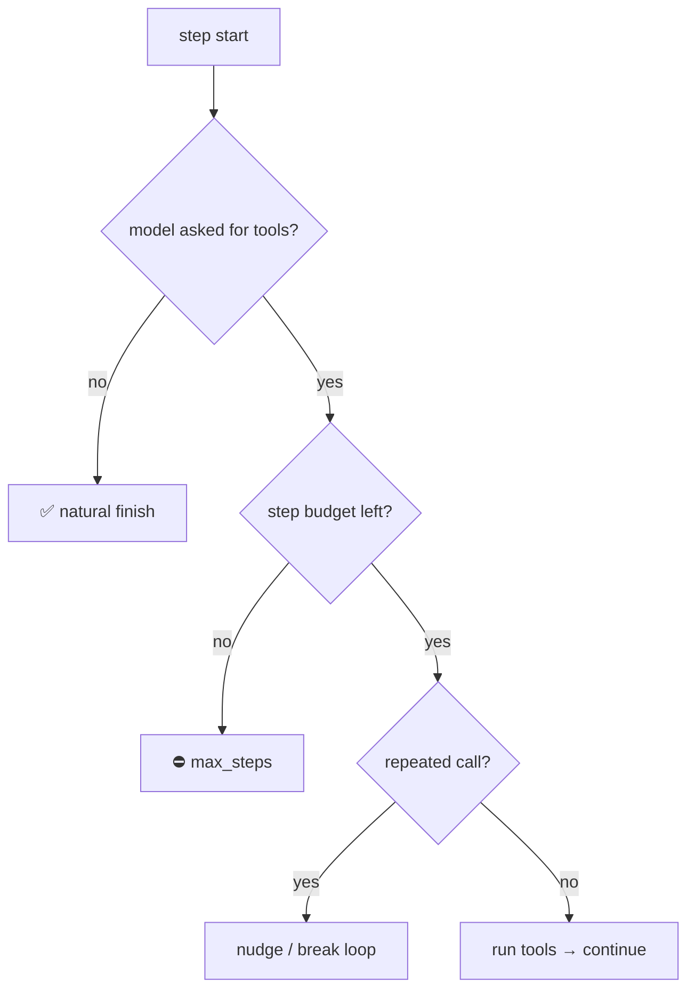

# Termination: stop conditions & max steps

> **Motto** — An agent without a stop condition is a fork bomb with opinions.

*Part of Phase 02 — The Agent Loop. Builds on
[The agent loop from scratch](../../01-agent-loop/docs/en.md).*

## The Problem

The loop calls the model, runs tools, calls again. What makes it *stop*? "When the model
stops asking for tools" is one answer — but a confused model can ask forever, repeat the
same call, or never emit a final answer. Without explicit ceilings, a single request can
run 40 steps and spend real money. Termination is not an afterthought; it's the
difference between an agent and a runaway bill.

## The Concept

A loop needs **layered** stop conditions, checked every iteration:



- **Natural:** the model returns no tool calls → done.
- **Hard ceiling:** `max_steps` — non-negotiable, always present.
- **Behavioral:** loop detection (same call twice), token/cost budget (Phase 14).
- **Explicit:** a `done` tool the model calls to signal completion.

## Build It

`code/termination.py` — a policy object the loop consults each step:

```python
from dataclasses import dataclass, field

@dataclass
class StopPolicy:
    max_steps: int = 10
    seen: list = field(default_factory=list)      # signatures of past calls

    def check(self, step, calls):
        if not calls:
            return "done"                          # natural finish
        if step >= self.max_steps:
            return "max_steps"                     # hard ceiling
        sig = tuple(sorted((c["name"], str(c["args"])) for c in calls))
        if self.seen and sig == self.seen[-1]:
            return "loop"                          # same calls as last step
        self.seen.append(sig)
        return None                                # keep going

def run(query, model, run_calls):
    history, policy = [{"role": "user", "content": query}], StopPolicy()
    for step in range(policy.max_steps + 1):
        msg = model(history)
        history.append({"role": "assistant", "content": msg["text"]})
        verdict = policy.check(step, msg["tool_calls"])
        if verdict == "done":
            return msg["text"]
        if verdict == "max_steps":
            return "stopped: step budget exhausted"
        if verdict == "loop":
            history.append({"role": "user", "content": "You repeated a call. Try a different approach or finish."})
            continue
        history.append({"role": "user", "content": run_calls(msg["tool_calls"])})
    return "stopped: step budget exhausted"
```

The policy is separate from the loop, so termination rules are testable in isolation and
reusable across agents.

## Use It

The SDK gives you `stop_reason` (`"end_turn"`, `"tool_use"`, `"max_tokens"`) — that
covers *natural* and *token* termination. The **step**, **loop**, and **cost** ceilings
are yours to add; no SDK enforces them for you. That's the whole point of owning the
loop: the provider stops a single call, but only your harness stops a *runaway agent*.

## Ship It

[`code/termination.py`](../../03-termination/code/termination.py) — a `StopPolicy` you
compose into any loop.

## Check Yourself

**Q1.** Which stop condition must *always* be present, even if every other check is off?

- A) loop detection
- B) a hard `max_steps` ceiling
- C) a `done` tool
- D) token budget

<details><summary>Answer</summary>B — it's the backstop that guarantees the loop
terminates no matter how the model behaves.</details>

**Q2.** On detecting a repeated call, the better default is to…

- A) crash
- B) nudge the model to change approach and continue within budget
- C) silently re-run it
- D) return the previous result

<details><summary>Answer</summary>B — give the model a chance to recover; the step
ceiling still bounds the total.</details>

**Challenge.** Add a `max_tool_calls` ceiling (total across all steps), so a model that
asks for 5 tools per step can't blow the budget before hitting `max_steps`.

## Related

- Builds on: [The agent loop from scratch](../../01-agent-loop/docs/en.md)
- Next: [Turn history & conversation state](../../04-turn-history/docs/en.md)
- Concept: [Agent guardrails](../../../../ROADMAP.md)
