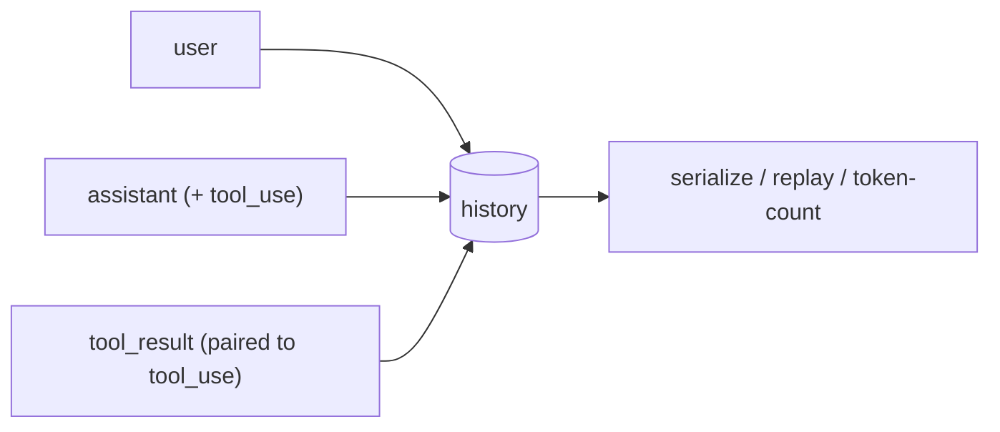

# Turn History & Conversation State

> **Motto** — History is the only memory the model has — so own it deliberately.

*Part of Phase 02 — The Agent Loop. Builds on
[The agent loop from scratch](../../01-agent-loop/docs/en.md).*

## The Problem

The model is stateless: every call must carry the whole conversation, including tool
results. So far we've appended raw dicts to a list. That works until you need to:
serialize a session to disk, replay it, count its tokens, or — critically — keep the
`assistant` tool-request and its `tool_result` paired so the provider doesn't reject the
request. History is a data structure with invariants, not just a list.

## The Concept



Two invariants the harness must keep:

1. **Pairing:** every `tool_use` in an assistant turn must be followed by a matching
   `tool_result`. Truncation (Phase 4) must never split a pair.
2. **Order:** roles alternate as the API expects; tool results belong to the turn that
   requested them.

## Build It

`code/history.py` — a `History` that enforces pairing and serializes:

```python
import json
from dataclasses import dataclass, field

@dataclass
class History:
    messages: list = field(default_factory=list)
    _pending: set = field(default_factory=set)        # tool_use ids awaiting results

    def user(self, text):
        self.messages.append({"role": "user", "content": text})

    def assistant(self, text, tool_calls=None):
        msg = {"role": "assistant", "content": text, "tool_calls": tool_calls or []}
        self.messages.append(msg)
        self._pending = {c["id"] for c in msg["tool_calls"]}

    def tool_result(self, call_id, content):
        if call_id not in self._pending:
            raise ValueError(f"result for unknown/unpaired call {call_id!r}")
        self.messages.append({"role": "tool", "call_id": call_id, "content": content})
        self._pending.discard(call_id)

    def complete(self):
        """True when every requested tool call has a result — safe to call the model."""
        return not self._pending

    def dump(self):
        return json.dumps(self.messages, indent=2)

    @classmethod
    def load(cls, blob):
        return cls(messages=json.loads(blob))
```

```python
h = History()
h.user("what is 2 + 3?")
h.assistant("let me add", tool_calls=[{"id": "t1", "name": "add", "args": {"a": 2, "b": 3}}])
print(h.complete())          # False — result for t1 is missing
h.tool_result("t1", "5")
print(h.complete())          # True — safe to call the model again
```

`complete()` is the guard: the loop must not call the model while a tool result is
outstanding. `dump()`/`load()` make sessions resumable — the seed of Phase 9 memory.

## Use It

The SDK enforces the same pairing at the wire level: an assistant message with a
`tool_use` block must be followed by a user message containing a `tool_result` block
with the matching `tool_use_id`, or the API errors. Because you built `_pending`
tracking yourself, that error message ("expected tool_result for id …") is now obvious
rather than mysterious.

## Ship It

[`code/history.py`](../../04-turn-history/code/history.py) — a `History` class with
pairing invariants and JSON serialization, reused by the context manager (Phase 4) and
memory store (Phase 9).

## Check Yourself

**Q1.** Why must the loop check `complete()` before the next model call?

- A) For speed
- B) An unmatched `tool_use` without its `tool_result` is rejected by the API
- C) To save tokens
- D) It isn't necessary

<details><summary>Answer</summary>B — the provider requires every tool request to be
answered before the conversation continues.</details>

**Q2.** When truncating long history (Phase 4), the one thing you must never do is…

- A) drop the system prompt
- B) split a `tool_use` from its `tool_result`
- C) summarize old turns
- D) keep the most recent turn

<details><summary>Answer</summary>B — splitting a pair leaves the conversation in an
invalid state the API rejects.</details>

**Challenge.** Add `token_estimate()` that approximates the history's size (e.g. 4 chars
≈ 1 token) so a future context manager can decide when to compact.

## Related

- Builds on: [The agent loop from scratch](../../01-agent-loop/docs/en.md)
- Next: [Use It: the SDK tool-use loop](../../05-sdk-tool-use-loop/docs/en.md)
- Deepens in: Phase 4 — [Context Engineering](../../../../ROADMAP.md), Phase 9 — Memory
