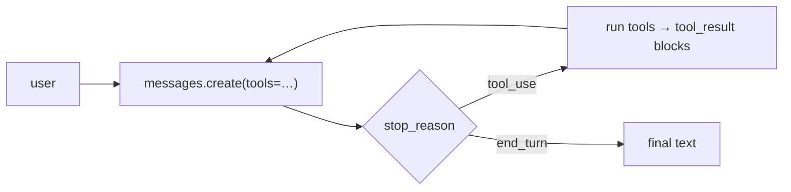

# Use It: The Agent Loop on the Real SDK

> **Motto** — Same loop, same invariants — the only new thing is the wire format.

*Part of Phase 02 — The Agent Loop. Builds on lessons 01–04.*

## The Problem

You've built the loop, the act step, termination, and history from scratch. Now wire
them to a real model so the agent actually does something. The risk at this step is
treating the SDK as magic and forgetting the invariants you just learned. It isn't
magic — it's the same loop with `tool_use` / `tool_result` content blocks instead of
plain dicts.

## The Concept



The mapping from your scratch version:

| Scratch | SDK |
| --- | --- |
| `model(history)` | `client.messages.create(model=…, tools=…, messages=…)` |
| `msg["tool_calls"]` | `[b for b in msg.content if b.type == "tool_use"]` |
| your `tool_result` dict | `{"type": "tool_result", "tool_use_id": id, "content": …}` |
| `StopPolicy` natural finish | `msg.stop_reason == "end_turn"` |

## Build It (wire it up)

`code/sdk_loop.py` — defaults to the latest model, **Claude Opus 4.8**
(`claude-opus-4-8`). Requires `pip install anthropic` and `ANTHROPIC_API_KEY`.

```python
import anthropic
client = anthropic.Anthropic()
MAX_STEPS = 10

TOOLS = {"add": lambda a, b: a + b}
SCHEMA = [{
    "name": "add", "description": "Add two numbers.",
    "input_schema": {"type": "object",
        "properties": {"a": {"type": "number"}, "b": {"type": "number"}},
        "required": ["a", "b"]},
}]

def run(query):
    messages = [{"role": "user", "content": query}]
    for _ in range(MAX_STEPS):
        msg = client.messages.create(
            model="claude-opus-4-8", max_tokens=1024, tools=SCHEMA, messages=messages)
        messages.append({"role": "assistant", "content": msg.content})
        calls = [b for b in msg.content if b.type == "tool_use"]
        if msg.stop_reason != "tool_use" or not calls:           # termination
            return "".join(b.text for b in msg.content if b.type == "text")
        results = []
        for call in calls:                                        # act step
            try:
                out = str(TOOLS[call.name](**call.input))
            except Exception as e:
                out = f"error: {e}"                               # errors are data
            results.append({"type": "tool_result", "tool_use_id": call.id, "content": out})
        messages.append({"role": "user", "content": results})     # pairing invariant
    return "stopped: hit MAX_STEPS"

if __name__ == "__main__":
    print(run("What is 12 + 30? Use the add tool."))
```

Every concept from lessons 01–04 is visible: termination (`stop_reason`), the act step
(parse `tool_use`, dispatch, errors-as-data), and the pairing invariant (results go back
in a `user` message keyed by `tool_use_id`).

## Use It (TypeScript)

The Node SDK is identical in shape — `@anthropic-ai/sdk`, `client.messages.create`,
`content.filter(b => b.type === 'tool_use')`, results returned as `tool_result` blocks.
Harnesses like Claude Code live in this ecosystem; the loop you wrote ports directly.

## Ship It

[`code/sdk_loop.py`](../../05-sdk-tool-use-loop/code/sdk_loop.py) — a real, model-backed
agent loop you can point at any tool set.

## Check Yourself

**Q1.** Where do tool results go in the SDK conversation?

- A) in the next `assistant` message
- B) in a `user` message as `tool_result` blocks keyed by `tool_use_id`
- C) in the system prompt
- D) they're discarded

<details><summary>Answer</summary>B — results are sent back as a user turn, each paired
to the originating `tool_use_id`.</details>

**Q2.** `stop_reason == "end_turn"` means…

- A) run more tools
- B) the model is done — return its text
- C) an error occurred
- D) the token limit was hit

<details><summary>Answer</summary>B — natural finish. (`"max_tokens"` is the truncated
case; `"tool_use"` means act and continue.)</details>

**Challenge.** Replace the inline message list with the `History` class from lesson 04
and the `StopPolicy` from lesson 03, so this loop reuses your scratch modules instead of
re-implementing them.

## Related

- Builds on: lessons [01](../../01-agent-loop/docs/en.md)–[04](../../04-turn-history/docs/en.md)
- Next: [Error recovery inside the loop](../../06-error-recovery/docs/en.md)
