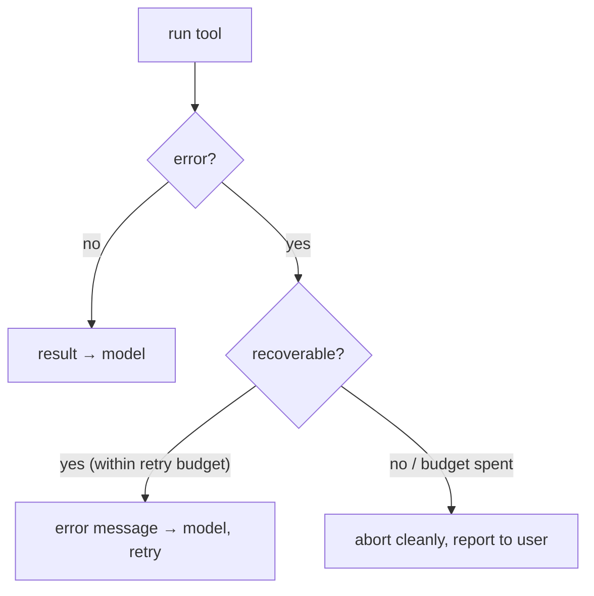

# Error recovery inside the loop

> **Motto** — Errors are messages to the model, not exceptions to the user.

*Part of Phase 02 — The Agent Loop. Builds on lessons 01–05.*

## The Problem

Tools fail: a file doesn't exist, a command times out, an API returns 500, the model
passes a bad argument. A naive loop lets the exception bubble up and the whole agent
dies mid-task — the user sees a stack trace instead of a recovery. A robust loop treats
every failure as information the model can act on: read the error, try a different path,
or explain what went wrong. The skill is deciding *which* errors are recoverable and
*how many times* to let the model try.

## The Concept



Classify errors into three buckets:

- **Model-fixable** (bad args, wrong tool) → feed the error back; the model corrects.
- **Transient** (timeout, 429, 5xx) → retry with backoff (Phase 14), bounded count.
- **Fatal** (auth failure, out of budget) → stop and report; don't loop forever.

## Build It

`code/recovery.py` — wraps dispatch, classifies, and enforces a per-tool retry budget:

```python
from dataclasses import dataclass, field

TRANSIENT = ("timeout", "429", "503", "connection")

@dataclass
class Recovery:
    max_retries: int = 2
    attempts: dict = field(default_factory=dict)        # tool name -> count

    def dispatch(self, name, args, tools):
        try:
            return {"ok": True, "content": str(tools[name](**args))}
        except KeyError:
            return {"ok": False, "fatal": False,        # model-fixable: unknown tool
                    "content": f"error: no tool {name!r}; available: {list(tools)}"}
        except TypeError as e:
            return {"ok": False, "fatal": False,        # model-fixable: bad args
                    "content": f"error: bad arguments for {name}: {e}"}
        except Exception as e:
            msg = str(e).lower()
            transient = any(t in msg for t in TRANSIENT)
            n = self.attempts.get(name, 0) + 1
            self.attempts[name] = n
            if transient and n <= self.max_retries:
                return {"ok": False, "fatal": False, "retry": True,
                        "content": f"transient error (attempt {n}): {e}"}
            return {"ok": False, "fatal": not transient,
                    "content": f"error: {e}"}
```

```python
def flaky(n=[0]):
    n[0] += 1
    if n[0] < 3:
        raise RuntimeError("connection timeout")
    return "ok"

r = Recovery()
print(r.dispatch("flaky", {}, {"flaky": lambda: flaky()}))   # retry: True (attempt 1)
print(r.dispatch("flaky", {}, {"flaky": lambda: flaky()}))   # retry: True (attempt 2)
print(r.dispatch("flaky", {}, {"flaky": lambda: flaky()}))   # ok: True
print(r.dispatch("nope",  {}, {"flaky": lambda: flaky()}))   # model-fixable: unknown tool
```

The loop reads `fatal` to decide whether to abort, and `retry` to decide whether to
re-dispatch without consuming a step. The model only ever sees clean messages.

## Use It

In production the transient bucket becomes a real backoff policy (`anthropic` raises
`APIStatusError` with `.status_code`; you retry 429/5xx with exponential backoff and
jitter — Phase 14). The classification you wrote here is the decision layer that sits on
top of any retry library.

## Ship It

[`code/recovery.py`](../../06-error-recovery/code/recovery.py) — a `Recovery` dispatcher
that classifies failures and bounds retries.

## Check Yourself

**Q1.** A tool is called with a missing argument. The right classification is…

- A) fatal — abort
- B) model-fixable — feed the error back so the model retries with correct args
- C) transient — retry with backoff
- D) ignore it

<details><summary>Answer</summary>B — the model produced the bad call, so the model can
fix it from a clear error message.</details>

**Q2.** Why bound the retry count per tool?

- A) to save memory
- B) so a permanently-failing tool can't loop forever burning budget
- C) the API requires it
- D) to reduce tokens

<details><summary>Answer</summary>B — without a ceiling, a transient classification on a
truly-broken tool becomes an infinite retry.</details>

**Challenge.** Add jitter to a (simulated) backoff between transient retries and log each
attempt, so the recovery is observable (a preview of Phase 16).

## Related

- Builds on: [Termination](../../03-termination/docs/en.md), [SDK loop](../../05-sdk-tool-use-loop/docs/en.md)
- Next: [A streaming agent loop](../../07-streaming-loop/docs/en.md)
- Deepens in: Phase 14 — [Reliability Engineering](../../../../ROADMAP.md)
