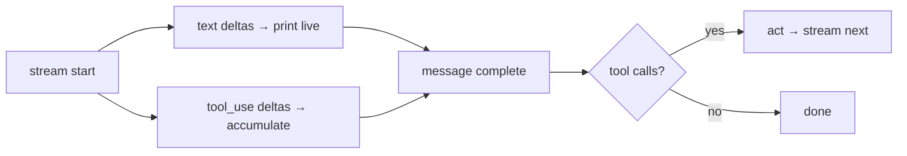

# A Streaming Agent Loop

> **Motto** — Stream tokens so the human sees thinking, not a spinner.

*Part of Phase 02 — The Agent Loop. Builds on lessons 01–06; completes the phase.*

## The Problem

A non-streaming loop waits for the entire model response before showing anything. For a
coding agent that may "think" for many seconds, that's a dead UI and a worse feeling of
control — the user can't tell if it's working or hung, and can't interrupt early.
Streaming changes the experience: text appears token-by-token, and you still have to
*accumulate* those tokens (and any tool calls) into a complete message before the act
step can run.

## The Concept



The key insight: streaming changes *how you receive* the message, not the loop's logic.
You still end each turn with a complete message, then apply the same termination and act
steps from earlier lessons.

## Build It

A fake streamed model (a generator of deltas) proves the accumulation logic with no
network. `code/streaming.py`:

```python
import sys

def fake_stream(history):
    """Yield deltas like a real streaming API: text chunks, then maybe a tool call."""
    if not any(m["role"] == "tool" for m in history):
        for chunk in ["Let ", "me ", "add ", "those.\n"]:
            yield {"type": "text", "text": chunk}
        yield {"type": "tool_use", "name": "add", "args": {"a": 2, "b": 3}}
    else:
        for chunk in ["The ", "answer ", "is ", history[-1]["content"], "."]:
            yield {"type": "text", "text": chunk}

def stream_turn(history, model, on_text):
    """Consume the stream, print text live, return the assembled message."""
    text, tool_calls = "", []
    for delta in model(history):
        if delta["type"] == "text":
            on_text(delta["text"])              # live output
            text += delta["text"]
        elif delta["type"] == "tool_use":
            tool_calls.append({"name": delta["name"], "args": delta["args"]})
    return {"text": text, "tool_calls": tool_calls}

def run(query, model, tools, max_steps=10):
    history = [{"role": "user", "content": query}]
    for _ in range(max_steps):
        msg = stream_turn(history, model, on_text=lambda t: sys.stdout.write(t))
        history.append({"role": "assistant", "content": msg["text"]})
        if not msg["tool_calls"]:               # same termination as lesson 03
            return msg["text"]
        for call in msg["tool_calls"]:          # same act step as lesson 02
            out = str(tools[call["name"]](**call["args"]))
            history.append({"role": "tool", "content": out})
    return "stopped: max_steps"
```

```python
run("2 + 3?", fake_stream, {"add": lambda a, b: a + b})
# prints:  Let me add those.
#          The answer is 5.
```

The text streams as it arrives; the tool call is accumulated and dispatched only once the
turn is complete. Loop logic = unchanged.

## Use It

The SDK exposes this as `with client.messages.stream(...) as stream:` — you iterate
`stream.text_stream` for live text, and `stream.get_final_message()` gives you the
assembled message (with `tool_use` blocks) to run the act step on. Same two-part shape:
stream for the human, assemble for the loop.

## Ship It

[`code/streaming.py`](../../07-streaming-loop/code/streaming.py) — a streaming loop that
prints live and still drives tools.

## Check Yourself

**Q1.** When can the act step run on a streamed turn?

- A) after the first text delta
- B) only once the message is fully assembled
- C) before the stream starts
- D) never

<details><summary>Answer</summary>B — you need the complete tool call (name + args)
before dispatching; deltas are partial.</details>

**Q2.** Streaming primarily changes…

- A) the loop's termination logic
- B) how the message is *received* (incrementally), not the loop logic
- C) which tools are available
- D) the model's accuracy

<details><summary>Answer</summary>B — same loop; only the delivery of the message is
incremental.</details>

**Challenge.** Add interrupt support: if the user sends a stop signal mid-stream, abandon
the current turn cleanly (close the stream, leave history valid) instead of crashing.

## Related

- Builds on: [tool-call parsing](../../02-tool-call-parsing/docs/en.md), [termination](../../03-termination/docs/en.md)
- Phase complete → next: Phase 3 [Tool Engineering](../../../../ROADMAP.md), Phase 4 [Context Engineering](../../../../ROADMAP.md)
