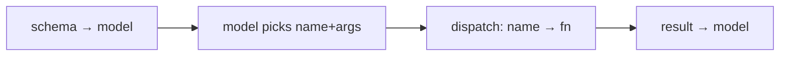

# Schemas, Registry and Descriptions

> **Motto** — A tool is a function plus a schema, and the description is the only manual the model gets.

*Part of Phase 02 — Tools.*

*Last reviewed: 2026-10 · Volatility: fast*

## The Problem

The model never sees your Python. It sees a name, a description, and an input shape. From those it decides whether to call a tool and what to pass. A vague description makes it skip the tool, call it for the wrong job, or pass bad arguments.

Tools also multiply. With fifty of them you need one place that lists them, runs them by name, and decides which agent may see which.

## The Concept

A tool has two halves. The **schema** goes to the model. It holds `name`, `description`, and `input_schema`, which is a JSON Schema object. The **implementation** stays in the harness. The name must match `^[a-zA-Z0-9_-]{1,128}$`.

The description matters most. Say what the tool does, when to use it and when not to, what each parameter means, and what it returns. Anthropic advises at least 3 to 4 sentences. Write for the model, not for a human reader. Fewer, richer tools are easier to choose from than many thin ones.

A **registry** keeps schema and function together, so they cannot drift apart. It exports the `tools=` list, dispatches by name, and scopes tools by role. Scoping must happen twice. Hiding a schema keeps the model from asking. The dispatch check keeps it from succeeding.



## Build It

`code/tools.py` holds the registry. The decorator registers the function and its schema in one step. `dispatch` raises on unknown or forbidden tools. The next lesson turns those errors into results the model can read.

```python
class Registry:
    def __init__(self):
        self._tools = {}                                # name -> {"fn", "schema"}

    def tool(self, name, description, properties, required=()):
        """Decorator: register the function and its schema together so they cannot drift."""
        if not NAME_RE.match(name):
            raise ValueError(f"bad tool name {name!r}")
        schema = {"name": name, "description": description,
                  "input_schema": {"type": "object", "properties": properties,
                                   "required": list(required)}}

        def deco(fn):
            self._tools[name] = {"fn": fn, "schema": schema}
            return fn
        return deco

    def schemas(self, allow=None):
        """The list you pass as tools=. `allow` hides tools from a role."""
        return [t["schema"] for n, t in self._tools.items() if allow is None or n in allow]

    def dispatch(self, name, args, allow=None):
        """Map the model's chosen name + args to a function. Hiding is not enough: enforce here."""
        if allow is not None and name not in allow:
            raise PermissionError(f"tool {name!r} is not permitted for this role")
        if name not in self._tools:
            raise LookupError(f"no tool named {name!r}; have {sorted(self._tools)}")
        return str(self._tools[name]["fn"](**args))
```

`lint` turns the description rules into a rough check. It finds gaps. It cannot judge quality.

```python
def lint(schema):
    """Rough check of the rubric. A lint finds gaps. It cannot judge quality."""
    problems, desc = [], schema["description"]
    if len(re.findall(r"[.!?](?:\s|$)", desc)) < 3:
        problems.append("description has fewer than 3 sentences")
    if "use when" not in desc.lower():
        problems.append("say when to use it (and when not to)")
    if "return" not in desc.lower():
        problems.append("say what it returns")
    for key, spec in schema["input_schema"]["properties"].items():
        if not spec.get("description"):
            problems.append(f"parameter {key!r} has no description")
    return problems
```

Here is a tool that passes. The description answers all four questions.

```python
reg = Registry()


@reg.tool("read_file",
          "Read a text file from the project and return its contents. "
          "Use when you need to see code or config. Do not use it to list a folder. "
          "Returns the file text, or an error if the path does not exist.",
          {"path": {"type": "string", "description": "Path relative to the project root, e.g. src/app.py"}},
          required=["path"])
def read_file(path):
    with open(path, encoding="utf-8") as f:
        return f.read()
```

The asserts register a second tool with the description "Delete a file." and prove that the lint finds four problems in it. They also prove that a reviewer role cannot see or run `delete_file`, and that the file survives the attempt.

## Use It

Pass `reg.schemas()` as `tools=` to `messages.create`. The model replies with `tool_use` blocks. Your `dispatch` runs each one.

Three more fields help on the Anthropic API:

- `input_examples` holds sample inputs. Each one must match the schema.
- `strict: true` guarantees that inputs match the schema.
- `tool_choice` takes `auto`, `any`, `tool`, or `none`. Some current models reject `any` and `tool` with a 400 error. Check the docs for your model, and use `auto` with strict tools there.

When an eval shows tool misuse, fix the description first.

## Challenge

Derive `input_schema` from a function's type hints and its docstring. Use `inspect`. Register `read_file` without writing the schema by hand, and assert that the output equals the hand-written one.

## Sources

[Define tools](https://platform.claude.com/docs/en/agents-and-tools/tool-use/define-tools)

Other tracks: [Tools and function calling](../../../../../agentic-ai/tools-and-function-calling.md) and [Function calling](../../../../../content/02-reliable-outputs/function-calling.md).

Next: [Validation, Results and Errors](../../02-validation-results-and-errors/docs/en.md)
