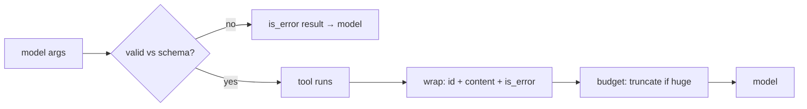

# Validation, Results and Errors

> **Motto** — The model proposes the arguments, the harness proves them, and every outcome goes back as a message the model can use.

*Part of Phase 02 — Tools.*

*Last reviewed: 2026-10 · Volatility: fast*

## The Problem

The model fills in tool arguments from a schema, and it can get them wrong. A field is missing. A string sits where a number belongs. A value is outside the allowed set. If you call the function anyway, you get a traceback or a silently wrong action.

The result needs care too. A huge raw dump blows the context budget. An unlabeled error looks like a success. Validate before you run, and shape what comes back.

## The Concept

Every call passes through the same path. Validate the arguments against the schema. Run the tool only if they pass. Wrap the outcome in a `tool_result` block. Cap its size.

A `tool_result` carries the `tool_use_id` it answers, a `content` string, and an optional `is_error` flag. The flag tells the model that the content is a failure to act on, not an answer.

Write errors for the model. Name the field, say what was wrong, and say what to try next. Anthropic advises messages such as "Rate limit exceeded. Retry after 60 seconds" over a bare "failed". When arguments are invalid, the model usually retries with corrections.

Cap large results and say so in the text. The model then knows it saw a part, and the note tells it how to ask for the rest.



## Build It

`code/results.py` has a small JSON Schema validator. It checks `type`, `enum`, `required`, `minimum`, `maximum`, nested objects, and array items. It rejects unknown fields, because a stray key would crash the function call. It also rejects `True` for a number, because Python treats `bool` as an `int`.

```python
def validate(value, schema, path="args"):
    """Return None if valid, else a message that names the field and what to change."""
    t = schema.get("type")
    if t:
        is_num = t in ("number", "integer")
        if not isinstance(value, TYPES[t]) or (is_num and isinstance(value, bool)):
            return f"{path}: expected {t}, got {type(value).__name__}"
    if "enum" in schema and value not in schema["enum"]:
        return f"{path}: {value!r} is not allowed; choose one of {schema['enum']}"
    if t in ("number", "integer"):
        if "minimum" in schema and value < schema["minimum"]:
            return f"{path}: {value} is below the minimum {schema['minimum']}"
        if "maximum" in schema and value > schema["maximum"]:
            return f"{path}: {value} is above the maximum {schema['maximum']}"
    if t == "object":
        props = schema.get("properties", {})
        for key in schema.get("required", []):
            if key not in value:
                return f"{path}: missing required field {key!r}"
        for key, item in value.items():
            if key not in props:
                return f"{path}: unexpected field {key!r}; allowed: {sorted(props)}"
            err = validate(item, props[key], f"{path}.{key}")
            if err:
                return err
    if t == "array" and "items" in schema:
        for n, item in enumerate(value):
            err = validate(item, schema["items"], f"{path}[{n}]")
            if err:
                return err
    return None
```

`result` builds the block and truncates with a visible note.

```python
def result(call_id, content, is_error=False, limit=MAX_RESULT_CHARS):
    """Wrap an outcome: pair it to the call id, flag errors, cap the size with a visible note."""
    text = str(content)
    if len(text) > limit:
        text = (f"{text[:limit]}\n...[truncated {len(text) - limit} of {len(text)} chars; "
                "ask for a narrower range]")
    return {"type": "tool_result", "tool_use_id": call_id, "content": text, "is_error": is_error}
```

`run_tool` joins the steps. It never raises, and it never runs a call that failed validation.

```python
def run_tool(call, impls, schemas):
    """validate -> run -> wrap. Never raises, and never runs a call that failed validation."""
    schema = schemas.get(call["name"])
    if schema is None:
        return result(call["id"], f"no tool named {call['name']!r}; have {sorted(schemas)}", True)
    problem = validate(call["input"], schema["input_schema"])
    if problem:
        return result(call["id"], problem, True)
    try:
        return result(call["id"], impls[call["name"]](**call["input"]))
    except Exception as exc:
        return result(call["id"], f"{type(exc).__name__}: {exc}", True)
```

The asserts try six bad calls and check the exact message for each. They also prove that the function never ran for any of them. A crash becomes an `is_error` result. A 5,000-character output is cut to 2,000, and the note says how much was dropped. The 2,000 limit is an example value.

## Use It

These blocks are what you put in the user turn of the SDK loop. The API accepts `content` as a string or as a list of content blocks, so a tool can also return an image or a document block.

The provider offers `strict: true` on a tool definition. It guarantees that inputs match the schema. Keep your own check at the dispatch boundary anyway. It covers rules that JSON Schema cannot express, and you control the wording of the message.

Treat tool results as untrusted. A web page or an email can carry instructions. [Untrusted Content](../../../06-permissions-and-security/04-untrusted-content/docs/en.md) covers that risk.

## Challenge

Replace the hard cut with a head and tail slice. Keep the first 1,000 and last 1,000 characters, and put a line count in the note. Assert that a stack trace keeps its last line.

## Sources

[Handle tool calls](https://platform.claude.com/docs/en/agents-and-tools/tool-use/handle-tool-calls)

Next: [Parallel Tool Use](../../03-parallel-tool-use/docs/en.md)
