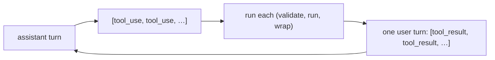

# Parallel Tool Use

> **Motto** — One model turn can ask for several tools at once, so run them together when it is safe and answer them all in one message.

*Part of Phase 02 — Tools.*

*Last reviewed: 2026-10 · Volatility: fast*

## The Problem

The loop so far ran one tool per turn. A real model often asks for several in one message: read three files, or check two services. The API expects a result for every `tool_use` block. If you answer only the first, the request fails.

Running them one after another is also slow. Three reads that could overlap take three times as long. But running everything at once is unsafe for tools that write.

## The Concept

The API does not prescribe an order. You choose. Independent, read-only calls are usually safe to run in parallel. Calls with side effects, shared state, or an ordering need run one at a time.

Whatever you choose, return one `tool_result` per `tool_use`. Put them all in the next user message. Put every `tool_result` before any text. If you skip a call, still answer it with an `is_error` result that says why.

Do not send each result in its own user message. That pattern teaches the model to stop making parallel calls.



## Build It

`code/parallel_tools.py` has three small functions. `outcome` runs one call and turns a crash into an error result. In a full harness it would call `run_tool` from [Validation, Results and Errors](../../02-validation-results-and-errors/docs/en.md).

```python
def outcome(call, impls):
    """Run one call. A crash becomes an error result, never an exception."""
    try:
        text, is_error = str(impls[call["name"]](**call["input"])), False
    except Exception as exc:
        text, is_error = f"{type(exc).__name__}: {exc}", True
    return {"type": "tool_result", "tool_use_id": call["id"], "content": text, "is_error": is_error}
```

`run_batch` picks the mode. All-read-only batches go to a thread pool, and `pool.map` keeps the call order. Any other batch runs in order, and a failure skips the rest with an explanation.

```python
def run_batch(calls, impls, read_only):
    """Return one tool_result per call, in call order."""
    if all(c["name"] in read_only for c in calls):
        with ThreadPoolExecutor(max_workers=len(calls)) as pool:   # independent reads
            return list(pool.map(lambda c: outcome(c, impls), calls))
    results = []
    for n, call in enumerate(calls):                               # side effects: in order
        res = outcome(call, impls)
        results.append(res)
        if res["is_error"]:                                        # skip the rest, but still answer
            for rest in calls[n + 1:]:
                results.append({"type": "tool_result", "tool_use_id": rest["id"], "is_error": True,
                                "content": f"Not executed: the earlier {call['name']} call failed."})
            break
    return results
```

`user_turn` builds the single user message with results first and text last.

```python
def user_turn(results, note=None):
    """All results go in ONE user message. tool_result blocks come first, any text after."""
    content = list(results) + ([{"type": "text", "text": note}] if note else [])
    return {"role": "user", "content": content}
```

The proof of parallelism is a barrier. Three reads each wait for the other two. Run one after another, they would time out. They pass only because all three run at once. The other asserts check that result order is kept, that text follows the results, and that a failed write skips the next one.

## Use It

`code/parallel_tools_sdk.py` wires `run_batch` into the SDK loop. It needs `pip install anthropic` and `ANTHROPIC_API_KEY`.

Current models call tools in parallel by default when it helps. To push them further, add a line to the system prompt. This line comes from Anthropic's guidance:

```python
SYSTEM = ("For maximum efficiency, whenever you need to perform multiple independent "
          "operations, invoke all relevant tools simultaneously rather than sequentially.")
```

To turn parallel calls off, set `disable_parallel_tool_use: true` inside `tool_choice`. It is not a top-level parameter. With `auto`, the model then makes at most one tool call per response.

## Challenge

Give each read a 5-second limit. If one read is too slow, return an `is_error` result for that call only. The other results must still return in the same user message.

## Sources

[Parallel tool use](https://platform.claude.com/docs/en/agents-and-tools/tool-use/parallel-tool-use)

Next: [Context Budget](../../../03-context-and-memory/01-context-budget/docs/en.md)
