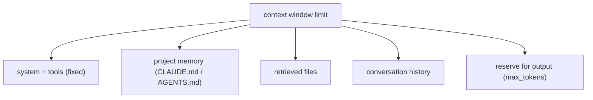

# Context budget

> **Motto** — Treat the context window as a budget you allocate, not a bucket you fill.

*Part of Phase 03 — Context and memory.*

*Last reviewed: 2026-10 · Volatility: fast*

## The Problem

A coding agent fills its window fast. The system prompt, tool schemas, project memory, retrieved files, history and tool results all compete for the same space. The reply needs room too.

Without a plan, one of two things happens. The call fails because the input is too big. Or the harness cuts text blindly and drops the one file the model needed.

"The window is full" tells you nothing. You need to know which part is too big. That means a budget per category, checked before every call. Lesson 02 of Phase 01 explains tokens and the window itself: [Tokens, context and caching](../../../01-foundations-and-the-loop/02-tokens-context-and-caching/docs/en.md).

## The Concept



Split the window into slices. First take the output reserve. Then give each category a share of what is left.

Each category has a cap. When a category goes over its cap, you trim or compact that category. You do not trim whatever happens to be oldest. The next two lessons build the parts that do the trimming.

The numbers are a policy, not a law. Pick weights from what your agent really loads. A repo-heavy agent needs a big `files` slice. A chat agent needs a big `history` slice.

## Build It

`code/budget.py` holds a small `ContextBudget` class. It has three methods.

```python
def estimate(text):
    return max(1, round(len(text) / 4))      # about 4 characters per token

class ContextBudget:
    def __init__(self, limit, reserve_output, weights):
        if sum(weights.values()) > 1.0 + 1e-9:
            raise ValueError("weights must sum to 1.0 or less")
        self.limit, self.reserve = limit, reserve_output
        self.weights = weights                   # category -> fraction of usable tokens

    def allocation(self):
        usable = self.limit - self.reserve       # the reply needs room too
        return {cat: int(usable * w) for cat, w in self.weights.items()}

    def check(self, sizes):
        alloc = self.allocation()
        return {cat: (sizes.get(cat, 0), alloc[cat], sizes.get(cat, 0) <= alloc[cat])
                for cat in alloc}

    def fit(self, sizes):
        """Tokens each over-budget category must shed. Input to trim and compact."""
        return {cat: used - cap
                for cat, (used, cap, ok) in self.check(sizes).items() if not ok}
```

`allocation` turns weights into token caps. `check` compares real sizes to those caps. `fit` returns only the overage, so it is the exact input a trimmer needs.

Run the file. With a 200,000-token window and an 8,000-token reserve, `files` gets 86,400 tokens. A 100,000-token file load is over by 13,600. The file ends with asserts that prove the reply always fits, that only over-budget categories shed tokens, and that bad weights are rejected.

The `estimate` function is a rough guess. Count real tokens before you trust a tight budget.

## Use It

Claude Code applies the same idea for you. Run `/context` in a session to see what uses space. Skills show only their descriptions at session start. The full body loads when the skill is used. MCP tool definitions are deferred by default, so only tool names and server instructions take space until a tool is used.

When the window fills, Claude Code clears older tool outputs first. If that is not enough, it summarizes the conversation. Your requests and key code snippets are kept. Detailed early instructions can be lost, so put persistent rules in `CLAUDE.md`.

In the Messages API, `max_tokens` caps the reply. Set `reserve_output` at least that high, or the reply can be cut short.

A bloated memory file spends budget on every turn. That is the main reason to keep it short (see [Memory files](../../../04-prompts-and-instructions/02-memory-files/docs/en.md)).

## Challenge

Add a borrowing rule. If `history` uses less than its cap, let `files` use the spare tokens. Write an assert that the total still stays under `limit - reserve`.

## Sources

Claude Code docs, "How Claude Code works" (code.claude.com/docs/en/how-claude-code-works), sections on the context window and compaction.

Next: [Assemble and inject](../../02-assemble-and-inject/docs/en.md)
