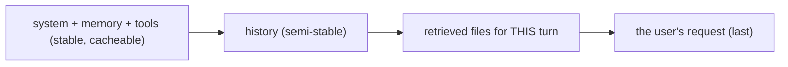

# Assemble and inject

> **Motto** — Assemble context in a fixed order: stable first, volatile last, and label everything you inject.

*Part of Phase 03 — Context and memory.*

*Last reviewed: 2026-10 · Volatility: fast*

## The Problem

A request has many parts. It has a system prompt, project memory, tool schemas, history, files and the new user message. You can order them many ways.

Order matters for two reasons. A stable prefix keeps the prompt cache valid. And the model gives weight to the text it reads last, so the ask should come last.

Injected content adds three more risks. You can inject too much: a whole 5,000-line file when 40 lines mattered. You can inject it unlabeled, so the model cannot tell file text from instructions. And you can inject it without a source, so nothing can be cited.

## The Concept



Use one canonical order. First comes the stable prefix, then history, then this turn's data, then the request.

Wrap every injected file in a block. The block carries its path and line span. A standing note says the content is data, not instructions. The note lowers the risk of prompt injection. It does not remove it, so Phase 06 adds hard controls: [Untrusted content](../../../06-permissions-and-security/04-untrusted-content/docs/en.md).

One function decides the order. That keeps caching and salience the same on every call.

## Build It

`code/assembly.py` has three small functions. `slice_around` cuts a window of lines. `wrap` labels it. `assemble` puts the request together.

```python
def wrap(path, content, span=None, max_chars=2000):
    if len(content) > max_chars:
        content = content[:max_chars] + f"\n[truncated: {len(content) - max_chars} more chars]"
    content = content.replace("</file>", "<\\/file>")          # a file cannot close its own block
    path = path.replace('"', "%22")
    loc = f" lines={span[0]}-{span[1]}" if span else ""
    return f'<file path="{path}"{loc}>\n{content}\n</file>'


def assemble(system, memory, history, files, user_msg):
    system_block = "\n\n".join(filter(None, [system, memory]))   # stable, cacheable
    messages = list(history)                                      # semi-stable
    parts = []
    if files:                                                     # this-turn data
        parts.append(DATA_NOTE + "\n\n" + "\n\n".join(wrap(*f) for f in files))
    parts.append(user_msg)                                        # the ask, last
    messages.append({"role": "user", "content": "\n\n".join(parts)})
    return system_block, messages
```

The files and the ask share one user message. That keeps the roles alternating, which the API expects. The `wrap` function escapes `</file>` inside the content, so a hostile file cannot close its own block and start a fake one. It also caps the size and says how much it cut.

The asserts at the end prove five things. The system block is byte-identical when only this turn's files change. The ask is last. The data note comes before the first file. Hostile text cannot break out of its block. Oversize content gets a visible note.

## Use It

Claude Code does the same job. It loads `CLAUDE.md` files from the broadest scope to the most specific. A project instruction appears after a user instruction. Instructions closer to your working directory are read last. It also adds its own context beside your messages, such as the output-style instructions and a note when a file you read changes on disk.

In the Messages API, a change to `tool_choice` invalidates cached message blocks. Tool definitions and the system prompt stay cached. So keep volatile settings out of the prefix, and keep per-turn data after it.

For a real SDK call, pass `system_block` as `system` and `messages` as `messages`. The details of cache markers live in [Tokens, context and caching](../../../01-foundations-and-the-loop/02-tokens-context-and-caching/docs/en.md).

## Challenge

Make `assemble` take a `ContextBudget` from [Context budget](../../01-context-budget/docs/en.md). When the `files` category is over its cap, drop the lowest-ranked files first. Assert that the ask still comes last.

## Sources

Claude Code docs, "How Claude remembers your project" and "How Claude Code works" (code.claude.com/docs). Claude API docs, "Define tools", note on `tool_choice` and prompt caching (platform.claude.com/docs).

Next: [Trim and compact](../../03-trim-and-compact/docs/en.md)
