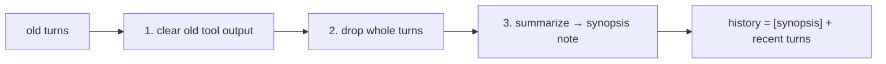

# Trim and compact

> **Motto** — When history will not fit, shrink it in stages, and never split a tool call from its result.

*Part of Phase 03 — Context and memory.*

*Last reviewed: 2026-10 · Volatility: fast*

## The Problem

A long session overflows the window. The obvious fix is to drop the oldest messages. That fix has a bug.

A coding agent's history is full of pairs. An assistant message holds a `tool_use` block. The next user message holds the matching `tool_result` block. The API rejects a history where one half of a pair is missing. A naive cut can land between the halves.

Dropping text also loses facts. The agent may need a decision it made 30 turns ago. So the harness must do two things: keep the history valid, and keep the gist.

## The Concept



Work in stages, from cheap to costly.

1. **Clear old tool output.** Replace the body of old `tool_result` blocks with a short note. Keep the blocks, so every pair stays whole.
2. **Drop whole turns.** A turn starts at a real user prompt and includes every tool pair after it. Remove the oldest turns, never single messages.
3. **Compact.** Summarize the old turns into a synopsis. Keep the recent turns word for word.

A good synopsis records decisions, the current plan, files touched and open questions. It is the working state, not a transcript.

## Build It

`code/compaction.py` uses the Anthropic message shape. The key idea is the *turn*. If you only cut at turn boundaries, pairs cannot split.

```python
def turns(messages):
    """Split into turns. Each turn starts at a real prompt and keeps its tool pairs inside."""
    out = []
    for m in messages:
        if is_prompt(m) or not out:
            out.append([])
        out[-1].append(m)
    return out
```

```python
def trim(messages, max_tokens, keep_turns=1):
    """Stage 1: clear old tool output. Stage 2: drop the oldest whole turns."""
    ts = turns(messages)
    flat = lambda xs: [m for t in xs for m in t]
    if size(flat(ts)) > max_tokens:
        ts = [clear_results(t) for t in ts[:-keep_turns]] + ts[-keep_turns:]
    while size(flat(ts)) > max_tokens and len(ts) > keep_turns:
        ts.pop(0)                                    # a whole turn, never a half pair
    return flat(ts)
```

```python
def compact(messages, max_tokens, summarize, keep_turns=2):
    """Replace old turns with a synopsis merged into the first kept prompt."""
    ts = turns(messages)
    if size(messages) <= max_tokens or len(ts) <= keep_turns:
        return messages
    old = [m for t in ts[:-keep_turns] for m in t]
    kept = [m for t in ts[-keep_turns:] for m in t]
    note = f"[summary of earlier conversation]\n{summarize(old)}\n\n"
    first = dict(kept[0], content=note + kept[0]["content"])
    return [first] + kept[1:]
```

The synopsis merges into the first kept prompt. That avoids two user messages in a row. The `summarize` argument is a stub here. In production it is a model call.

The proof is in the asserts. A `check_pairs` function lists every orphan `tool_use` or `tool_result`. The file also has a `naive_trim` that drops one message at a time. The asserts show that the naive version leaves an orphan at some budgets. They also show that `trim` and `compact` return a valid history at every budget in the range. The newest turn stays untouched, and an old decision survives in the synopsis.

## Use It

Claude Code runs this ladder for you. When the window fills, it clears older tool outputs first. Then it summarizes the conversation if needed. Your requests and key code snippets are kept. Detailed early instructions can be lost.

You can steer it. Add a "Compact Instructions" section to `CLAUDE.md`, or run `/compact` with a focus, such as `/compact focus on the API changes`. If one huge file refills the window after each summary, Claude Code stops auto-compacting after a few attempts and shows an error. It does not loop.

The Claude API also offers server-side compaction, where Claude writes the summary. Both the on-demand and the token-threshold kinds are in beta at the time of writing, so read the current docs before you build on them. Context editing clears old tool results by rule instead of summarizing them. Your own `summarize` function, as here, always works.

## Challenge

Make `compact` recursive. When the synopsis plus the kept turns still overflows, summarize again. Assert that a fact from the first summary is still in the final text.

## Sources

Claude Code docs, "How Claude Code works", section "When context fills up" (code.claude.com/docs/en/how-claude-code-works). Claude API docs, "Compaction overview" (platform.claude.com/docs/en/build-with-claude/compaction).

Next: [Persist, resume and checkpoints](../../04-persist-resume-and-checkpoints/docs/en.md)
