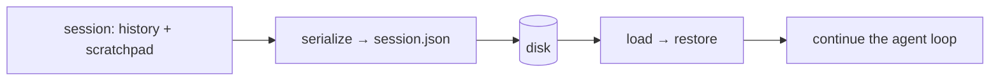

# Persist, resume and checkpoints

> **Motto** — A session you can save is a session you can resume. Resume from the last checkpoint, never from zero.

*Part of Phase 03 — Context and memory.*

*Last reviewed: 2026-10 · Volatility: fast*

## The Problem

You close the terminal. The process crashes. You come back tomorrow. Unless the harness saved the work, it is gone.

There are two kinds of loss. The first is the conversation: the message history and the notes the agent kept. The second is progress inside a long task. If a run dies in phase 3 of 5, a harness without checkpoints redoes phases 1 and 2. That wastes time and can repeat side effects, such as a second commit or a second email.

Both fixes use the same tool: write state to disk, and read it back on start.

## The Concept



Three pieces of state matter.

- **History.** The messages, including every tool pair. The round trip must keep pairs whole (see [Trim and compact](../../03-trim-and-compact/docs/en.md)).
- **Scratchpad.** A small key/value store of working notes: the file being edited, a value computed, a decision made. It lives outside the history, so it survives trimming. Inject its summary when the agent needs a refresher.
- **Checkpoints.** After each phase of a task, record what finished and what changed. On resume, skip finished phases.

One rule protects all three: write atomically. Write a temp file, then rename it over the real file. A crash then leaves the old good file, never half a file.

## Build It

`code/session_store.py` has four parts: an atomic writer, a `Scratchpad`, a `SessionStore`, and a checkpointed task runner.

```python
def atomic_write(path, data):
    """Write to a temp file, then rename. A crash never leaves a half-written file."""
    fd, tmp = tempfile.mkstemp(dir=os.path.dirname(os.path.abspath(path)))
    try:
        with os.fdopen(fd, "w") as f:
            json.dump(data, f, indent=2)
        os.replace(tmp, path)                        # one atomic step
    except BaseException:
        os.unlink(tmp)
        raise
```

```python
def run_task(path, phases):
    """Run phases in order. Skip any phase the checkpoint file records as done."""
    state = read_json(path, {"done": []})
    for name, work in phases:
        if name in [d["phase"] for d in state["done"]]:
            continue
        result = work()                              # may raise: the crash case
        state["done"].append({"phase": name, "changes": result})
        atomic_write(path, state)                    # checkpoint after every phase
    return state
```

The asserts at the end test four cases. Resume restores history with its tool pair and the scratchpad. A save that dies halfway leaves the last good file, and no temp file behind. A missing file loads as an empty session. A task that crashes in phase 3 resumes in phase 3: the calls list shows `scaffold` and `implement` ran once, and `test` ran twice, once failing and once passing.

Checkpoints only help if phases are safe to skip. A phase that ran but did not record its checkpoint will run again. Make such phases idempotent, as [Budgets, idempotency and degraded mode](../../../09-reliability-evals-and-ops/02-budgets-idempotency-degraded-mode/docs/en.md) explains.

## Use It

Claude Code saves each conversation locally. Every message, tool use and result goes to a plaintext JSONL file under `~/.claude/projects/`. `claude --continue` or `claude --resume` reopens a session under the same ID and appends to it. `--fork-session` or `/branch` copies the history into a new session and leaves the original unchanged.

Claude Code also keeps file checkpoints. Before it edits a file, it snapshots the contents. Press `Esc` twice to rewind. Checkpoints are separate from git. They cover file edits only, not databases, APIs or deployments. Sessions are independent: a new session starts with a fresh window. Facts that must cross sessions belong in `CLAUDE.md` or in memory (next lesson).

## Challenge

Add a `--resume` flag to the REPL from [First call and REPL](../../../01-foundations-and-the-loop/01-first-call-and-repl/docs/en.md). Save after every turn. On start with the flag, load the last session. Assert that the resumed history ends with the same message that was saved.

## Sources

Claude Code docs, "How Claude Code works", sections "Work with sessions" and "Undo changes with checkpoints" (code.claude.com/docs/en/how-claude-code-works).

Next: [Long-term memory](../../05-long-term-memory/docs/en.md)
