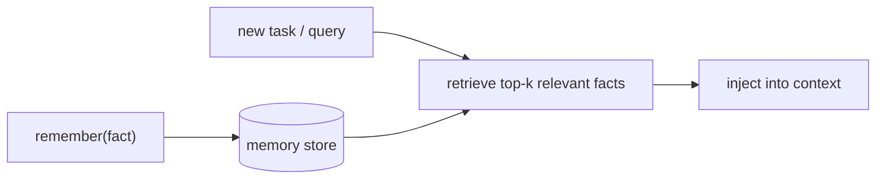

# Long-term memory

> **Motto** — Long-term memory is a store you write facts to and retrieve the relevant few from.

*Part of Phase 03 — Context and memory.*

*Last reviewed: 2026-10 · Volatility: fast*

## The Problem

The scratchpad dies with the session. A saved session belongs to one conversation. Some knowledge should outlive both: "this project uses pnpm", "the auth flow lives in `auth/`", "we decided against Redis".

A durable store solves this. The agent writes facts to it. On later tasks the harness retrieves the relevant ones.

The hard part is reading. If you load the whole store into every prompt, it grows until it crowds out the task. This is the same budget problem as in [Context budget](../../01-context-budget/docs/en.md). Retrieval keeps the prompt small as the store grows.

## The Concept



Writing appends a fact. Reading ranks the facts by relevance and returns the top few. Only those few enter the context.

Three rules keep the store useful.

- **Write durable facts only.** Skip chat and one-off details. A fact should help a future task.
- **Deduplicate and forget.** A store full of repeats and stale claims gives bad answers.
- **Record the source.** A fact the agent copied from an untrusted page is a poisoning risk. Label retrieved facts as data when you inject them, as in [Assemble and inject](../../02-assemble-and-inject/docs/en.md).

This lesson ranks by word overlap with a rare-word bonus. Phase 08 shows how to retrieve over code: [Repo map](../../../08-extending-mcp-skills-retrieval/04-repo-map/docs/en.md).

## Build It

`code/long_term.py` stores facts in a JSON file. A new instance reads the same file, so facts survive the process.

```python
    def remember(self, fact, tags=(), source="agent"):
        if any(words(e["fact"]) == words(fact) for e in self.facts):
            return "duplicate"                       # same words, same fact
        self.facts.append({"fact": fact, "tags": list(tags), "source": source})
        self._save()
        return "remembered"
```

```python
    def retrieve(self, query, k=3):
        q = words(query)
        n = len(self.facts)

        def idf(w):                                  # rare words count more than common ones
            hits = sum(1 for e in self.facts if w in words(e["fact"]) | set(e["tags"]))
            return math.log(1 + n / hits) if hits else 0.0

        def score(e):
            return sum(idf(w) for w in q & (words(e["fact"]) | set(e["tags"])))

        ranked = sorted(self.facts, key=score, reverse=True)
        return [e["fact"] for e in ranked[:k] if score(e) > 0]
```

The `words` helper lowercases text and drops filler words and punctuation. The old version split on spaces, so "npm." never matched "npm". The `_save` method uses the same atomic write as the session store.

The asserts prove four things. A query returns the matching fact and nothing else. A query with no match returns an empty list. A second instance reads the facts the first one wrote. A repeated fact is ignored, and `forget` removes a stale one for good.

## Use It

Claude Code has two memory systems, and both load at the start of every session. `CLAUDE.md` holds instructions you write. Auto memory holds notes Claude writes for itself. It saves four kinds: `user`, `feedback`, `project` and `reference`. It skips anything it can derive from the code. The first 200 lines or 25KB of `MEMORY.md` load each session. Run `/memory` to toggle it.

In the API, the memory tool gives Claude a `/memories` directory. Add `{"type": "memory_20250818", "name": "memory"}` to `tools`. Claude then sends `view`, `create`, `str_replace`, `insert`, `delete` and `rename` requests. Your code runs them. Memory lives entirely in your application, so you pick the storage. Your handler must reject any path outside `/memories`, because a path like `/memories/../../secrets.env` is an attack.

`code/long_term_memory_sdk.py` uses the Python SDK helper `BetaLocalFilesystemMemoryTool`. It needs `pip install anthropic` and an API key, so it does not run offline.

## Challenge

Add an expiry rule. Give each fact a `last_used` time. Make `retrieve` update it, and make `forget_stale(days)` remove old facts. Assert that a fact used today survives and an old one goes.

## Sources

Claude Code docs, "How Claude remembers your project" (code.claude.com/docs/en/memory). Claude API docs, "Memory tool" (platform.claude.com/docs/en/agents-and-tools/tool-use/memory-tool).

Next: [System prompt and steering](../../../04-prompts-and-instructions/01-system-prompt-and-steering/docs/en.md)
